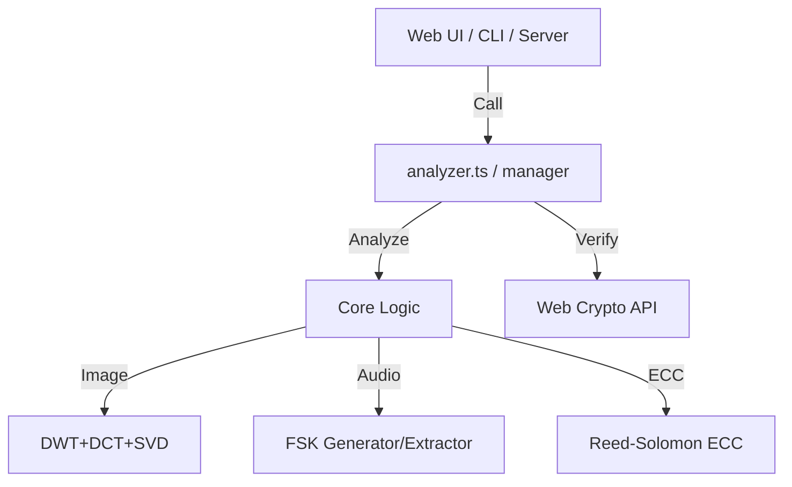

# ts-forensic-watermark

A secure, isomorphic (environment-agnostic) forensic watermarking library in TypeScript.
Supports embedding robust and tamper-resistant watermarks into **images**, **videos**, and **audio**.

## 💡 Architecture Philosophy: Library-First

This project encapsulates all business logic (watermark generation, signing, extraction, and verification) within the core library. The library handles high-level functions that work identically across browsers, Node.js servers, and CLI tools using a pure isomorphic design.

---

## 🚀 Key Features

- **[Image] Frequency-Domain Forensic Watermarking**: Invisible watermarking resilient to lossy compression (JPEG, etc.) via DWT + DCT + SVD.
- **[Video/Audio] FSK Acoustic Watermarking**: High-frequency watermarking (17kHz–19kHz) using FSK (Frequency-Shift Keying). Resilient to "Analog Hole" (re-recording) attacks.
- **[Cross-Platform] Metadata Signing (HMAC-SHA256)**: Mathematically proves that watermark data has not been tampered with.
- **[Cross-Platform] Self-Healing (ECC)**: Implements Reed-Solomon Error Correction to restore corrupted payloads.

---

## 📖 Beginner's Guide: Embedding & Verification Flow

### Step 1: Generating Signatures and Payloads (Signing)

Generate all necessary payloads (JSON for EOF, secure string for Forensic/FSK) in one go.

> [!IMPORTANT]
> **⚠️ The 22-Byte Constraint**
> For maximum robustness and error correction, Forensic and FSK watermarks have a fixed payload capacity of **22 bytes**.
> We generate a **"6-character Session ID" + "16-character HMAC signature"** set to ensure tamper detection even with short data.

### Step 2: Embedding into Media (Pipeline)

Burn the generated data into your media. For images, a dual-layer approach is recommended.

#### 【For Images】
Apply both invisible pixel-level embedding and file-end metadata appending.

```typescript
import { embedImageWatermarks, finalizeImageBuffer } from 'ts-forensic-watermark';

// 1. [Pixel Level] Modifies Canvas ImageData directly
embedImageWatermarks(imageData, payloads.securePayload);

// 2. [Binary Level] Append to file buffer after converting Canvas to Blob/Buffer
const finalBuffer = finalizeImageBuffer(originalBuffer, payloads.jsonString);
```

### Step 3: Analysis and Verification (Verification)

Extract data from a file and verify its authenticity using your secret key.

```typescript
import { analyzeTextWatermarks, verifyWatermarks } from 'ts-forensic-watermark';

// 1. Scan for watermarks (Auto-detection)
const foundWMs = analyzeTextWatermarks(fileUint8Array);

// 2. Verify all signatures in batch
const results = await verifyWatermarks(foundWMs, secretKey);
```

---

## 🔀 Pipeline Function Reference

High-level APIs designed to simplify complex orchestration.

### 1. `generateWatermarkPayloads(metadata, secretKey, secureIdLength = 6)`
Generates all signed payloads required for watermarking.
- **Arguments**:
  - `metadata`: Object like `{ userId, sessionId, ... }`.
  - `secretKey`: Secret key for HMAC signing.
  - `secureIdLength`: (Optional) The length of the session ID portion (Total must be 22 bytes with HMAC).
- **Returns**:
  - `jsonString`: Signed JSON for EOF/SEI.
  - `securePayload`: Configurable length ID + HMAC (Total 22 bytes).

### 2. `embedImageWatermarks(imageData, securePayload, options)`
Writes forensic watermarks into image pixel data.
- **Role**: Directly mutates the `ImageData` object to embed invisible watermarks.

### 3. `finalizeImageBuffer(buffer, jsonMetadata)`
Appends metadata to the file binary.
- **Role**: Appends signed JSON metadata to a `Uint8Array` (image buffer) and returns the finalized file buffer.

### 4. `verifyWatermarks(watermarks, secretKey)`
Verifies authenticity for all detected watermarks.
- **Role**: Automatically detects signature types and performs HMAC verification. Returns an array of results with `valid` status and messages.

---

## ⚙️ Detailed Parameter Reference

### 1. Advanced Forensic Watermarking (`ForensicOptions`)
| Parameter | Type | Default | Description |
| :--- | :--- | :--- | :--- |
| `delta` | number | `120` | Embedding intensity. Higher = more robust but more digital noise. |
| `varianceThreshold` | number | `25` | Texture threshold. Lower = embeds in smoother areas. |
| `arnoldIterations` | number | `7` | Scrambling iterations. Must match during extraction. |
| `force` | boolean | `false` | Ignores texture checks and forces embedding. |
| `robustAngles` | number[] | `[0]` | **[NEW]** List of angles to try during extraction. e.g., `[0, 90, 180, 270, 0.5, -0.5]`. Enables detection even if the image is rotated or slightly tilted. |

> [!TIP]
> **Rotation Robustness (Multi-angle Scan)**
> The library dynamically rotates the image during analysis based on the provided angle list. 90/180/270-degree rotations are performed via fast index transpositions, while fine-grained tilts (e.g., 0.5°) use high-precision **Bilinear Interpolation** to preserve watermark signal integrity.

### 2. FSK Acoustic Watermarking (`FskOptions`)
| Parameter | Type | Default | Description |
| :--- | :--- | :--- | :--- |
| `amplitude` | number | `2000` | Signal volume. Use 2000-5000 for robustness against AAC compression. |
| `sampleRate` | number | `44100` | Sampling rate in Hz. |
| `bitDuration` | number | `0.025` | Duration per bit in seconds. |
| `freqZero` | number | `18000` | Frequency for bit "0" (Hz). |
| `freqOne` | number | `19000` | Frequency for bit "1" (Hz). |
| `freqSync` | number | `17000` | Frequency for sync pulse (Hz). |

---

## 📚 Technical Comparison: Pros and Cons

### 1. Advanced Forensic Watermarking (DWT + DCT + SVD)
* **Technical Details**: Uses **YCrCb** color space, **DWT** to decompose into frequency bands, and **8x8 Block-based DCT** and **SVD** on the LH band. Scrambled via **Arnold Transform**.
* **Pros**: Extreme resistance to JPEG compression, resizing, and noise.
* **Cons**: Computationally heavy for huge images.

### 2. FSK Acoustic Watermarking
* **Technical Details**: Uses **FSK** modulation. Extraction via **FFT** analysis. Protected by **Reed-Solomon ECC (22+8 parity)** for high reliability.
* **Pros**: Survives the "Analog Hole" (mic recording). Inaudible to humans.
* **Cons**: Vulnerable to 16kHz low-pass filters used by some platforms.

### 3. EOE (End Of File) Metadata
* **Technical Details**: Appends signed data after the EOF marker.
* **Pros**: Instant, zero quality loss, high capacity.
* **Cons**: Extremely fragile; removed by most editors.

### 4. H.264 SEI / MP4 UUID Box
* **Technical Details**: Injects metadata into H.264 bitstreams or MP4 containers.
* **Pros**: Standard compliant.
* **Cons**: Typically stripped during transcoding on video platforms.

---

## ⚠️ Important Notes & Limitations

- **Payload Limit & ID Length Trade-off**: 
  - Forensic and FSK are fixed at **22 bytes** total.
  - Default is **"6 chars ID + 16 chars HMAC"**. This is configurable via library options.
  - **Disadvantage (Important)**: Increasing the ID length (e.g., to 10 chars) reduces the HMAC length (e.g., to 12 chars). This reduces the cryptographic security against tampering and increases collision probability. We recommend the default 6-char setting unless strictly necessary.
  - **Consistency**: You MUST use the same `secureIdLength` for both embedding and verification.
- **Key Management**: Losing `secretKey` means you can never verify existing watermarks again.
- **Layered Defense**: We recommend combining Forensic (robust) with EOF/SEI (high capacity) for best results.

---

## 🏗 Architecture



## License
MIT License
