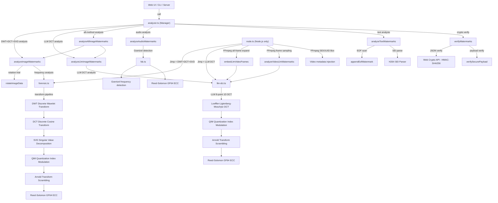

# ts-forensic-watermark

A secure, isomorphic (environment-agnostic) forensic watermarking library in TypeScript.
Embed robust and tamper-resistant watermarks into **images**, **videos**, and **audio**.

---

## Table of Contents

1. [Installation](#installation)
2. [Quick Start (Copy-Paste Ready)](#quick-start-copy-paste-ready)
3. [Where does inputBuffer come from?](#where-does-inputbuffer-come-from)
   - [File path (Node.js)](#1-file-path-nodejs)
   - [URL (Node.js)](#2-url-nodejs)
   - [URL in the browser](#3-url-in-the-browser)
   - [Local file picker (browser)](#4-local-file-picker-browser)
4. [High-Level API Guide](#high-level-api-guide)
   - [generateWatermarkPayloads — signed payload generation](#1-generatewatermarkpayloads--signed-payload-generation)
   - [embedImageWatermarks — pixel-level embedding](#2-embedimagewatermarks--pixel-level-embedding)
   - [finalizeImageBuffer — EOF metadata append](#3-finalizeimagebuffer--eof-metadata-append)
   - [analyzeTextWatermarks — automatic text watermark scan](#4-analyzetextwatermarks--automatic-text-watermark-scan)
   - [analyzeAudioWatermarks — FSK audio watermark extraction](#5-analyzeaudiowatermarks--fsk-audio-watermark-extraction)
   - [analyzeImageWatermarks — forensic image analysis](#6-analyzeimagewatermarks--forensic-image-analysis)
   - [verifyWatermarks — batch cryptographic verification](#7-verifywatermarks--batch-cryptographic-verification)
   - [embedLlmImageWatermark — LLM DCT frame watermark embedding](#8-embedllmimagewatermark--llm-dct-frame-watermark-embedding)
   - [analyzeLlmImageWatermarks — LLM DCT frame watermark analysis](#9-analyzellmimagewatermarks--llm-dct-frame-watermark-analysis)
   - [analyzeAllImageWatermarks — analyze image with all methods at once](#10-analyzeallImagewatermarks--analyze-image-with-all-methods-at-once)
5. [Node.js-Only Helper API](#nodejs-only-helper-api)
   - [embedForensicImage — direct image embedding](#embedforensicimage--direct-image-embedding)
   - [extractForensicImage — direct image extraction](#extractforensicimage--direct-image-extraction)
   - [embedLlmVideoFile — LLM DCT embedding for a single image/frame](#embedllmvideofile--llm-dct-embedding-for-a-single-imageframe)
   - [extractLlmVideoFile — LLM DCT extraction from a single image/frame](#extractllmvideofile--llm-dct-extraction-from-a-single-imageframe)
   - [embedLlmVideoFrames — LLM DCT embedding across all video frames](#embedllmvideoframes--llm-dct-embedding-across-all-video-frames)
   - [extractLlmVideoFrames — LLM DCT extraction from a video file](#extractllmvideoframes--llm-dct-extraction-from-a-video-file)
   - [analyzeVideoLlmWatermarks — video analysis ready for verifyWatermarks](#analyzevideollmwatermarks--video-analysis-ready-for-verifywatermarks)
   - [embedVideoWatermark — video watermark injection](#embedvideowatermark--video-watermark-injection)
6. [Low-Level API Reference](#low-level-api-reference)
7. [Parameter Reference](#parameter-reference)
8. [Technical Background](#technical-background)
   - [1. Forensic Watermark: DWT + DCT + SVD + QIM](#1-forensic-watermark-dwt--dct--svd--qim)
   - [2. Reed-Solomon Error Correction (ECC)](#2-reed-solomon-error-correction-ecc)
   - [3. FSK Acoustic Watermark](#3-fsk-acoustic-watermark)
   - [4. Tamper Detection with HMAC-SHA256](#4-tamper-detection-with-hmac-sha256)
   - [5. Arnold Transform (Spatial Scrambling)](#5-arnold-transform-spatial-scrambling)
   - [6. Sync Marker (16 bits)](#6-sync-marker-16-bits)
   - [7. EOF Metadata Append](#7-eof-metadata-append)
   - [8. MP4 UUID Box](#8-mp4-uuid-box)
   - [9. H.264 SEI User Data](#9-h264-sei-user-data)
   - [10. LLM DCT Frame Watermark](#10-llm-dct-frame-watermark)
   - [11. Soft-decision (erasure) decoding & structured bit interleaving (v3.0.0+)](#11-soft-decision-erasure-decoding--structured-bit-interleaving-v300)
9. [Operational Notes & Trade-offs](#operational-notes--trade-offs)
10. [Architecture](#architecture)
11. [Web UI Guide](#web-ui-guide)
12. [Watermark Method Selection Guide](#watermark-method-selection-guide)

---

## 💡 Architecture Philosophy: Library-First

All business logic (generation, signing, extraction, verification) is encapsulated within the library. The Web UI is merely an interface; the core logic works identically across browsers, Node.js servers, and CLI tools using a pure isomorphic design.

---

## 🚀 Key Features

| Category | Technology | Robustness |
| :--- | :--- | :--- |
| **[Image]** Frequency-based forensic watermark | DWT + DCT + SVD + QIM | High (JPEG / resize resistant) |
| **[Image/Video]** LLM DCT frame watermark | Loeffler–Ligtenberg–Moschytz 8-point DCT + QIM | High (H.264/H.265 compression resistant) |
| **[Audio/Video]** FSK acoustic watermark | Frequency-Shift Keying (14–16 kHz) + Goertzel | High (analog recording + AAC compression resistant) |
| **[Shared]** Metadata signing | HMAC-SHA256 (Web Crypto API) | Tamper detection |
| **[Shared]** Error correction | Reed-Solomon ECC (GF64) + **erasure decoding (v3.0.0+)** | Self-healing, up to 2× correction capacity |
| **[Shared]** Spatial scrambling | Arnold transform + **structured bit interleaving (v3.0.0+)** | Analysis + burst-error resistance |

### v3.0.0 — robustness update (breaking change)

- **Soft-decision (erasure) decoding**: extraction declares low-confidence symbols as erasures based on `bitSums`, then decodes within the `2·errors + erasures ≤ eccLen` bound. **Up to 2× correction capacity** with the same ECC, so longer payloads (30–32 chars) become practical even under JPEG Q≈70.
- **Structured bit interleaving**: a symbol's 6 bits are now placed at `b * 63 + s` (bit-plane major), so any two bits of the same symbol are at least 63 positions apart in the bit matrix. Combined with Arnold scrambling, this dramatically reduces the probability of a single JPEG block wiping out all bits of one symbol.
- **Compatibility**: watermarks created with v2.x cannot be extracted with v3.x (bit layout changed). Pin v2.x if you need to read legacy watermarks.
- **Zero perceptual change**: all of the above are encoder/decoder-layer changes; embedding strength (`delta`), targeted blocks, and SVD operation are identical to v2.x.

---

## Installation

```bash
npm install ts-forensic-watermark
```

`jimp`, `ffmpeg-static`, and `fluent-ffmpeg` are listed in `dependencies` and are installed automatically with the command above.

### Automatic entry point selection

The package selects the correct entry point for each environment automatically.

| Environment | File used | Included features |
| :--- | :--- | :--- |
| Node.js (`require` / `import`) | `dist/index.js` | Everything, including Node.js helpers |
| Browser bundlers (Vite, webpack, etc.) | `dist/browser.js` | Browser-safe functions only |

Bundlers like Vite, webpack, and Rollup automatically read the `"browser"` field in `package.json` and use `dist/browser.js`, which has no dependency on `fs`, `jimp`, or FFmpeg. **You do not need to change your import statements for browser code.**

```typescript
// Works identically in both browser and Node.js
import { embedImageWatermarks, generateWatermarkPayloads } from 'ts-forensic-watermark';

// Importing Node.js-only helpers in a browser build will produce a bundler warning
// import { embedForensicImage } from 'ts-forensic-watermark'; // ← browser: unavailable
```

---

## Quick Start (Copy-Paste Ready)

### Node.js — embed a watermark from a file path (shortest example)

```typescript
import * as fs from 'fs';
import { embedForensicImage, extractForensicImage, generateWatermarkPayloads } from 'ts-forensic-watermark';

async function main() {
  const secretKey = "my-secret-key-2024";

  // 1. Generate payload (data + signature to embed)
  const payloads = await generateWatermarkPayloads(
    { userId: "user_001", sessionId: "TX1234" },
    secretKey
  );
  console.log("Payload to embed:", payloads.securePayload); // e.g. "TX1234a3f9b2..."

  // 2. Read input file as Buffer
  const inputBuffer = fs.readFileSync('./input.jpg');

  // 3. Embed watermark and save (uses Jimp internally)
  const outputBuffer = await embedForensicImage(inputBuffer, payloads.securePayload);
  fs.writeFileSync('./output.png', outputBuffer);
  console.log("Done: output.png");

  // 4. Verify: extract the embedded watermark
  const result = await extractForensicImage(outputBuffer);
  console.log("Extracted:", result?.payload);   // "TX1234a3f9b2..."
  console.log("Confidence:", result?.confidence); // 0–100
}

main().catch(console.error);
```

### Node.js — fetch image from URL and embed watermark

```typescript
import * as fs from 'fs';
import { embedForensicImage, generateWatermarkPayloads } from 'ts-forensic-watermark';

async function main() {
  const secretKey = "my-secret-key-2024";
  const imageUrl = "https://example.com/photo.jpg"; // ← change this

  const payloads = await generateWatermarkPayloads(
    { userId: "user_002", sessionId: "TX5678" },
    secretKey
  );

  // Pass the URL string directly — the library fetches it for you
  const outputBuffer = await embedForensicImage(imageUrl, payloads.securePayload, undefined, './watermarked.png');
  console.log("Done: watermarked.png");
}

main();
```

### Browser — embed watermark from a file input

```html
<input type="file" id="fileInput" accept="image/*">
<canvas id="canvas"></canvas>
<script type="module">
import { embedImageWatermarks, generateWatermarkPayloads } from 'ts-forensic-watermark';

document.getElementById('fileInput').addEventListener('change', async (e) => {
  const file = e.target.files[0];
  const secretKey = "my-secret-key-2024";

  // 1. Generate payload
  const payloads = await generateWatermarkPayloads(
    { userId: "user_003", sessionId: "TX9999" },
    secretKey
  );

  // 2. Draw file onto Canvas to obtain ImageData
  const canvas = document.getElementById('canvas');
  const ctx = canvas.getContext('2d');
  const img = new Image();
  const objectUrl = URL.createObjectURL(file);

  img.onload = () => {
    canvas.width = img.width;
    canvas.height = img.height;
    ctx.drawImage(img, 0, 0);

    // ImageData = raw pixel buffer (the library's input)
    const imageData = ctx.getImageData(0, 0, canvas.width, canvas.height);

    // 3. Embed watermark (mutates imageData in-place)
    embedImageWatermarks(imageData, payloads.securePayload);

    // 4. Write modified pixels back to Canvas
    ctx.putImageData(imageData, 0, 0);
    URL.revokeObjectURL(objectUrl);
    console.log("Watermark embedded — Canvas updated");
  };
  img.src = objectUrl;
});
</script>
```

---

## Where does inputBuffer come from?

Most APIs accept a `Buffer` (Node.js) or `Uint8Array` (browser). Here are the common ways to obtain one.

### 1. File path (Node.js)

The simplest approach — use `fs.readFileSync` or `fs.promises.readFile`.

```typescript
import * as fs from 'fs';

// Synchronous
const inputBuffer: Buffer = fs.readFileSync('./path/to/image.jpg');

// Asynchronous (recommended)
const inputBuffer: Buffer = await fs.promises.readFile('./path/to/image.jpg');

// Pass directly to the library
const outputBuffer = await embedForensicImage(inputBuffer, payload);
fs.writeFileSync('./output.png', outputBuffer);
```

### 2. URL (Node.js)

Node.js 18+ has built-in `fetch`:

```typescript
// Node.js 18+ (built-in fetch)
async function loadFromUrl(url: string): Promise<Buffer> {
  const res = await fetch(url);
  if (!res.ok) throw new Error(`HTTP error: ${res.status}`);
  return Buffer.from(await res.arrayBuffer());
}

const inputBuffer = await loadFromUrl("https://example.com/photo.jpg");
const outputBuffer = await embedForensicImage(inputBuffer, payload);
```

For Node.js 17 and below use the `https` module or `node-fetch`:

```typescript
// npm install node-fetch
import fetch from 'node-fetch';

const res = await fetch("https://example.com/photo.jpg");
const inputBuffer = Buffer.from(await res.arrayBuffer());
```

### 3. URL in the browser

```typescript
async function loadImageDataFromUrl(url: string): Promise<ImageData> {
  return new Promise((resolve, reject) => {
    const img = new Image();
    img.crossOrigin = "anonymous"; // required for cross-origin images
    img.onload = () => {
      const canvas = document.createElement('canvas');
      canvas.width = img.width;
      canvas.height = img.height;
      const ctx = canvas.getContext('2d')!;
      ctx.drawImage(img, 0, 0);
      resolve(ctx.getImageData(0, 0, img.width, img.height));
    };
    img.onerror = reject;
    img.src = url;
  });
}

const imageData = await loadImageDataFromUrl("https://example.com/photo.jpg");
embedImageWatermarks(imageData, payload);
```

> **Note:** Cross-origin images require the server to send an `Access-Control-Allow-Origin` header.

### 4. Local file picker (browser)

```typescript
// Get ArrayBuffer / Uint8Array from a <input type="file"> selection
async function loadFromFileInput(file: File): Promise<Uint8Array> {
  return new Uint8Array(await file.arrayBuffer());
}

// Get ImageData + raw buffer at the same time
async function loadImageDataFromFile(file: File): Promise<{ imageData: ImageData, buffer: Uint8Array }> {
  const buffer = await loadFromFileInput(file);
  const url = URL.createObjectURL(file);

  return new Promise((resolve, reject) => {
    const img = new Image();
    img.onload = () => {
      const canvas = document.createElement('canvas');
      canvas.width = img.width;
      canvas.height = img.height;
      const ctx = canvas.getContext('2d')!;
      ctx.drawImage(img, 0, 0);
      const imageData = ctx.getImageData(0, 0, img.width, img.height);
      URL.revokeObjectURL(url);
      resolve({ imageData, buffer });
    };
    img.onerror = reject;
    img.src = url;
  });
}
```

---

## High-Level API Guide

### 1. `generateWatermarkPayloads` — signed payload generation

**Purpose:** Generates the two payload variants used throughout the rest of the pipeline.

```typescript
import { generateWatermarkPayloads } from 'ts-forensic-watermark';

const payloads = await generateWatermarkPayloads(
  {
    userId: "user_8822",    // required
    sessionId: "TX9901",    // required (used for forensic / FSK payload)
    orderId: "ORDER-001",   // any extra fields are included in EOF metadata
    planType: "premium"
  },
  "your-secret-key",        // HMAC signing key
  6                         // secureIdLength: chars of sessionId to use (default: 6)
);

// Outputs:
console.log(payloads.jsonString);
// '{"userId":"user_8822","sessionId":"TX9901","orderId":"ORDER-001",
//   "planType":"premium","timestamp":"2024-01-01T00:00:00.000Z","signature":"a3f9b2..."}'
// → used for EOF / video SEI embedding

console.log(payloads.securePayload);
// 'TX9901a3f9b2c841d5ef97'  (exactly 22 bytes)
// → used for image forensic and FSK audio embedding

console.log(payloads.json);
// Parsed object (same as jsonString parsed)
```

**securePayload structure:**
```
[ first 6 chars of sessionId ][ first 16 chars of HMAC ]
        TX9901                      a3f9b2c841d5ef97
|←── 6 bytes ──→|←────────── 16 bytes ──────────→|
|←─────────────── 22 bytes total ─────────────────→|
```

---

### 2. `embedImageWatermarks` — pixel-level embedding

**Purpose:** Writes an invisible frequency-domain watermark into ImageData pixels. **Mutates the imageData object in-place.**

```typescript
import { embedImageWatermarks } from 'ts-forensic-watermark';

// imageData obtained from Canvas API or Jimp
embedImageWatermarks(
  imageData,                   // ImageData / ImageDataLike (mutated in-place)
  payloads.securePayload,      // 22-byte payload string
  {
    delta: 120,                // embedding strength
    varianceThreshold: 25,     // block selection threshold
    arnoldIterations: 7        // scramble depth (must match extraction)
  }
);
// Returns void. imageData.data is modified directly.
```

**Note:** After calling this function you must write the modified pixels back — via `ctx.putImageData()` in the browser or `image.bitmap.data = Buffer.from(imageData.data)` with Jimp.

#### Full browser example (embed + PNG download)

```typescript
async function embedAndDownload(file: File, userId: string, sessionId: string) {
  const secretKey = "my-secret-key";
  const payloads = await generateWatermarkPayloads({ userId, sessionId }, secretKey);

  const img = new Image();
  img.src = URL.createObjectURL(file);
  await new Promise(r => img.onload = r);

  const canvas = document.createElement('canvas');
  canvas.width = img.width;
  canvas.height = img.height;
  const ctx = canvas.getContext('2d')!;
  ctx.drawImage(img, 0, 0);
  const imageData = ctx.getImageData(0, 0, img.width, img.height);

  embedImageWatermarks(imageData, payloads.securePayload);
  ctx.putImageData(imageData, 0, 0);

  canvas.toBlob((blob) => {
    const a = document.createElement('a');
    a.href = URL.createObjectURL(blob!);
    a.download = 'watermarked.png';
    a.click();
  }, 'image/png');
}
```

---

### 3. `finalizeImageBuffer` — EOF metadata append

**Purpose:** Appends signed JSON metadata as plain text to the end of a file buffer. JPEG/PNG decoders ignore trailing bytes, so the image still displays normally. Low robustness but human-readable.

```typescript
import { finalizeImageBuffer } from 'ts-forensic-watermark';
import * as fs from 'fs';

const originalBuffer = new Uint8Array(fs.readFileSync('./input.jpg'));

const finalBuffer = finalizeImageBuffer(
  originalBuffer,       // Uint8Array of the original file
  payloads.jsonString   // JSON string or object (auto-stringified)
);

fs.writeFileSync('./output_with_eof.jpg', finalBuffer);

// The appended bytes look like this (human-readable):
// ---WATERMARK_START---
// {"userId":"user_8822","sessionId":"TX9901",...,"signature":"a3f9b2..."}
// ---WATERMARK_END---
```

**Recommended dual-layer pattern:**

```typescript
// Layer 1: invisible pixel watermark (high robustness)
embedImageWatermarks(imageData, payloads.securePayload);

// Export modified canvas to a new buffer, then:
// Layer 2: EOF metadata (low robustness, but easy to read)
const finalBuffer = finalizeImageBuffer(new Uint8Array(newBuffer), payloads.jsonString);
```

---

### 4. `analyzeTextWatermarks` — automatic text watermark scan

**Purpose:** Scans a binary file buffer for three types of text-based watermarks: EOF, MP4 UUID Box, and H.264 SEI. Works in both Node.js and the browser.

```typescript
import { analyzeTextWatermarks } from 'ts-forensic-watermark';
import * as fs from 'fs';

const fileBuffer = new Uint8Array(fs.readFileSync('./suspicious_video.mp4'));
const watermarks = analyzeTextWatermarks(fileBuffer);

// Example output:
// [
//   { type: 'EOF',      name: '...', robustness: 'Low (脆弱)',  data: { userId: "...", signature: "..." } },
//   { type: 'H264_SEI', name: '...', robustness: 'High (堅牢)', data: { userId: "...", signature: "..." } }
// ]

watermarks.forEach(wm => {
  console.log(`Detected: ${wm.name}`);
  console.log(`  type: ${wm.type}, robustness: ${wm.robustness}`);
  console.log(`  data:`, wm.data);
});
```

**Detectable watermark types:**

| type | Description | Robustness |
| :--- | :--- | :--- |
| `EOF` | `---WATERMARK_START---` marker at end of file | Low |
| `UUID_BOX` | UUID Box inside MP4 container | Low |
| `H264_SEI` | SEI user_data_unregistered in H.264 stream | High |

---

### 5. `analyzeAudioWatermarks` — FSK audio watermark extraction

**Purpose:** Extracts an FSK watermark from a `Float32Array` of audio samples. Use with the Web Audio API or an audio decoding library.

```typescript
import { analyzeAudioWatermarks } from 'ts-forensic-watermark';

// Browser: decode audio file via AudioContext
async function analyzeAudioFile(file: File) {
  const audioContext = new AudioContext();
  const arrayBuffer = await file.arrayBuffer();
  const audioBuffer = await audioContext.decodeAudioData(arrayBuffer);

  const channelData: Float32Array = audioBuffer.getChannelData(0);

  const watermarks = analyzeAudioWatermarks(channelData, {
    sampleRate: audioBuffer.sampleRate
  });

  watermarks.forEach(wm => {
    console.log(`FSK detected: ${wm.data.payload}`);
  });
}
```

```typescript
// Node.js: read WAV with the `wav` package
// npm install wav
import * as fs from 'fs';
import * as wav from 'wav';

function readWavFile(path: string): Promise<{ channelData: Float32Array, sampleRate: number }> {
  return new Promise((resolve, reject) => {
    const reader = new wav.Reader();
    const chunks: Buffer[] = [];

    reader.on('format', (format) => {
      reader.on('data', (chunk: Buffer) => chunks.push(chunk));
      reader.on('end', () => {
        const raw = Buffer.concat(chunks);
        const samples = new Float32Array(raw.length / 2);
        for (let i = 0; i < samples.length; i++) {
          samples[i] = raw.readInt16LE(i * 2) / 32768;
        }
        resolve({ channelData: samples, sampleRate: format.sampleRate });
      });
    });

    reader.on('error', reject);
    fs.createReadStream(path).pipe(reader);
  });
}

const { channelData, sampleRate } = await readWavFile('./audio_with_watermark.wav');
const watermarks = analyzeAudioWatermarks(channelData, { sampleRate });
```

---

### 6. `analyzeImageWatermarks` — forensic image analysis

**Purpose:** Extracts the DWT+DCT+SVD forensic watermark from ImageData. Supports multi-angle extraction for rotation robustness.

```typescript
import { analyzeImageWatermarks } from 'ts-forensic-watermark';

const watermarks = analyzeImageWatermarks(imageData, {
  delta: 120,
  arnoldIterations: 7,
  robustAngles: [0, 90, 180, 270, 0.5, -0.5, 1, -1, 2, -2, 3, -3]
});

watermarks.forEach(wm => {
  console.log(`Forensic detected: ${wm.data.payload}`);
  console.log(`Confidence: ${wm.data.confidence.toFixed(1)}%`);
  console.log(`Angle: ${wm.data.angle}°`);
});
```

**`robustAngles` guide:**
- `[0]` — default, no rotation (fastest)
- `[0, 90, 180, 270]` — handles right-angle rotations
- `[0, 90, 180, 270, 0.5, -0.5, 1, -1]` — handles slight tilts (scanner-level)
- `[0, 90, 180, 270, 0.5, -0.5, 1, -1, 2, -2, 3, -3]` — **recommended**; covers photos of screens taken with a smartphone (tilts up to ±3°)

> **Note:** Each angle runs one full extraction pass. Since the loop exits immediately on success, putting `0` first (no rotation) is the most efficient ordering. Arbitrary angles beyond ±5° disrupt DCT block boundaries enough to exceed Reed-Solomon's correction capacity.

---

### 7. `verifyWatermarks` — batch cryptographic verification

**Purpose:** Cryptographically verifies watermarks detected by the `analyze*` functions using HMAC.

```typescript
import { analyzeTextWatermarks, analyzeImageWatermarks, verifyWatermarks } from 'ts-forensic-watermark';
import * as fs from 'fs';

const secretKey = "my-secret-key-2024";

const fileBuffer = new Uint8Array(fs.readFileSync('./output.mp4'));
const textWatermarks = analyzeTextWatermarks(fileBuffer);
const imageWatermarks = analyzeImageWatermarks(imageData, { delta: 120 });

const results = await verifyWatermarks(
  [...textWatermarks, ...imageWatermarks],
  secretKey,
  6  // secureIdLength — must match what was used during embedding
);

results.forEach(wm => {
  const ok = wm.verification?.valid;
  console.log(`[${wm.type}] ${ok ? '✅ Authentic' : '❌ Tampered / Invalid'}`);
  console.log(`  ${wm.verification?.message}`);
  if (wm.data.userId) console.log(`  userId: ${wm.data.userId}`);
});
```

**Verification logic by watermark type:**

| Type | Verification method | Signed fields |
| :--- | :--- | :--- |
| `EOF`, `UUID_BOX`, `H264_SEI` | JSON signature (HMAC-SHA256 over `userId:sessionId`) | `userId`, `sessionId` |
| `AUDIO_FSK`, `FORENSIC`, `LLM_VIDEO` | Secure payload (HMAC) | Entire payload |

---

### 8. `embedLlmImageWatermark` — LLM DCT frame watermark embedding

**Purpose:** Embeds an LLM DCT watermark directly into an `ImageData` object (from the browser Canvas API or a Node.js canvas polyfill). This is the LLM DCT equivalent of `embedImageWatermarks` (DWT+DCT+SVD).

```typescript
import { embedLlmImageWatermark, generateWatermarkPayloads } from 'ts-forensic-watermark';

const payloads = await generateWatermarkPayloads(
  { userId: "user_001", sessionId: "TX9901" },
  "my-secret-key-2024"
);

// Browser example: get ImageData from Canvas and embed
const canvas = document.createElement('canvas');
const ctx = canvas.getContext('2d');
ctx.drawImage(videoFrame, 0, 0);
const imageData = ctx.getImageData(0, 0, canvas.width, canvas.height);

embedLlmImageWatermark(imageData, payloads.securePayload, {
  quantStep: 300,       // quantization step (recommended: 300)
  coeffRow: 2,          // DCT coefficient position — row
  coeffCol: 1,          // DCT coefficient position — column
  arnoldIterations: 7,  // scramble depth
  payloadSymbols: 22,   // number of data symbols
});

ctx.putImageData(imageData, 0, 0); // write modified pixels back
```

---

### 9. `analyzeLlmImageWatermarks` — LLM DCT frame watermark analysis

**Purpose:** Analyzes and extracts an LLM DCT watermark from `ImageData`, returning results in `DetectedWatermark[]` format. This is the LLM DCT equivalent of `analyzeImageWatermarks` (DWT+DCT+SVD). Supports multi-angle extraction via `robustAngles`.

```typescript
import { analyzeLlmImageWatermarks, verifyWatermarks } from 'ts-forensic-watermark';

// Browser example: get ImageData from Canvas and analyze
const imageData = ctx.getImageData(0, 0, canvas.width, canvas.height);

const watermarks = analyzeLlmImageWatermarks(imageData, {
  quantStep: 300,
  arnoldIterations: 7,
  payloadSymbols: 22,
  robustAngles: [0, 90, 180, 270, 0.5, -0.5, 1, -1, 2, -2, 3, -3],
});

// Verify
const verified = await verifyWatermarks(watermarks, "my-secret-key-2024", 6, 22);
verified.forEach(wm => {
  console.log(`[${wm.type}] payload: ${wm.data.payload}`);
  console.log(`  Confidence: ${wm.data.confidence.toFixed(1)}%`);
  console.log(`  Signature: ${wm.verification?.valid ? 'authentic' : 'failed'}`);
});
```

---

### 10. `analyzeAllImageWatermarks` — analyze image with all methods at once

**Purpose:** Tries both DWT+DCT+SVD forensic and LLM DCT extraction on the same `ImageData` in one call, returning all detected watermarks. Useful when the embedding method is unknown or both methods may be present.

```typescript
import { analyzeAllImageWatermarks, verifyWatermarks } from 'ts-forensic-watermark';

// Get ImageData from Canvas
const imageData = ctx.getImageData(0, 0, canvas.width, canvas.height);

// Try both DWT+DCT+SVD and LLM DCT
const allWatermarks = analyzeAllImageWatermarks(
  imageData,
  // forensicOptions (optional — defaults to delta:120)
  { delta: 120, arnoldIterations: 7, payloadSymbols: 22 },
  // llmOptions (optional — defaults to quantStep:300)
  { quantStep: 300, arnoldIterations: 7, payloadSymbols: 22 }
);

// Verify all at once
const verified = await verifyWatermarks(allWatermarks, "my-secret-key-2024", 6, 22);

verified.forEach(wm => {
  const method = wm.type === 'FORENSIC' ? 'DWT+DCT+SVD' : 'LLM DCT';
  console.log(`[${method}] payload: ${wm.data.payload}`);
  console.log(`  Confidence: ${wm.data.confidence?.toFixed(1)}%`);
  console.log(`  Signature: ${wm.verification?.valid ? '✅ authentic' : '❌ failed'}`);
});
```

**Comparison with `analyzeImageWatermarks`:**

| | `analyzeImageWatermarks` | `analyzeAllImageWatermarks` |
|:---|:---|:---|
| Methods tried | DWT+DCT+SVD only | DWT+DCT+SVD + LLM DCT |
| Arguments | `(imageData, forensicOptions)` | `(imageData, forensicOptions?, llmOptions?)` |
| Use case | Method is known | Method unknown / detect both |
| Speed | Faster | Slightly slower (runs both) |

---

## Node.js-Only Helper API

These functions use Jimp and FFmpeg internally. **Node.js environment only — do not import in browser builds.**

The `embedForensicImage` and `extractForensicImage` functions accept `ImageInput`:

```typescript
type ImageInput = Buffer | string;
// Buffer — raw bytes (backward compatible)
// string starting with 'http://' or 'https://' → fetched via fetch()
// any other string → treated as a local file path via fs.promises.readFile
```

### `embedForensicImage` — direct image embedding

```typescript
import { embedForensicImage, generateWatermarkPayloads } from 'ts-forensic-watermark';

const payloads = await generateWatermarkPayloads(
  { userId: "user_001", sessionId: "TX1234" },
  "my-secret-key-2024"
);

// ── Pattern 1: file path (simplest) ──
const outputBuffer = await embedForensicImage(
  './input.jpg',            // local file path
  payloads.securePayload,   // 22-byte payload
  { delta: 150 },           // ForensicOptions (optional)
  './output.png'            // outputPath: optional — also writes to disk when provided
);

// ── Pattern 2: URL ──
const fromUrl = await embedForensicImage(
  'https://example.com/photo.jpg',
  payloads.securePayload,
  undefined,
  './watermarked_from_url.png'
);

// ── Pattern 3: Buffer (backward compatible) ──
import * as fs from 'fs';
const buf = await embedForensicImage(fs.readFileSync('./input.jpg'), payloads.securePayload);
fs.writeFileSync('./output.png', buf);
```

> **Output format:** Always PNG. This prevents watermark degradation from JPEG re-compression.
>
> **`outputPath`:** When the 4th argument is provided, the buffer is also written to disk via `fs.promises.writeFile`. The same buffer is returned regardless.

### `extractForensicImage` — direct image extraction

```typescript
import { extractForensicImage, verifySecurePayload } from 'ts-forensic-watermark';

// ── Pattern 1: file path ──
const result = await extractForensicImage('./output.png');

// ── Pattern 2: URL ──
const resultFromUrl = await extractForensicImage('https://example.com/watermarked.png');

// ── Pattern 3: Buffer (backward compatible) ──
import * as fs from 'fs';
const result2 = await extractForensicImage(fs.readFileSync('./output.png'));

if (result && result.payload !== 'RECOVERY_FAILED') {
  console.log("Extracted:", result.payload);   // "TX1234a3f9b2..."
  console.log("Confidence:", result.confidence); // 0–100

  const isValid = await verifySecurePayload(result.payload, "my-secret-key-2024", 6);
  console.log("Signature:", isValid ? "authentic" : "tampered");
} else {
  console.log("Extraction failed or data corrupted");
}
```

**Automatic fallback:** Internally tries `delta: 120` first, then falls back to `delta: 60` if extraction fails, covering watermarks embedded with different strength settings.

### `embedLlmVideoFile` — LLM DCT embedding for a single image/frame

Reads a single image file (PNG/JPG) with Jimp, embeds an LLM DCT watermark, and returns the result as a PNG buffer. Intended for still images or individual frames.

```typescript
import { embedLlmVideoFile, generateWatermarkPayloads } from 'ts-forensic-watermark';

const payloads = await generateWatermarkPayloads(
  { userId: "user_001", sessionId: "TX9901" },
  "my-secret-key-2024"
);

const outputBuffer = await embedLlmVideoFile(
  './frame.png',           // ImageInput: Buffer, file path, or URL
  payloads.securePayload,  // payload to embed (Base64url)
  { quantStep: 300, coeffRow: 2, coeffCol: 1, arnoldIterations: 7, payloadSymbols: 22 },
  './output_frame.png'     // optional — also writes to disk when provided
);
```

### `extractLlmVideoFile` — LLM DCT extraction from a single image/frame

```typescript
import { extractLlmVideoFile, verifySecurePayload } from 'ts-forensic-watermark';

const result = await extractLlmVideoFile('./output_frame.png', {
  quantStep: 300, arnoldIterations: 7, payloadSymbols: 22,
});
if (result) {
  console.log("Payload:", result.payload);
  console.log("Confidence:", result.confidence); // 0–100 (sync marker match rate)
}
```

### `embedLlmVideoFrames` — LLM DCT embedding across all video frames

Embeds a watermark into every frame of a video file. Internal flow:

1. FFmpeg extracts all frames as numbered PNG files (temp directory)
2. Jimp reads each frame → `embedLlmVideoFrame` embeds → overwrites PNG
3. FFmpeg re-encodes PNG sequence + original audio → H.264 / yuv420p output
4. Temp directory is deleted

```typescript
import { embedLlmVideoFrames, generateWatermarkPayloads } from 'ts-forensic-watermark';

const payloads = await generateWatermarkPayloads(
  { userId: "user_001", sessionId: "TX9901" },
  "my-secret-key-2024"
);

await embedLlmVideoFrames(
  './input.mp4',           // input video path
  payloads.securePayload,  // payload to embed
  './output_wm.mp4',       // output video path
  { quantStep: 300, arnoldIterations: 7, payloadSymbols: 22 }
);

console.log("All frames watermarked.");
```

> **Note:** Processing time scales linearly with frame count. A 1-minute 30 fps video requires ~1,800 frames to be processed.

### `extractLlmVideoFrames` — LLM DCT extraction from a video file

Samples frames at even intervals and returns the highest-confidence extraction result.

```typescript
import { extractLlmVideoFrames, verifySecurePayload } from 'ts-forensic-watermark';

const result = await extractLlmVideoFrames('./output_wm.mp4', {
  quantStep: 300,
  arnoldIterations: 7,
  payloadSymbols: 22,
  sampleFrames: 10,  // sample up to 10 frames at 1-second intervals (default: 10)
});

if (result) {
  console.log("Payload:", result.payload);
  console.log("Confidence:", result.confidence);
  const isValid = await verifySecurePayload(result.payload, "my-secret-key-2024", 6, 22);
  console.log("Signature:", isValid ? "authentic" : "tampered");
} else {
  console.log("Extraction failed (Reed-Solomon uncorrectable)");
}
```

| Parameter | Description | Default |
|:---|:---|:---|
| `sampleFrames` | Number of frames to sample (1 per second) | 10 |
| `quantStep` / `arnoldIterations` / `payloadSymbols` | Must match embedding-time settings | 300 / 7 / 22 |

### `analyzeVideoLlmWatermarks` — video analysis ready for `verifyWatermarks`

Wraps `extractLlmVideoFrames` output into `DetectedWatermark[]` format so it can be passed directly to `verifyWatermarks` — watermark extraction and signature verification in a single pipeline.

```typescript
import { analyzeVideoLlmWatermarks, verifyWatermarks } from 'ts-forensic-watermark';

const secretKey = "my-secret-key-2024";

// ① Sample frames from video → DetectedWatermark[]
const watermarks = await analyzeVideoLlmWatermarks('./output_wm.mp4', {
  quantStep: 300,
  arnoldIterations: 7,
  payloadSymbols: 22,
  sampleFrames: 10,
});

// ② Pass directly to verifyWatermarks
const verified = await verifyWatermarks(watermarks, secretKey, 6, 22);

verified.forEach(wm => {
  console.log(`[${wm.type}] payload: ${wm.data.payload}`);
  console.log(`  Confidence: ${wm.data.confidence.toFixed(1)}%`);
  console.log(`  Signature: ${wm.verification?.valid ? '✅ authentic' : '❌ tampered'}`);
});
```

**Comparison of extraction functions:**

| Function | Environment | Return type | Directly usable with `verifyWatermarks` |
|:---|:---:|:---:|:---:|
| `extractLlmVideoFrames` | Node.js | `{payload, confidence}\|null` | ❌ |
| `analyzeVideoLlmWatermarks` | Node.js | `DetectedWatermark[]` | ✅ |
| `analyzeLlmImageWatermarks` | Browser / Node.js | `DetectedWatermark[]` | ✅ (single image/frame) |

---

### `embedVideoWatermark` — video watermark injection

**Purpose:** Injects watermarks into an H.264 video via SEI units and an MP4 UUID Box. No re-encoding — video quality and bitrate are unchanged.

```typescript
import { embedVideoWatermark, generateWatermarkPayloads, analyzeTextWatermarks } from 'ts-forensic-watermark';
import * as fs from 'fs';

const secretKey = "my-secret-key-2024";
const payloads = await generateWatermarkPayloads(
  { userId: "user_8822", sessionId: "TX9901" },
  secretKey
);

await embedVideoWatermark(
  './input.mp4',           // input video path
  './output.mp4',          // output path
  payloads.jsonString,     // JSON metadata to embed
  "d41d8cd98f00b204e9800998ecf8427e"  // UUID (optional, has default)
);

// Verify
const outputBuffer = new Uint8Array(fs.readFileSync('./output.mp4'));
const found = analyzeTextWatermarks(outputBuffer);
console.log("Detected types:", found.map(w => w.type)); // ['H264_SEI', 'UUID_BOX']
```

**Manual FFmpeg equivalent:**
```bash
ffmpeg -i input.mp4 \
  -c:v copy \
  -bsf:v "h264_metadata=sei_user_data='086f3693b7b34f2c965321492feee5b8+eyJ1c2VySWQi...'" \
  -c:a copy \
  output.mp4
```

---

## Low-Level API Reference

### Image core (`forensic.ts`)

#### `embedForensic(imageData, payload, options?)`

```typescript
import { embedForensic } from 'ts-forensic-watermark';

const imageDataLike = {
  data: new Uint8ClampedArray(width * height * 4), // RGBA
  width: 800,
  height: 600
};

embedForensic(imageDataLike, "TX9901a3f9b2c841d5ef7", {
  delta: 200,
  varianceThreshold: 10,
  arnoldIterations: 5,
  force: true  // skip variance / SVD threshold checks
});
```

#### `extractForensic(imageData, options?)`

```typescript
import { extractForensic } from 'ts-forensic-watermark';

const result = extractForensic(imageDataLike, { delta: 200, arnoldIterations: 5 });
// { payload: "TX9901...", confidence: 87.3, debug: {...} }
// null  — image too small
// { payload: "RECOVERY_FAILED", confidence: 30 }  — ECC failed
```

### LLM DCT frame core (`llm-dct.ts`)

#### `embedLlmVideoFrame(imageData, payload, options?)`

Embeds an LLM DCT + QIM watermark into every 8×8 block of an ImageData (mutates in-place).

```typescript
import { embedLlmVideoFrame } from 'ts-forensic-watermark';

const imageDataLike = {
  data: new Uint8ClampedArray(width * height * 4), // RGBA
  width: 1920,
  height: 1080
};

embedLlmVideoFrame(imageDataLike, "TX9901SGVsbG8hV29ybGQ-", {
  quantStep: 300,        // QIM quantization step (default: 300)
  coeffRow: 2,           // DCT coefficient row (default: 2)
  coeffCol: 1,           // DCT coefficient column (default: 1)
  arnoldIterations: 7,   // Arnold scramble iterations (default: 7)
  payloadSymbols: 22,    // data symbols (default: 22, ECC=41)
});
// imageDataLike.data is mutated in-place — no return value
```

**Coefficient position guide:**

| Position (row, col) | Frequency band | Compression resistance | Visibility |
|:---:|:---|:---:|:---:|
| (0, 0) | DC component | Highest | Noticeable |
| (1–2, 0–2) | Low frequency (recommended) | High | Slightly visible |
| (3–4, 3–4) | Mid frequency | Medium | Nearly invisible |
| (5–7, 5–7) | High frequency | Low | Invisible |

#### `extractLlmVideoFrame(imageData, options?)`

Extracts an LLM DCT watermark via soft majority voting.

```typescript
import { extractLlmVideoFrame } from 'ts-forensic-watermark';

const result = extractLlmVideoFrame(imageDataLike, {
  quantStep: 300,   // must match embedding settings
  coeffRow: 2,
  coeffCol: 1,
  arnoldIterations: 7,
  payloadSymbols: 22,
});

if (result) {
  console.log("payload:", result.payload);
  // confidence: 16-bit sync marker match rate (0–100)
  // values above 50 suggest successful extraction
  console.log("confidence:", result.confidence.toFixed(1) + "%");
} else {
  // Reed-Solomon uncorrectable (error count exceeded ECC capacity)
  console.log("Extraction failed");
}
```

**Return value:**

| Field | Type | Description |
|:---|:---|:---|
| `payload` | `string` | Recovered Base64url payload |
| `confidence` | `number` | Sync marker match rate 0–100. Values below 50 are suspect |
| `null` | — | Reed-Solomon correction failed |

---

### Audio core (`fsk.ts`)

#### `generateFskBuffer(payload, options?)`

```typescript
import { generateFskBuffer } from 'ts-forensic-watermark';
import * as fs from 'fs';

const fskWav: Uint8Array = generateFskBuffer("TX9901a3f9b2c841d5ef7", {
  sampleRate: 44100,
  bitDuration: 0.025,
  syncDuration: 0.05,
  marginDuration: 0.1,
  amplitude: 50,         // default; raise only if detection is unreliable
  // freqZero/freqOne/freqSync omitted → uses defaults (15k/16k/14kHz)
});
// fskWav is a WAV-format binary (Uint8Array)
fs.writeFileSync('./watermark_signal.wav', fskWav);

// Mix with original audio via FFmpeg:
// ffmpeg -i original.mp3 -i watermark_signal.wav \
//   -filter_complex "amix=inputs=2:duration=first" output.mp3
```

#### `extractFskBuffer(channelData, options?)`

```typescript
import { extractFskBuffer } from 'ts-forensic-watermark';

// channelData: Float32Array of normalized audio samples (-1.0 to 1.0)
// Omitting freqZero/freqOne/freqSync uses the defaults (15k/16k/14kHz)
const payload: string | null = extractFskBuffer(channelData, { sampleRate: 44100 });
if (payload) console.log("FSK extracted:", payload);
```

### Utilities (`utils.ts`)

#### `generateSecurePayload(id, secret, idLength?)`

```typescript
import { generateSecurePayload } from 'ts-forensic-watermark';

const payload = await generateSecurePayload("TX9901", "my-secret-key", 6);
// "TX9901a3f9b2c841d5ef97"  (22 bytes fixed)
```

#### `verifySecurePayload(payload, secret, idLength?)`

```typescript
import { verifySecurePayload } from 'ts-forensic-watermark';

const isValid = await verifySecurePayload("TX9901a3f9b2c841d5ef97", "my-secret-key", 6);
// true / false
```

#### `rotateImageData(imageData, angle)`

```typescript
import { rotateImageData } from 'ts-forensic-watermark';

const rotated = rotateImageData(imageData, 45); // bilinear interpolation
// 90 / 180 / 270 use a fast integer path
```

#### `appendEofWatermark` / `extractEofWatermark`

```typescript
import { appendEofWatermark, extractEofWatermark } from 'ts-forensic-watermark';

const withWatermark = appendEofWatermark(originalBuffer, '{"userId":"user_001",...}');

const extracted: string | null = extractEofWatermark(withWatermark);
// Scans only the last 4096 bytes — fast even for large files
if (extracted) console.log(JSON.parse(extracted).userId);
```

---

## Parameter Reference

### ForensicOptions (image watermark settings)

| Parameter | Type | Default | Description |
| :--- | :--- | :--- | :--- |
| `delta` | number | `120` | **Embedding strength.** Higher values survive heavier JPEG compression but introduce more visible noise. Use 120 for normal use, 200–300 for very aggressive compression (quality < 50). |
| `varianceThreshold` | number | `25` | **Block selection threshold.** 8×8 blocks with luminance variance below this value (flat areas like sky/walls) are skipped. Setting to 0 embeds everywhere but increases noise visibility. |
| `arnoldIterations` | number | `7` | **Arnold transform iterations.** Controls the spatial scrambling depth. **Must be identical at embedding and extraction** — any mismatch causes complete extraction failure. |
| `force` | boolean | `false` | When `true`, skips variance and SVD threshold checks to force-embed in every block. Used for tests and video pattern generation. |
| `robustAngles` | number[] | `[0]` | Angles to try during extraction via `analyzeImageWatermarks`. More angles = higher rotation robustness but slower. |
| `payloadSymbols` | number | `22` | **Number of data symbols.** Controls the payload / ECC split (ECC = 63 − payloadSymbols). Must match between embedding and extraction. |
| `softDecoding` | boolean | `true` | **Soft-decision (erasure) decoding** (v3.0.0+). Low-confidence symbol positions are declared erasures, expanding RS correction capacity to `2·errors + erasures ≤ eccLen` — up to **2× the hard-decision limit**. Greatly improves robustness under JPEG and other lossy paths. Set `false` to fall back to pure hard-decision decoding. |
| `erasureThreshold` | number | `0.35` | **Relative erasure threshold** (only when `softDecoding: true`). A symbol is erased when its minimum bit confidence drops below `(median over all symbols) × threshold`. Higher values erase more symbols (rescue weaker bits at the cost of ECC budget); lower values approach hard decoding. |
| `regions` | number | `1` | **Spatial diversity (multi-region embedding).** Divides the image into N regions and embeds the same watermark into each. Extraction soft-combines (Maximal-Ratio Combining) the per-region soft values before RS decoding. Improves robustness against partial crops and locally-uneven degradation. Each region requires at least **160×160 px**; if the image is too small, automatically falls back to the largest N that fits (down to `1`). Must match between embedding and extraction. See [Spatial diversity](#spatial-diversity-regions) for details. |

### LlmVideoOptions (LLM DCT frame watermark settings)

| Parameter | Type | Default | Description |
| :--- | :--- | :--- | :--- |
| `quantStep` | number | `300` | **QIM quantization step.** Higher values survive H.264/H.265 compression better but introduce more visible brightness change. Recommended range: 200–500. |
| `coeffRow` | number | `2` | **DCT coefficient row** to embed into. Lower values (1–2) target low-frequency coefficients and are more compression-resistant. Must match between embedding and extraction. |
| `coeffCol` | number | `1` | **DCT coefficient column** to embed into. Same guidance as `coeffRow`. |
| `arnoldIterations` | number | `7` | **Arnold transform iterations.** Controls scrambling depth. **Must be identical at embedding and extraction** — any mismatch causes complete extraction failure. |
| `payloadSymbols` | number | `22` | **Number of data symbols.** Controls the payload / ECC split. Must match between embedding and extraction. |
| `robustAngles` | number[] | `[0]` | Angles to try during extraction via `analyzeLlmImageWatermarks`. More angles = higher rotation robustness but slower. |

---

### FskOptions (FSK audio watermark settings)

| Parameter | Type | Default | Description |
| :--- | :--- | :--- | :--- |
| `sampleRate` | number | `44100` | **Sample rate (Hz).** Must match between generation and extraction. |
| `bitDuration` | number | `0.025` | **Seconds per bit.** Shorter = less total signal time but lower reliability on poor recordings. 25 ms is the recommended balance. |
| `syncDuration` | number | `0.05` | **Sync tone duration (seconds).** The marker tone the extractor uses to locate the start of data. |
| `marginDuration` | number | `0.1` | **Guard interval after sync (seconds).** Silent gap between sync tone and data bits; provides timing margin. |
| `amplitude` | number | `50` | **Signal volume** (raw 16-bit PCM value). Practical range: 50–5000. Max: 32767. Higher values are easier to detect but may be audible. |
| `freqZero` | number | `15000` | **Frequency for bit 0 (Hz).** Default 15 kHz — inaudible to most people (especially 30+) and faithfully preserved by AAC at 192 kb/s+. Recommend at least 500 Hz gap from `freqOne`. |
| `freqOne` | number | `16000` | **Frequency for bit 1 (Hz).** Default 16 kHz. Same rationale as `freqZero`. |
| `freqSync` | number | `14000` | **Sync tone frequency (Hz).** Default 14 kHz. Kept separate from data frequencies to avoid false sync detection. |

---

## 📚 Technical Background

### 1. Forensic Watermark: DWT + DCT + SVD + QIM

#### Processing pipeline

```
Input image (RGBA)
    ↓ RGB → YCbCr (use Y luminance channel only)
    ↓ Split into 8×8 blocks
    ↓ [per block]
    ↓ DWT → 4 sub-bands (LL / HL / LH / HH)
    ↓ 4×4 DCT applied to HL and LH bands
    ↓ Jacobi SVD on DCT coefficient matrix
    ↓ QIM embedding on largest singular value σ₁
    ↓ Inverse SVD → Inverse DCT → Inverse DWT
    ↓ YCbCr → RGB
    ↓ Watermarked image (RGBA)
```

#### Role of each algorithm

**YCbCr color space**
Separates the luminance (Y) component — where human vision is most sensitive — from chrominance (Cb/Cr). Embedding only in the Y channel minimises visible colour shifts.

**DWT (Discrete Wavelet Transform)**
Used in JPEG 2000. Decomposes each 8×8 block into four frequency bands:
- `LL` — low-frequency (overall brightness / large shapes)
- `HL` — horizontal high-frequency edges
- `LH` — vertical high-frequency edges
- `HH` — diagonal high-frequency

This library uses **Dual-Band QIM** — embedding simultaneously in both HL and LH — so that if one band is destroyed the other can still carry the bit.

**DCT (Discrete Cosine Transform)**
The core of JPEG compression. Because JPEG quantises DCT coefficients, embedding in the DCT domain makes the watermark much more likely to survive JPEG compression.

**SVD (Singular Value Decomposition) + QIM (Quantization Index Modulation)**
SVD factors a matrix A = UΣVᵀ. The largest singular value σ₁ represents the "energy" of the block and is stable under geometric transforms (rotation, scaling).

QIM encodes each bit by quantising σ₁ to one of two lattices separated by `delta`:
```
bit=1: σ₁ = round((σ₁ - delta*0.75) / delta) * delta + delta*0.75
bit=0: σ₁ = round((σ₁ - delta*0.25) / delta) * delta + delta*0.25
```
After compression, the bit can be recovered from `σ₁ mod delta`.

**Arnold transform (torus automorphism)**
Spatially shuffles the 400-bit (20×20) payload matrix:
```
(x', y') = ((x + 2y) mod N, (x + y) mod N)
```
The transform is periodic (period 30 for N=20) and invertible. Scrambling converts burst errors into scattered errors that Reed-Solomon can correct.

#### Strengths and weaknesses

**Strengths:**
- JPEG compression (quality ≥ 60 recovers reliably)
- Resize / scale (aspect-ratio preserved)
- Mild colour grading / contrast adjustments
- Screenshots (when `delta` is sufficient)

**Weaknesses:**
- Heavy JPEG compression (quality < 30)
- Cropping (insufficient blocks remain)
- Very small images (fewer than 400 blocks of 8×8 → embedding impossible)
- GIF format (colour palette quantisation destroys the signal)
- Large rotations without `robustAngles` configured

---

### 2. Reed-Solomon Error Correction (ECC)

#### Overview

The algebraic error-correcting code used in barcodes, QR codes, and CDs. This library uses **Reed-Solomon over GF(2⁶) = GF(64)** (`ReedSolomonGF64`).

**Why GF(64)?** Watermark payloads are Base64url strings (`A-Z, a-z, 0-9, -, _`, 64 characters). GF(64) makes 1 symbol exactly equal to 1 Base64url character (6 bits), so symbol boundaries align perfectly with payload boundaries — no padding loss as you would get with GF(2⁸) = 8-bit symbols.

**Forensic watermark configuration (default):**
- Data symbols: 22 (= 22 chars Base64url)
- ECC symbols: 41
- Codeword length: 63 symbols (the GF(64) maximum, = 378 bits)
- Hard-decision correction: up to 20 symbol errors
- Soft-decision correction (v3.0.0+): up to 41 symbol erasures (`2·errors + erasures ≤ 41`)

**FSK watermark configuration (default):**
- Data symbols: 22
- ECC symbols: 18
- Codeword length: 40 symbols (FSK uses a fixed 40-symbol codeword)
- Hard-decision correction: up to 9 symbol errors

#### How it works

The Berlekamp-Massey algorithm computes the error-locator polynomial from syndrome polynomials; Chien search finds error positions; Forney's formula recovers the error values. The entire implementation (`watermark-lib/src/rs-gf64.ts`) is dependency-free and runs in both the browser and Node.js.

**Errors-and-erasures decoder (v3.0.0+):** the soft `bitSums` values from the extraction stage identify low-confidence symbol positions, which are declared as erasures before decoding. By the RS theoretical bound `2 × errors + erasures ≤ eccLen`, pure-erasure decoding gives **twice** the correction capacity of hard-decision decoding.

**Strengths:**
- Handles burst errors (consecutive corrupted symbols) — further improved by structured interleaving (v3.0.0+)
- Handles random scattered errors
- Soft-decision (erasure) decoding (v3.0.0+) — directly corrects the bit-confidence loss caused by JPEG and other lossy paths

**Weaknesses:**
- Returns `null` when errors exceed the capacity bound (uncorrectable)
- Cannot help when degradation destroys the 16-bit synchronization marker entirely

---

### 3. FSK Acoustic Watermark

#### Overview

Frequency-Shift Keying (FSK) is a digital modulation technique that maps bit values to different carrier frequencies. This library uses the 14–16 kHz range — inaudible to most people yet faithfully preserved by AAC at 192 kb/s and above.

> **Design rationale:** Earlier versions used 17/18/19 kHz, but FFmpeg's default AAC encoder (~69 kb/s) heavily attenuates that range via its psychoacoustic model, destroying the FSK signal beyond Reed-Solomon's repair capacity. The 14/15/16 kHz defaults survive AAC compression reliably while remaining inaudible at normal playback volumes.

**Signal structure (timeline):**
```
[14 kHz sync tone: 50 ms][silent guard interval: 100 ms][data bits: ~6 s]
      ↑ detection marker                                 ↑ 15/16 kHz × 240 bits
```

**Total duration:** ~6.15 s (default settings)

#### Goertzel algorithm for frequency detection

Instead of a full FFT, Goertzel computes the power at a single frequency in O(N) time:
```
k = round(N × f / sampleRate)
w = 2πk / N
Q₀ = 2cos(w)·Q₁ − Q₂ + sample[i]
magnitude = √(Q₁² + Q₂² − Q₁·Q₂·2cos(w))
```

#### Robust scanning decoder

At extraction time, the decoder tolerates timing errors via four strategies:
1. **Time-shift sweep:** tries 6 offsets (±15 ms) around the detected sync position
2. **Bit-shift sweep:** tries 0–7 bit offsets to handle byte-boundary drift
3. **Bit-inversion attempt:** also tries RS decoding on bit-flipped data
4. **RS correction:** repairs up to 4 corrupted bytes automatically

#### Strengths and weaknesses

**Strengths:**
- Survives analog-hole attacks (speaker → microphone recording)
- Survives AAC/MP3 compression (14–16 kHz is faithfully preserved at 192 kb/s+)
- Independent of video content — survives video editing if audio is untouched
- Can be mixed into any audio track with FFmpeg
- Inaudible to most people at the default `amplitude` of 50

**Weaknesses:**
- Destroyed by aggressive low-pass filters below ~13 kHz
- Time-stretching or pitch-shifting breaks sync detection
- Very low SNR (heavy noise overlay) can exceed RS capacity
- Audio track replacement defeats it completely
- May be faintly audible to young listeners at high `amplitude` values

---

### 4. Tamper Detection with HMAC-SHA256

#### Overview

Hash-based Message Authentication Code (HMAC) proves data authenticity (i.e. that it has not been tampered with) using a secret key combined with SHA-256.

**Signing flow:**
```
message   = userId + ":" + sessionId   (e.g. "user_8822:TX9901")
signature = HMAC-SHA256(message, secretKey)   → 64-char hex string
JSON gets: { ..., signature: "a3f9b2..." }
```

**Verification flow:**
```
expected = HMAC-SHA256(userId + ":" + sessionId, secretKey)
valid    = expected === metadata.signature
```

**Web Crypto API:** Uses `globalThis.crypto.subtle`, available natively in both Node.js (18+) and browsers. Zero external dependencies.

#### Secure payload (22-byte variant)

Within the 22-byte constraint for forensic/FSK:
```
secureIdLength=6:
  ID part:   "TX9901"            (6 bytes)
  HMAC part: "SGVsbG8hV29ybGQ-" (16 bytes — Base64url-encoded HMAC bytes)
```

**HMAC encoding: Base64url (96 bits)**

The raw HMAC-SHA256 bytes are Base64url-encoded (`A-Za-z0-9-_`), then the first 16 characters are used. Each Base64url character carries 6 bits of entropy, giving **96 bits** of strength for 16 characters.

| Encoding | Bits per char | 16-char strength | Combinations |
| :--- | :---: | :---: | :--- |
| Hex (legacy) | 4 bits | 64 bits | ~1.8 × 10¹⁹ |
| **Base64url (current)** | **6 bits** | **96 bits** | **~7.9 × 10²⁸** |

**Backward compatibility:** `verifySecurePayload` automatically detects and accepts both Base64url (new) and hex (legacy) formats, so watermarks embedded with older versions of the library continue to verify correctly.

**Strengths:**
- Detects any modification (even a single bit change breaks the signature)
- Prevents replay attacks when `timestamp` is included in the signed fields
- Forgery impossible without the secret key

**Weaknesses:**
- Key leakage completely defeats tamper detection
- HMAC provides authenticity, not secrecy (payload is not encrypted)
- Longer IDs with the 22-byte constraint leave less room for HMAC, reducing security

---

### 5. Arnold Transform (Spatial Scrambling)

**Periodicity:** For a 20×20 matrix the period is 30 (30 applications return to the original).

**Security note:** `arnoldIterations` is **not** a secret key. Even if an attacker knows this value, they cannot forge a watermark without the HMAC secret key. The purpose of scrambling is **burst-error dispersal**, not secrecy.

---

### 6. Sync Marker (16 bits)

A fixed 16-bit pattern `1010101001010101` is prepended to the bit stream before Arnold scrambling. At extraction, the fraction of these bits that match the expected pattern is the primary component of the `confidence` score. A perfect marker match indicates the correct `arnoldIterations` and `delta` settings were used.

---

### 7. EOF Metadata Append

#### Overview

Appends arbitrary text (JSON) as plain bytes after the end of a media file. Most decoders stop reading at the formal end-of-file marker and ignore any trailing bytes.

**Appended format:**
```
[original JPEG/PNG/MP4 bytes...][0x0A]---WATERMARK_START---[0x0A]
{"userId":"user_8822","sessionId":"TX9901","timestamp":"...","signature":"a3f9b2..."}
[0x0A]---WATERMARK_END---[0x0A]
```

**Extraction:** Only the last 4096 bytes of the file are decoded, making it fast regardless of file size. The extractor searches backwards for the `---WATERMARK_START---` / `---WATERMARK_END---` pair.

#### Why each format ignores trailing bytes

| Format | Why trailing bytes are ignored |
| :--- | :--- |
| JPEG | Decoder stops at the `FFD9` (EOI) marker; everything after is discarded |
| PNG | Decoder stops after the `IEND` chunk; trailing data is ignored |
| MP4 | Data outside the box structure is skipped by most players |

#### Strengths and weaknesses

**Strengths:**
- Simple and reliable (no third-party dependencies)
- Human-readable — easy to inspect during forensic investigation
- Applicable to any file format
- Fast extraction (scans only last 4 KB)

**Weaknesses:**
- Low tamper resistance — deletable with a text editor or hex editor
- Lost on re-encoding / format conversion (JPEG → PNG, etc.)
- Lost on video transcode (FFmpeg `-c:v libx264`)
- Presence of the watermark is immediately visible in a binary viewer
- Slightly increases file size (~100–200 extra bytes)

---

### 8. MP4 UUID Box

#### Overview

MP4 (ISO Base Media File Format) is a nested "box" container. The `uuid` box type is a standards-defined extension point for application-specific data; most players simply skip unrecognised UUID boxes and continue playback.

**UUID Box binary structure:**
```
[4 bytes: box size (big-endian uint32)]
[4 bytes: 'uuid' ASCII]
[16 bytes: UUID byte sequence = WATERMARK_UUID_HEX]
[N bytes: payload (JSON bytes)]
```

Example hex dump:
```
00 00 00 39  ← size (57 bytes)
75 75 69 64  ← 'uuid'
d4 1d 8c d9 8f 00 b2 04 e9 80 09 98 ec f8 42 7e  ← UUID (16 bytes)
7b 22 75 73 65 72 49 64 22 3a 22 ...              ← JSON payload
```

#### Detection in `analyzeTextWatermarks`

Two complementary methods are used:
1. **Regex scan (fast):** Decodes the first 5 MB as text and searches for `{"userId":"...",...,"signature":"..."}` pattern
2. **Binary search (precise):** Linear scan for the UUID byte sequence (up to first 50 MB)

#### Strengths and weaknesses

**Strengths:**
- Standards-compliant — most tools skip unknown UUID boxes gracefully
- Survives stream-copy operations (`ffmpeg -c copy`)
- Minimal file-size overhead

**Weaknesses:**
- Destroyed by video re-encoding (transcode)
- Easily detected and deleted with `mp4box`, `mp4info`, or a hex editor
- No inherent protection beyond the HMAC signature

---

### 10. LLM DCT Frame Watermark

#### Overview

LLM (Loeffler–Ligtenberg–Moschytz, 1989) is a butterfly-network algorithm that computes the 8-point 1D DCT using only **5 multiplications and 29 additions**. It achieves the same transform as standard JPEG DCT without calling `Math.cos` or `Math.sqrt` at runtime — all constants are pre-computed.

**Pre-computed constants used (6 values):**

| Constant | Value | Meaning |
|:---|:---|:---|
| `LLM_C4` | 0.7071… | cos(4π/16) = 1/√2 |
| `LLM_C6` | 0.3826… | cos(6π/16) |
| `LLM_C2mC6` | 0.5411… | cos(2π/16) − cos(6π/16) |
| `LLM_C2pC6` | 1.3065… | cos(2π/16) + cos(6π/16) |
| `LLM_2C2` | 1.8477… | 2·cos(2π/16) |
| `LLM_SQRT2` | 1.4142… | √2 |

#### Embedding algorithm

```
1. RS encode: payload → GF(64) Reed-Solomon codeword (data + ECC = 63 symbols)
2. Arnold scramble: shuffle 400 bits with Arnold transform
3. Scan all 8×8 blocks across the frame
   ├── Load Y luminance channel into Float32Array(64)
   ├── fdct2d(): 2D LLM DCT (rows then columns, 8 passes each)
   ├── QIM embed at coefficient [coeffRow, coeffCol]:
   │     bit=1 → q*Q + 0.75*Q
   │     bit=0 → q*Q + 0.25*Q
   ├── idct2d(): 2D LLM inverse DCT (columns then rows)
   └── ÷64 scale correction + add delta to RGB, clamp
4. Bits are cyclically embedded across all blocks (redundancy)
```

#### Extraction algorithm

```
1. Scan all blocks
   ├── fdct2d() → read target coefficient
   └── Soft QIM: accumulate (val % Q + Q) % Q - Q/2 (majority vote)
2. Hard decision: sign of accumulated value → bit
3. Inverse Arnold scramble
4. RS decode: error-correct to recover payload
5. Confidence: 16-bit sync marker match rate (0–100%)
```

#### Strengths and weaknesses

**Strengths:**
- Stable embedding in video frames, uniform images (gradients, screenshots, CG)
- Survives H.264/H.265 compression (increase `quantStep` for higher resistance)
- Works on images as small as 8×8 pixels (lower minimum size than DWT+DCT+SVD)
- Fast processing (5 multiplications + 29 additions per butterfly)
- Well-suited for embedding across all frames of a video
- Rotation-robust extraction supported via `robustAngles` in `analyzeLlmImageWatermarks`

**Weaknesses:**
- Less effective at hiding in natural photographs (cannot exploit complex texture)
- Heavy JPEG compression (quality < 30) or large resizes reduce reliability (mitigate by raising `quantStep`)
- Cropping (most of the image removed) destroys redundancy
- Applying DWT+DCT+SVD and LLM DCT to the same image simultaneously causes interference — use only one method per image

#### Comparison with DWT+DCT+SVD

| Property | LLM DCT | DWT+DCT+SVD |
|:---|:---|:---|
| Best target | Video frames, uniform images | Natural photos, high-texture images |
| Speed | Fast (minimal arithmetic) | Moderate (DWT subband processing) |
| Compression resistance | High (tunable via `quantStep`) | High (SVD singular value modulation) |
| Luminance change | ±few levels (depends on `quantStep`) | ±`delta` value (depends on texture) |
| Minimum image size | 8×8 pixels | 32×32 pixels (DWT requirement) |
| Rotation robustness | ✅ via `robustAngles` | ✅ via `robustAngles` |
| ECC | GF(64) RS (63 symbols) | GF(64) RS (63 symbols) |

---

### 9. H.264 SEI User Data

#### Overview

The H.264 (AVC) standard defines SEI (Supplemental Enhancement Information) NAL units. SEI type 5 — `user_data_unregistered` — allows applications to embed arbitrary data identified by a 16-byte UUID. This is a fully standards-conformant extension point.

**SEI NAL unit binary structure:**
```
[3–4 bytes: H.264 start code (00 00 01 or 00 00 00 01)]
[1 byte: nal_unit_type = 0x06 (SEI)]
[1 byte: payloadType = 0x05 (user_data_unregistered)]
[1 byte: payloadSize]
[16 bytes: UUID (086f3693b7b34f2c965321492feee5b8)]
[N bytes: Base64url-encoded JSON payload]
```

#### FFmpeg injection (`generateH264SeiPayload` → `h264_metadata` filter)

`generateH264SeiPayload` produces the string format expected by FFmpeg's `h264_metadata` bitstream filter:

```
086f3693b7b34f2c965321492feee5b8+eyJ1c2VySWQiOiJ1c2VyXzg4MjIiLC4uLn0=
└── UUID (32-char hex) ──────────┘└── Base64url-encoded JSON ───────────┘
```

**Why Base64url?**
FFmpeg receives the `sei_user_data` argument via a shell command line. Base64url avoids shell-unsafe characters (`"`, `{`, `}`, `:`) that would break argument parsing.

#### Detection in `analyzeTextWatermarks`

A linear binary search for the 16-byte UUID `086f3693b7b34f2c965321492feee5b8` scans the first 50 MB of the file. On a match, the following Base64url bytes are decoded to recover the JSON.

#### Strengths and weaknesses

**Strengths:**
- Codec-standard injection method — widely supported
- Survives stream-copy (no re-encoding needed)
- Zero impact on video quality or bitrate
- Most players skip SEI NAL units transparently during playback
- Trusted by forensic investigators as a standard-conformant channel

**Weaknesses:**
- H.264 (AVC) only — H.265 (HEVC), VP9, and AV1 need different mechanisms
- Destroyed by video transcoding
- Detectable and deletable with `ffprobe -show_packets` or bitstream filter tools
- Requires FFmpeg 4.0+ for the `h264_metadata` filter

---

### 11. Soft-decision (erasure) decoding & structured bit interleaving (v3.0.0+)

Two encoding-layer improvements introduced in v3.0.0. **The image embedding (delta, target blocks, SVD operation) is identical to v2.x — zero perceptual change** — yet JPEG robustness is significantly improved.

#### 11.1 Soft-decision (erasure) decoding

##### Overview

In v2.x, extraction collapsed each `bitSums[i]` value to a hard 0/1 (`> 0 ? 1 : 0`) before handing it to the RS decoder. This discarded the precious **confidence** information carried by `|bitSums[i]|`.

In v3.0.0, low-confidence symbol positions are declared as **erasures** before invoking an errors-and-erasures decoder. Erasures are far cheaper than errors in the RS bound:

| Mode | Correctable bound | At ECC=41 |
| :--- | :--- | :--- |
| Hard-decision (v2.x) | `2 × errors ≤ eccLen` → `errors ≤ ⌊eccLen/2⌋` | **20 symbols** |
| Erasures only | `erasures ≤ eccLen` | **41 symbols** |
| Mixed (v3.0.0+) | `2 × errors + erasures ≤ eccLen` | e.g. 5 errors + 31 erasures |

##### Algorithm sketch (`ReedSolomonGF64.decodeWithErasures`)

```
Input: received word r, erasure positions E = {e_0, ..., e_{ν-1}}

1. Compute syndromes:
     S_i = r(α^i),  i = 0, ..., d-1   (d = eccLen)

2. Erasure locator polynomial σ_e(x):
     σ_e(x) = ∏_{e∈E} (1 + α^{n-1-e} · x)

3. Forney syndromes T(x) = σ_e(x) · S(x) mod x^d:
     T_j = Σ σ_e[i] · S_{j-i}

4. Run Berlekamp-Massey on T[ν..d-1]
     → error locator σ_E(x)

5. Combined locator σ(x) = σ_e(x) · σ_E(x)

6. Chien search → find all error/erasure positions

7. Forney's formula → compute magnitudes; XOR into r
```

##### Erasure decision threshold

The extracted `bitSums` array lives in Arnold-scrambled space. `inverseArnoldFloat()` maps it back to logical positions, where per-symbol confidence is computed:

```
confidence(s) = min_{b ∈ [0, 5]} |unscrambledSoft[bitPosition(s, b)]|

m = median(confidence over all symbols)
mark s as erasure if confidence(s) < m × erasureThreshold

if more than eccLen erasures, keep the lowest-confidence eccLen
```

The default `erasureThreshold = 0.35` is a practical sweet spot for typical JPEG (Q=50–80): aggressive enough to rescue hard-decode failures, conservative enough to avoid over-erasing. The median-based scaling makes the threshold robust to per-image confidence-magnitude variation.

##### Notes

- If erasure decisions were perfect, soft decoding would deliver the full 2× theoretical gain. Real-world errors in the threshold call (correct bits flagged as erasures) reduce the effective gain to roughly 1.3–1.7×
- Under high-SNR conditions (light JPEG, PNG) virtually no erasures are flagged, so soft decoding degenerates to hard decoding — backward compatible
- Whenever hard decoding succeeds, soft decoding produces the same answer

#### 11.2 Structured bit interleaving

##### Overview

In v2.x, "bit `b` of symbol `s`" was placed at `MARKER.length + s × 6 + b` — bits of one symbol sat side-by-side. After Arnold scrambling, there was still a non-trivial probability that two bits of the same symbol landed in spatially-close 8×8 blocks.

In v3.0.0, layout switches to **bit-plane major**:

```
v2.x:    position = MARKER + s × 6 + b   (symbol-major; 6 bits adjacent)
v3.0.0+: position = MARKER + b × 63 + s   (bit-plane major; 6 bits at least 63 apart)
```

##### Effects

- Any two bits of the same symbol are at least **63 positions apart** (≈75% of the maximum possible distance) before Arnold even runs
- Combined with Arnold scrambling, it becomes far less likely for a single localized JPEG block to wipe out multiple bits of one symbol
- Helps both hard and soft decoding — particularly valuable against burst errors

##### Implementation

```typescript
// Single function used in both directions
function bitPosition(symbolIdx: number, bitIdx: number): number {
  return MARKER.length + bitIdx * CODEWORD_SYMBOLS + symbolIdx;
}

// Embed (embedForensic)
for (let s = 0; s < encodedSymbols.length; s++) {
  for (let b = 0; b < BITS_PER_SYM; b++) {
    bitMatrix[bitPosition(s, b)] = (encodedSymbols[s] >> (BITS_PER_SYM - 1 - b)) & 1;
  }
}

// Extract (extractForensic) — same index calculation
for (let s = 0; s < extractedSymbols.length; s++) {
  let sym = 0;
  for (let b = 0; b < BITS_PER_SYM; b++) {
    sym = (sym << 1) | extractedBits[bitPosition(s, b)];
  }
  extractedSymbols[s] = sym & 0x3F;
}
```

##### Cost

Loop reordering only; identical memory and CPU. Arnold/inverse-Arnold operations also run the same number of times.

#### 11.3 Compatibility with v2.x

Watermarks created with v3.0.0 cannot be extracted by v2.x extractors and vice versa:

| Embed version | Extract version | Result |
| :---: | :---: | :--- |
| v2.x | v2.x | OK |
| v2.x | v3.0.0 | **fails** (bit layout mismatch) |
| v3.0.0 | v2.x | **fails** (bit layout mismatch) |
| v3.0.0 | v3.0.0 | OK |

To read legacy watermarks, pin v2.x.

---

## Operational Notes & Trade-offs

### Why 22 bytes?

The forensic image watermark has a capacity of exactly 400 bits (20×20 matrix):
- Sync marker: 16 bits
- Payload: 22 bytes = 176 bits
- ECC: 26 bytes = 208 bits
- Total: 16 + 176 + 208 = **400 bits** (exact fit)

FSK is sized to fit 240 bits (30 bytes):
- Payload: 22 bytes = 176 bits
- ECC: 8 bytes = 64 bits
- Total: **240 bits**

The 22-byte design maximises ECC length (= robustness) while preserving enough information capacity.

### `secureIdLength` trade-off

HMAC strength formula: `HMAC strength = (payloadSymbols - secureIdLength) × 6 bits`

The table below assumes **payloadSymbols=22 (default)**. See [Three-parameter co-design](#three-parameter-co-design-regions--payloadsymbols--secureidlength) for how `payloadSymbols` and `regions` change the picture.

| secureIdLength | ID chars | HMAC chars | HMAC strength | Assessment |
| :---: | :---: | :---: | :---: | :--- |
| 4 | 4 | 18 | **108 bits** | Security-first (short ID, long HMAC) |
| **6 (default)** | **6** | **16** | **96 bits** | **Balanced — recommended** |
| 8 | 8 | 14 | 84 bits | Longest ID while still above MAC baseline |
| 10 | 10 | 12 | 72 bits | Above NIST MAC truncation baseline (64 bits), margin tight |
| 12 | 12 | 10 | 60 bits | **Not recommended**: below NIST MAC baseline, ~36 days to break at 10¹² ops/s |
| ≥14 | ≥14 | ≤8 | ≤48 bits | **Dangerous**: breakable by a single GPU in minutes to days |

**Why the default `secureIdLength=6` should not be changed casually:**

- **96-bit strength** is 1.5× the NIST SP 800-107r1 MAC truncation baseline (64 bits)
- ID space: 64^6 ≈ 68.7 billion — plenty for session-ID use
- Forgery cost: 2^96 ≈ 7.9 × 10²⁸ attempts. At 10¹² ops/s that takes about **2.5 billion years** (~1/5 of the age of the universe)

> **Important:** `secureIdLength` must be identical during embedding and verification — any mismatch causes verification to always fail.

### Three-parameter co-design (`regions` × `payloadSymbols` × `secureIdLength`)

When you need longer IDs without sacrificing HMAC strength, tune these three parameters together:

```
HMAC strength      = (payloadSymbols - secureIdLength) × 6 bits
ID length          = secureIdLength
ECC symbols        = (63 - payloadSymbols)

Effective correction (v3.0.0+):
  hard:   floor(eccLen / 2)        (only when softDecoding: false)
  soft:   up to eccLen              (default — `2·errors + erasures ≤ eccLen`)

Effective robustness = correction
                     + spatial-diversity gain from regions
                     + burst-error gain from structured interleaving (v3.0.0+, automatic)
```

#### What changes in v3.0.0

In v2.x, ECC=41 capped at "20 symbols correctable". With v3.0.0 soft decoding the same ECC=41 corrects **up to 41 symbol erasures** (in practice 25–35, since erasure decisions from soft thresholds are imperfect).

This expands the design space:

- **Same robustness, longer ID** — pushing `payloadSymbols` from 22 to 32 retains JPEG resilience equivalent to v2.x's `payloadSymbols=22`
- **Same ID, more robust** — keeping `payloadSymbols` constant boosts decode success on heavily-compressed JPEGs that v2.x would fail on
- **Increase `payloadSymbols` before increasing `regions`** — you can now lengthen IDs with `regions=1` (no image splitting required)

#### Design patterns (v3.0.0+)

| Use case | regions | payloadSymbols | secureIdLength | HMAC | ID | ECC | Correction (hard / soft) |
| :--- | :---: | :---: | :---: | :---: | :---: | :---: | :---: |
| **Default** | 1 | 22 | 6 | 96 bits | 6 chars | 41 | 20 / **41** |
| 10-char ID (v3 recommended) | 1 | **32** | 10 | **132 bits** | **10 chars** | 31 | 15 / **31** |
| Longer ID + stronger HMAC (v2 compat) | 3 | 30 | 10 | 120 bits | 10 chars | 33 | 16 / **33** |
| Max ID length, HMAC preserved | 3 | 32 | 12 | **120 bits** | **12 chars** | 31 | 15 / **31** |
| Extreme robustness (short ID) | 4 | 15 | 4 | 66 bits | 4 chars | 48 | 24 / **48** |
| Maximum information density | 4 | 40 | 14 | 156 bits | **14 chars** | 23 | 11 / **23** |
| **ID-priority (v3 new)** | 1 | **40** | **16** | **144 bits** | **16 chars** | 23 | 11 / **23** |

> **"ID-priority (v3 new)" pattern:** with v3.0.0 soft decoding, you can deliver a 16-char ID + 144-bit HMAC even with `regions=1`. ECC of 23 symbols still rescues up to 23 erasures, which keeps the JPEG-Q≈70 regime in scope. Validated by the `payloadSymbols=32 @ Q=70` test.

#### Example: 10-char ID with stronger HMAC (v3.0.0 pattern)

```typescript
const options = {
  payloadSymbols: 32,   // unsafe in v2.x — practical with v3.0.0 soft decoding
  // softDecoding: true (default)
};
const payload = await generateSecurePayload(sessionId, secret, 10, 32); // secureIdLength=10, payloadLength=32

const watermarked = await embedForensicImage(buffer, payload, options);
const result = await extractForensicImage(watermarked, options);
const valid = await verifySecurePayload(result.payload, secret, 10, 32);
```

#### Example: maximum robustness via stacked techniques

```typescript
// Spatial diversity × soft decoding × structured interleaving (all stacked)
const options = {
  regions: 3,           // robust to partial crops & uneven degradation
  payloadSymbols: 32,   // 32-char ID
  // softDecoding: true (default)
};
```

#### Caveats

- The ECC-reduction benefit from `regions > 1` is strongest against **spatially-uneven** degradation. Under perfectly uniform noise the existing modulo-based redundancy already covers most of the gain, so the actual number of ECC symbols you can safely drop is **image and distortion dependent**
- Soft-decoding effective correction sits below the theoretical `eccLen` because some "actually correct" bits get falsely flagged as erasures by the threshold heuristic. The default `erasureThreshold` of `0.35` is tuned for typical JPEG damage; under harsher conditions raising it to `0.4–0.5` can rescue more
- For very-high-redundancy regimes (`payloadSymbols ≤ 10`), the existing hard-decision capacity is already abundant and soft decoding adds little. The benefits show up most clearly in the `payloadSymbols ≥ 30` regime
- The three core parameters (`regions` / `payloadSymbols` / `secureIdLength`) **must match** between embedding and extraction. `softDecoding` / `erasureThreshold` are extraction-side only and need not match

### Spatial diversity (`regions`)

The `regions` option on `ForensicOptions` splits the image into N regions and embeds the same watermark into each. Extraction independently derives per-region soft values from each region and combines them via **Maximal-Ratio Combining** before Reed-Solomon decoding. This classic diversity technique delivers three benefits:

- **Partial-crop resilience**: if one region is cropped off, the others still decode
- **Uneven-degradation averaging**: a heavily damaged region is down-weighted implicitly by soft combining
- **Spatially-biased noise robustness**: decorrelates noise that happens to align with specific scrambled bit positions in the single-region layout

#### Usage

```typescript
const watermarked = await embedForensicImage(buffer, payload, { regions: 3 });
const result      = await extractForensicImage(watermarked, { regions: 3 });
```

#### Constraints and fallback

- Each region needs at least **160×160 px** (enough for a 20×20 grid of 8-px blocks)
- If the requested `regions` does not fit, the library **automatically falls back to the largest feasible N** (down to `1`) and emits a `console.warn`
- Both embed and extract compute the same fallback deterministically from image width/height, so they stay in sync as long as the image size does not change between embedding and extraction

| Image size | regions=2 | regions=4 | regions=9 |
| :---: | :---: | :---: | :---: |
| 256×256 | falls back to 1 | falls back to 1 | falls back to 1 |
| 320×320 | OK (2×1) | OK (2×2) | falls back to 4 |
| 512×512 | OK | OK (2×2) | falls back to 4 |
| 1080×1080 | OK | OK | OK (3×3) |

> **Important:** `regions` must match between embedding and extraction. If the image is significantly resized between the two, the fallback may diverge and extraction will fail.

### Recommended embedding strategies

| Media | Recommended watermarks | Verification method |
| :--- | :--- | :--- |
| Photo / natural image (distribution) | DWT+DCT+SVD pixel + EOF | `analyzeImageWatermarks` + `analyzeTextWatermarks` |
| Solid-color / graph / screenshot | LLM DCT pixel + EOF | `analyzeLlmImageWatermarks` + `analyzeTextWatermarks` |
| Video (FSK only, lightweight) | FSK audio | `analyzeAudioWatermarks` |
| Video (all-frame pixel watermark) | LLM DCT all frames + FSK audio | `analyzeLlmImageWatermarks` (frame sampling) + `analyzeAudioWatermarks` |
| Video (text-based, fastest) | SEI + UUID Box | `analyzeTextWatermarks` |
| Audio | FSK | `analyzeAudioWatermarks` |
| Screen capture protection (photo) | DWT+DCT+SVD (high delta: 200) | `analyzeImageWatermarks` |
| Screen capture protection (video) | LLM DCT all frames (high quantStep: 500) | `analyzeLlmImageWatermarks` (frame sampling) |

> ⚠️ **Do not apply DWT+DCT+SVD and LLM DCT to the same image simultaneously.** Both methods modulate the same pixel regions and will interfere with each other, making neither reliably extractable.

---

## Architecture



---

## Web UI Guide

The included React browser UI lets you embed and verify watermarks without writing any code.

### Architecture

- **Entrypoint:** `src/main.tsx` → `src/App.tsx`
- **UI stack:** React + Vite + Tailwind CSS
- **Video processing:** WebAssembly FFmpeg (`@ffmpeg/ffmpeg`) — runs entirely in-browser
- **Library import:** via relative path `../watermark-lib/src/browser` (Node.js-only APIs are excluded automatically)
- **State management:** plain React `useState` for `forensicOptions`, `fskOptions`, `llmOptions`, `secureIdLength`, `payloadSymbols`

The UI is intentionally a **thin wrapper** that builds `forensicOptions` and forwards them to library functions (`embedForensicImage` etc.). Library default-value changes therefore flow through to the UI automatically.

### v3.0.0 behavior in the UI

The UI **inherits the v3.0.0 robustness improvements without any code change**:

- **Soft decoding (`softDecoding: true`)**: enabled by default in the library. The Analyze tab gets a higher detection rate on JPEG-compressed inputs out of the box
- **Structured interleaving**: applied automatically on both embed and extract. Behavior visible from the UI is unchanged, but the underlying bit layout is incompatible with v2.x watermarks
- **`payloadSymbols` upper bound**: the UI's selector exposes `[10, 15, 22, 30, 40]`. With v3.0.0 soft decoding, `30` graduates from "long-ID variant" to "practical default for longer IDs". `40` is still discouraged but is more realistic than under v2.x
- **`erasureThreshold` override**: not surfaced in the UI. Direct callers of `extractForensicImage` may pass it (default `0.35`); the default is good enough for most cases

> **Compatibility note:** v2.x watermarks cannot be read by v3.0.0 extractors. Pin `package.json` to `2.x` (or run a v2 CLI alongside) if you need to read legacy watermarks.

### Dev server

From the repo root:

```bash
npm install
npm run dev
```

Source changes inside `watermark-lib/` reflect into the UI immediately because `src/App.tsx` imports it via the relative path `../watermark-lib/src/browser` rather than a published package.

### Shared settings bar

Always visible at the top of the page.

#### Secret Key
Must be **identical** at embedding time and verification time. Used for HMAC signing. Keep it secret in production.

#### Advanced settings panel (gear button)

**Common settings**

| Setting | Range | Recommended | Description |
|---------|-------|-------------|-------------|
| Payload Symbols | 10/15/22/30/40 | 22 | Symbol count shared across image, LLM DCT, and FSK. Smaller = stronger ECC |
| Secure ID Length | 4/6/8/10/12 | 6 | Chars of sessionId used as ID. Trade-off vs. HMAC strength |

**Image watermark settings**

| Setting | Range | Recommended | Description |
|---------|-------|-------------|-------------|
| Delta | 10–255 | 120 | Higher = more JPEG-resistant but more visible noise |
| Variance Threshold | 0–100 | 25 | Skip flat image regions (sky, walls). 0 = embed everywhere |
| Arnold Iterations | 1–20 | 7 | Scramble depth. **Must match** between embed and analyze |
| Force | ON/OFF | OFF | Ignore variance check — use for blank/white images |
| Rotation detection | ON/OFF | OFF | When ON, scans 0°/90°/180°/270° and fine tilts up to ±3° (slower) |

**Audio / Video (FSK) settings**

| Setting | Range | Recommended | Description |
|---------|-------|-------------|-------------|
| Bit Duration | 0.01–0.1 s | 0.025 | Longer = more robust FSK, but longer signal |
| FSK Amplitude | 10–5000 | 50 | Higher = easier to detect, but may become audible |

**Video frame watermark (LLM DCT) settings**

| Setting | Range | Recommended | Description |
|---------|-------|-------------|-------------|
| Quant Step | 50–1000 | 300 | Higher = more H.264 compression resistant but more luminance change |
| Coeff Position | row 1–6 / col 0–6 | row 2, col 1 | DCT coefficient to embed into. Low-frequency positions (rows/cols 1–3) recommended |

> **Important:** Delta, Arnold Iterations, Quant Step, Payload Symbols, and Secure ID Length must be identical at embedding and analysis time.

---

### Tab 1: Analyze (透かし解析)

Verify watermarks in an uploaded file.

#### Steps

1. **Upload a file** — drag & drop or click to select.  
   Supported formats: `PNG` / `JPG` / `MP4` / `MP3`

2. **Analysis runs automatically.** The UI scans for all watermark types:

   | Watermark type | File types | Robustness |
   |---------------|-----------|------------|
   | EOF metadata | All | Low |
   | MP4 UUID Box | Video | Low |
   | H.264 SEI | Video | High |
   | DWT+DCT+SVD forensic watermark | Image | High |
   | LLM DCT frame watermark | Image | High |
   | FSK audio (14–16 kHz) | Audio / Video | High |
   | LLM DCT video frame watermark (sampled) | Video | High |

3. **Review results.** Each detected watermark shows:
   - Type and robustness label
   - Embedded data (userId, sessionId, timestamp, signature, …)
   - HMAC verification result:
     - **Authenticated ✅** — data is intact and matches the secret key
     - **Verification failed ❌** — tampered, or wrong secret key

---

### Tab 2: Sign & Embed (署名・埋め込み)

Embed watermarks into a media file and download the result.

#### Steps

**Step 1 — Fill in metadata**

| Field | Description |
|-------|-------------|
| User ID | User identifier (e.g. `user_12345`) |
| Session ID | Session identifier (e.g. `sess_abcde`) — primary HMAC input |
| Prize ID | Any extra field included in EOF metadata |

**Step 2 — Click "Generate Payload"**

Produces the `securePayload` (22-byte string for image/FSK embedding) and the signed JSON (for EOF metadata).

**Step 3 — Upload your media file**

**Step 4 (image only — optional) — Select embedding method**

| Checkbox | Description |
|----------|-------------|
| **[Image] Use LLM DCT watermark** | OFF = DWT+DCT+SVD, ON = LLM DCT. Use LLM DCT for video frames, graphs, and screenshots |

**Step 4 (video only — optional) — LLM DCT all-frame embedding**

| Checkbox | Description |
|----------|-------------|
| **[Video] Embed LLM DCT watermark in all frames** | When ON, every frame is extracted as PNG, watermarked with LLM DCT, then re-encoded together with the FSK audio watermark. Processing time scales with frame count |

> **Silent video:** If the source video has no audio track, an FSK audio track is added automatically. No checkbox is needed.

**Step 5 — Click "Embed & Download"**

| File type | Embedded watermarks | Output format |
|-----------|--------------------|----|
| Image (DWT+DCT+SVD mode) | DWT+DCT+SVD pixel watermark + EOF metadata | PNG |
| Image (LLM DCT mode) | LLM DCT pixel watermark + EOF metadata | PNG |
| Video (FSK only) | FSK audio track (14–16 kHz, AAC 192 kb/s) | MP4 |
| Video (FSK + LLM DCT) | LLM DCT all frames + FSK audio watermark | MP4 |
| Audio (MP3, etc.) | FSK signal mixed with original audio | WAV |

> **Video processing note:** Uses a WebAssembly build of FFmpeg — everything runs in the browser with no server upload. The first run may take several seconds to load the WASM binary. The FSK signal (~6 s) is inserted at the beginning of the output video audio track.

---

### Troubleshooting

**Nothing detected on the Analyze tab**  
→ Check that ① the Secret Key matches, ② Delta / Arnold Iterations / Quant Step match, ③ the video has not been re-encoded (which destroys the FSK track).

**Error during video embedding**  
→ Confirm the file is MP4. Silent videos are handled automatically (FSK audio track is added); if an error still occurs, check the browser console log.

**FSK tone is audible**  
→ Reduce the FSK Amplitude slider. The default value of 50 is inaudible at normal listening levels. Higher values may be perceptible to young listeners.

---

## Watermark Method Selection Guide

Use this guide when you are unsure which watermark method to choose.

### Recommended patterns by media type

| Media | Recommended method | Reason |
| :--- | :--- | :--- |
| **Photo / natural image (PNG/JPG)** | DWT+DCT+SVD (`embedImageWatermarks`) | Exploits complex texture to hide the watermark. High JPEG and resize resistance |
| **Solid-color / graph / screenshot** | LLM DCT (`embedLlmImageWatermark`) | Uniformly modulates DCT coefficients even in flat images |
| **Video (all-frame pixel watermark)** | LLM DCT all-frame (`embedLlmVideoFrames`) | Independent watermark in every frame; survives partial clipping and screen capture |
| **Video (via audio channel)** | FSK (`generateFskBuffer` + FFmpeg) | No video re-encoding required; lightweight processing |
| **Video (maximum robustness)** | LLM DCT frames + FSK audio (both) | Independent watermarks in both video and audio; resistant to muting or frame-only attacks |
| **Audio file (MP3/WAV)** | FSK (`generateFskBuffer` + FFmpeg) | The only method that survives analog-hole attacks (recording speaker playback with a phone) |

### ❗ Combinations to avoid

| Combination | Reason |
| :--- | :--- |
| **DWT+DCT+SVD + LLM DCT on the same image** | Both methods modulate the same pixel regions and interfere with each other, making neither reliably extractable |

## License
MIT License
