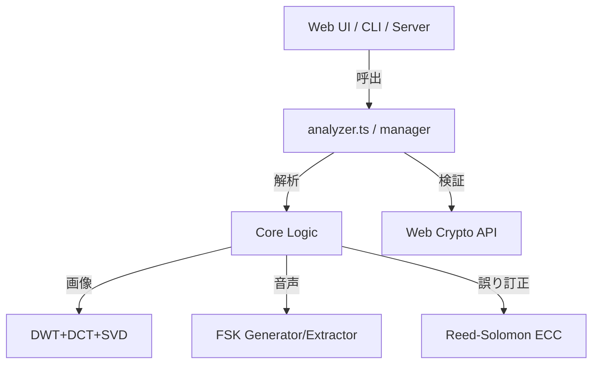

# ts-forensic-watermark

セキュアでアイソモルフィック（環境非依存）な電子透かし（フォレンジック・ウォーターマーク）ライブラリです。
「画像」「動画」「音声」の各種メディアに対して、堅牢で改ざん耐性のある透かしを埋め込むことができます。

## 💡 設計思想：ライブラリ・ファースト

本プロジェクトでは、すべてのビジネスロジック（透かしの生成、署名、抽出、検証）をライブラリ側にカプセル化しています。WEB UI（Reactなど）は単なるインターフェースに過ぎず、コアロジックはブラウザ、Node.jsサーバー、CLIツールのどこでも同一の関数で動作するアイソモルフィックな設計を採用しています。

---

## 🚀 主な機能

- **[画像] 空間周波数ベースのフォレンジック透かし**: DWT + DCT + SVD を組み合わせた、非可逆圧縮（JPEG等）や劣化に強い不可視透かし。
- **[動画・音声] FSKオーディオ透かし**: 17kHz〜19kHzの高周波帯域にFSK（周波数偏移変調）を用いてデータを重畳。マイク録音（アナログ・ホール）耐性も備えた高堅牢な技術。
- **[共通] メタデータ署名 (HMAC-SHA256)**: 透かしデータが改ざんされていないことを数学的に証明。
- **[共通] リード・ソロモン符号 (ECC)**: ノイズで一部のデータが破損しても、エラー訂正によりペイロードを自己復元。

---

## 📖 導入ガイド：初心者でもわかる埋め込み・検証フロー

本ライブラリは、単一の関数を呼ぶだけでなく、データ生成から合成までの「パイプライン処理」を意識して設計されています。以下の3ステップに従うだけで、安全な透かしシステムを構築できます。

### Step 1: 署名とペイロードの生成 (Signing)

埋め込みたいメタデータ（User IDや注文番号など）から、透かし用のデータを一括生成します。

> [!IMPORTANT]
> **⚠️ 22バイトの制約について**
> 高度フォレンジック透かしとFSK音声透かしは、物理的な信号の限界とエラー訂正能力のバランスから、ペイロード容量が **22バイト** に固定されています。
> 本ライブラリでは **「6文字のセッションID」+「16文字のHMAC署名」** の計22文字を標準セットとして生成します。これにより、短いデータでも改ざん検知が可能です。

### Step 2: メディアへの埋め込み (Embedding Pipeline)

生成したデータをメディアに焼き込みます。画像の場合は「二重の防御」を行うパイプラインが推奨されます。

#### 【画像の場合】
ピクセルデータへの書き込みと、ファイル末尾への署名付きJSON追記の2段階を適用します。

```typescript
import { embedImageWatermarks, finalizeImageBuffer } from 'ts-forensic-watermark';

// 1. [ピクセルに書く] 
embedImageWatermarks(imageData, payloads.securePayload);

// 2. [バイナリ末尾に書く]
const finalBuffer = finalizeImageBuffer(originalBuffer, payloads.jsonString);
```

### Step 3: 解析と検証 (Verification)

受け取ったファイルからデータを抽出し、秘密鍵を使って署名が正しいかを確認します。

```typescript
import { analyzeTextWatermarks, verifyWatermarks } from 'ts-forensic-watermark';

// 1. ファイルをスキャンして透かしデータを見つける（自動判別）
const foundWMs = analyzeTextWatermarks(fileUint8Array);

// 2. 署名の検証を一括チェック
const results = await verifyWatermarks(foundWMs, secretKey);
```

---

## 🔀 パイプライン関数リファレンス

複雑な処理を簡潔に記述するための高レベルAPI群です。

### 1. `generateWatermarkPayloads(metadata, secretKey)`
透かしに必要な全ての署名済みペイロードを一括生成します。
- **引数**:
  - `metadata`: `{ userId, sessionId, ... }` の形式のオブジェクト。
  - `secretKey`: HMAC署名に使用する秘密鍵。
- **戻り値**:
  - `jsonString`: ファイル末尾（EOF）やSEIメタデータに使用する署名済みJSON文字列。
  - `securePayload`: フォレンジック/FSKで使用する22バイトのセキュア文字列。

### 2. `embedImageWatermarks(imageData, securePayload, options)`
画像ピクセルデータへの書き込みを行います。
- **役割**: `ImageData` オブジェクトを直接書き換え、不可視のフォレンジック透かしを埋め込みます。

### 3. `finalizeImageBuffer(buffer, jsonMetadata)`
ファイルのバイナリに最終的なメタデータを付加します。
- **役割**: 生成された画像のバイナリ（Uint8Array）の末尾に、署名済みメタデータを追記し、完成したファイルデータを返します。

### 4. `verifyWatermarks(watermarks, secretKey)`
抽出されたすべての透かし情報の真正性を一括で検証します。
- **役割**: 各透かしが JSON署名形式か 22バイトセキュア形式かを自動判別し、HMAC検証を実行。検証結果（valid/message）を付加した配列を取得できます。

---

## ⚙️ 詳細パラメータリファレンス

### 1. 高度フォレンジック透かし (`ForensicOptions`)
| パラメータ | 型 | デフォルト | 説明 |
| :--- | :--- | :--- | :--- |
| `delta` | number | `120` | 透かしの強度。高くすると耐性が上がりますがノイズが増えます。 |
| `varianceThreshold` | number | `25` | 埋め込み場所の選定基準。低いほど平坦な場所にも埋め込みます。 |
| `arnoldIterations` | number | `7` | 空間変換の反復回数。抽出時にも一致させる必要があります。 |
| `force` | boolean | `false` | 画像の特性に関わらず強制的に埋め込みます。 |
| `robustAngles` | number[] | `[0]` | **[NEW]** 抽出時に試行する回転角度リスト。`[0, 90, 180, 270, 0.5, -0.5]` 等を指定することで、回転や微小な傾きに対しても透かしを検出可能になります。 |

> [!TIP]
> **回転耐性 (Multi-angle Scan) について**
> 本ライブラリは、指定された角度リストに基づいて画像を動的に回転させながら解析を行います。90/180/270度は高速なビット反転で、0.5度などの微小な傾きは **バイリニア補間** を用いた高精度な回転処理で対応します。

### 2. FSK 音響透かし (`FskOptions`)
| パラメータ | 型 | デフォルト | 説明 |
| :--- | :--- | :--- | :--- |
| `amplitude` | number | `2000` | 信号の振幅（音量）。AAC圧縮耐性を高めるには 2000-5000 を推奨。 |
| `sampleRate` | number | `44100` | サンプリングレート。 |
| `bitDuration` | number | `0.025` | 1ビットあたりの秒数。 |
| `freqZero` | number | `18000` | ビット「0」の周波数(Hz)。 |
| `freqOne` | number | `19000` | ビット「1」の周波数(Hz)。 |
| `freqSync` | number | `17000` | 同期信号の周波数(Hz)。 |

---

## 📚 各透かし技術の背景とメリット・デメリット

### 1. 高度フォレンジック透かし (DWT + DCT + SVD)
* **背景・技術的詳細**: 
  * **多重変換プロセス**: 画像を **YCrCb** 色空間に変換し、輝度（Y）成分に対して **DWT (離散ウェーブレット変換)** を行い、画像を4つの周波数帯域（LL, LH, HL, HH）に分解します。さらに重要な低域/中域成分である LH バンドに対して **8x8ブロック単位の DCT (離散コサイン変換)** を適用し、その係数行列に対して **SVD (特異値分解)** を実行します。
  * **埋め込みアルゴリズム**: 分解された特異値（Singular Values）行列 $S$ の最大値に対して、透かしのビット情報を量子化（QIM: Quantization Index Modulation）処理により刻み込みます。
  * **自己修復**: 22バイトのペイロードに 8バイトのパリティを付与した **リード・ソロモン誤り訂正 (ECC)** を適用し、自己復旧を可能にしています。
* **メリット**: JPEG圧縮、リサイズ、ノイズ追加、色調補正などの画像加工や劣化に対して、耐性があります。
* **デメリット**: 行列演算を多用するため、大容量画像の処理にはデバイスのリソースを消費します。

### 2. FSK音響透かし (Audio Watermarking)
* **背景・技術的詳細**: 
  * **伝送・変調方式**: デジタルデータを周波数の切り替えで表現する **FSK (Frequency-Shift Keying)** 方式を採用。
  * **FFT解析による抽出**: 音声信号を **FFT (高速フーリエ変換)** し、各時間窓における特定周波数のエネルギーピークを解析してビット列を復元します。
  * **リード・ソロモンによる信頼性**: 録音時のノイズや音飛びに対処するため、強力な誤り訂正を標準搭載しています。
* **メリット**: スピーカー再生音の録音（アナログ再録）に対しても、信号の特徴が残るため追跡可能です。
* **デメリット**: SNS等の動画圧縮プロセスで高帯域（16kHz以上）を遮断するローパスフィルタが適用されると、消失します。

### 3. EOE (End Of File) メタデータ追記
* **背景・技術的詳細**: ファイルバイナリの終端パターンの後に、HMAC署名付きのJSONデータを直接追記します。デコーダが EOF 以降のデータを無視する仕様を悪用しています。
* **メリット**: 高速、大容量、メディア品質への影響ゼロ。
* **デメリット**: 最も「脆い」透かしであり、再保存や形式変換で容易に消滅します。

### 4. H.264 SEI / MP4 UUID Box
* **背景・技術的詳細**: ビデオストリーム（NALユニット）やMP4コンテナの規格化された拡張領域に情報を注入します。
* **メリット**: メディアプレイヤーとの高い互換性。
* **デメリット**: SNSアップロード時の再エンコード（トランスコード）で破棄されるのが一般的です。

---

## ⚠️ 運用上の注意点と制限事項

- **バイト制限とID長のトレードオフ**: 
  - フォレンジック/FSKは堅牢性維持のため **22バイト** 固定です。
  - デフォルトでは **「6文字のID + 16文字のHMAC署名」** という内訳ですが、ライブラリのオプションで ID 長を変更可能です。
  - **重要（デメリット）**: ID 長を長くする（例: 10文字にする）と、その分 HMAC 署名の長さが短くなります（12文字に減少）。署名が短くなると、数学的な衝突確率が上がり、改ざん検知の信頼性が相対的に低下します。特別な理由がない限り、デフォルトの 6文字設定を推奨します。
  - **整合性の維持**: 埋め込み時と検証時で **同じ ID 長設定** を使用する必要があります。設定が一致しない場合、たとえデータが正しくても検証に失敗します。
- **秘密鍵の保管**: `secretKey` を紛失すると検証不可。安全な保管が必須です。
- **多層防御の推奨**: 高解像度での真正性には EOF、劣化耐性には Forensic というように、複数の技術を併用することを強く推奨します。

---

## 🏗 アーキテクチャ構成



## ライセンス
MIT License
