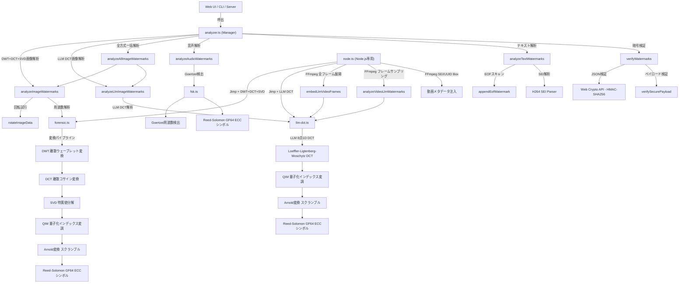

# ts-forensic-watermark

セキュアでアイソモルフィック（環境非依存）な電子透かし（フォレンジック・ウォーターマーク）ライブラリです。
「画像」「動画」「音声」の各種メディアに対して、堅牢で改ざん耐性のある透かしを埋め込むことができます。

---

## 目次

1. [インストール](#インストール)
2. [クイックスタート](#クイックスタート)
3. [inputBuffer はどこから来るか？](#inputbuffer-はどこから来るか)
   - [ファイルパス指定（Node.js）](#1-ファイルパス指定nodejs)
   - [URL指定（Node.js）](#2-url指定nodejs)
   - [URLから画像を読み込む（ブラウザ）](#3-urlから画像を読み込むブラウザ)
   - [ローカルファイルの選択（ブラウザ）](#4-ローカルファイルの選択ブラウザ)
4. [高レベルAPI 全機能ガイド](#高レベルapi-全機能ガイド)
   - [generateWatermarkPayloads — 署名済ペイロード生成](#1-generatewatermarkpayloads--署名済ペイロード生成)
   - [embedImageWatermarks — 画像ピクセルへの埋め込み](#2-embedimagewatermarks--画像ピクセルへの埋め込み)
   - [finalizeImageBuffer — EOFメタデータ追記](#3-finalizeimagebuffer--eofメタデータ追記)
   - [analyzeTextWatermarks — テキスト系透かしの自動解析](#4-analyzetextwatermarks--テキスト系透かしの自動解析)
   - [analyzeAudioWatermarks — FSK音声透かしの解析](#5-analyzeaudiowatermarks--fsk音声透かしの解析)
   - [analyzeImageWatermarks — 画像フォレンジック解析](#6-analyzeimagewatermarks--画像フォレンジック解析)
   - [verifyWatermarks — 暗号署名の一括検証](#7-verifywatermarks--暗号署名の一括検証)
   - [embedLlmImageWatermark — LLM DCTフレーム透かしの埋め込み](#8-embedllmimagewatermark--llm-dctフレーム透かしの埋め込み)
   - [analyzeLlmImageWatermarks — LLM DCTフレーム透かしの解析](#9-analyzellmimagewatermarks--llm-dctフレーム透かしの解析)
   - [analyzeAllImageWatermarks — 全透かし方式で画像を一括解析](#10-analyzeallImagewatermarks--全透かし方式で画像を一括解析)
5. [Node.js専用ヘルパーAPI](#nodejs専用ヘルパーapi)
   - [embedForensicImage — 画像ファイルへの直接埋め込み](#embedforensicimage--画像ファイルへの直接埋め込み)
   - [extractForensicImage — 画像ファイルからの直接抽出](#extractforensicimage--画像ファイルからの直接抽出)
   - [embedLlmVideoFile — 静止画フレームへの LLM DCT 埋め込み](#embedllmvideofile--静止画フレームへの-llm-dct-埋め込み)
   - [extractLlmVideoFile — 静止画フレームからの LLM DCT 抽出](#extractllmvideofile--静止画フレームからの-llm-dct-抽出)
   - [embedLlmVideoFrames — 動画ファイル全フレームへの LLM DCT 埋め込み](#embedllmvideoframes--動画ファイル全フレームへの-llm-dct-埋め込み)
   - [extractLlmVideoFrames — 動画ファイルからの LLM DCT 抽出](#extractllmvideoframes--動画ファイルからの-llm-dct-抽出)
   - [analyzeVideoLlmWatermarks — 動画の一括解析・署名検証対応](#analyzevideollmwatermarks--動画の一括解析署名検証対応)
   - [embedVideoWatermark — 動画ファイルへの透かし注入](#embedvideowatermark--動画ファイルへの透かし注入)
6. [ローレベルAPI リファレンス](#ローレベルapi-リファレンス)
   - [画像コア (forensic.ts)](#画像コア-forensicts)
   - [音声コア (fsk.ts)](#音声コア-fskts)
   - [LLM DCT フレームコア (llm-dct.ts)](#llm-dct-フレームコア-llm-dctts)
   - [ユーティリティ (utils.ts)](#ユーティリティ-utilsts)
7. [パラメータ詳細リファレンス](#パラメータ詳細リファレンス)
8. [テクニカルバックグラウンド](#テクニカルバックグラウンド)
   - [1. 高度フォレンジック透かし：DWT + DCT + SVD + QIM](#1-高度フォレンジック透かしdwt--dct--svd--qim)
   - [2. Reed-Solomon誤り訂正符号（ECC）](#2-reed-solomon誤り訂正符号ecc)
   - [3. FSK（周波数偏移変調）音響透かし](#3-fsk周波数偏移変調音響透かし)
   - [4. HMAC-SHA256による改ざん検知](#4-hmac-sha256による改ざん検知)
   - [5. Arnold変換（空間スクランブル）](#5-arnold変換空間スクランブル)
   - [6. 同期マーカー（16ビット）](#6-同期マーカー16ビット)
   - [7. EOFメタデータ追記](#7-eofメタデータ追記ファイル末尾への平文埋め込み)
   - [8. MP4 UUID Box](#8-mp4-uuid-boxコンテナへのメタデータ注入)
   - [9. H.264 SEI（ビデオストリームへのユーザーデータ注入）](#9-h264-seiビデオストリームへのユーザーデータ注入)
   - [10. LLM DCTフレーム透かし（8点離散コサイン変換による動画フレーム埋め込み）](#10-llm-dctフレーム透かし8点離散コサイン変換による動画フレーム埋め込み)
9. [運用上の注意点とトレードオフ](#運用上の注意点とトレードオフ)
10. [アーキテクチャ構成](#アーキテクチャ構成)
11. [WEB UI 使い方ガイド](#web-ui-使い方ガイド)
12. [透かし方式の使い分けガイド](#透かし方式の使い分けガイド)

---

## 🗺️ 透かし方式の使い分けガイド

どの透かし方式を選ぶべきか迷ったときはこのガイドを参照してください。

### メディア別・推奨パターン一覧

| メディア | 推奨方式 | 理由 |
| :--- | :--- | :--- |
| **写真・自然画像（PNG/JPG）** | DWT+DCT+SVD（`embedImageWatermarks`） | 自然画像の複雑なテクスチャ構造を活かして透かしを隠蔽できる。JPEG圧縮・リサイズ耐性が高い |
| **単色・グラフ・スクリーンショット** | LLM DCT（`embedLlmImageWatermark`）| 平坦な画像でも均一にDCT係数を変調できる |
| **動画（全フレームに映像透かし）** | LLM DCT フレーム処理（`embedLlmVideoFrames`） | 全フレームに独立した透かしを埋め込むため、部分切り出し・スクリーンキャプチャにも耐性がある |
| **動画（音声チャンネル経由）** | FSK（`generateFskBuffer` + FFmpeg） | 映像を一切再エンコードせずに透かしを付与できる。処理が軽い |
| **動画（最大堅牢性）** | LLM DCT フレーム + FSK 音声（同時適用） | 映像・音声の両方に独立した透かしが入るため、映像トリミング・ミュートなど片方への攻撃に強い |
| **音声ファイル（MP3/WAV）** | FSK（`generateFskBuffer` + FFmpeg） | アナログ録音（スマホで再生音を録音）にも耐性がある唯一の方式 |

### ❗ 同時適用してはいけない組み合わせ

| 組み合わせ | 理由 |
| :--- | :--- |
| **DWT+DCT+SVD と LLM DCT（同一画像に同時適用）** | 両方とも同じピクセル領域を変調するため互いに干渉し、どちらも正しく抽出できなくなる可能性がある |

### 方式別・強み・弱みの比較

| 方式 | 強み | 弱み | 環境 |
| :--- | :--- | :--- | :--- |
| DWT+DCT+SVD | 自然画像への高い隠蔽性・JPEG圧縮耐性 | 平坦な画像では埋め込み箇所が少ない | ブラウザ/Node.js |
| LLM DCT | 動画・均質画像への安定した埋め込み・H.264耐性 | 自然画像では DWT+DCT+SVD の方が隠蔽性が高い | ブラウザ/Node.js |
| FSK | アナログ録音耐性・AAC/MP4圧縮耐性・軽量 | 映像トリミング（動画の音声部分を削除）に弱い | ブラウザ/Node.js |
| EOF/UUID Box | 実装が単純・メタデータの完全保持 | 再エンコード・リセーブで消える（脆弱） | ブラウザ/Node.js |

---

## 💡 設計思想：ライブラリ・ファースト

すべてのビジネスロジック（透かしの生成、署名、抽出、検証）をライブラリ側にカプセル化しています。WEB UI（Reactなど）は単なるインターフェースに過ぎず、コアロジックはブラウザ・Node.jsサーバー・CLIツールのどこでも同一の関数で動作するアイソモルフィックな設計を採用しています。

---

## 🚀 主な機能

| カテゴリ | 技術 | 堅牢性 |
| :--- | :--- | :--- |
| **[画像]** 周波数ベースフォレンジック透かし | DWT + DCT + SVD + QIM | 高（JPEG圧縮・リサイズ耐性）|
| **[動画フレーム]** LLM DCTフレーム透かし | LLM 8点1D DCT + QIM + Reed-Solomon | 高（H.264/H.265圧縮耐性・多重冗長）|
| **[音声・動画]** FSK音響透かし | 周波数偏移変調 (14〜16kHz) + Goertzel | 高（アナログ録音耐性・AAC圧縮耐性）|
| **[共通]** メタデータ署名 | HMAC-SHA256 (Web Crypto API) | 改ざん検知 |
| **[共通]** 誤り訂正 | リード・ソロモン符号 (ECC) | 自己修復 |
| **[共通]** 空間スクランブル | Arnold変換 | 解析耐性 |

---

## インストール

```bash
npm install ts-forensic-watermark
```

`jimp`・`ffmpeg-static`・`fluent-ffmpeg` は `dependencies` に含まれており、上記コマンドだけで自動的にインストールされます。

### エントリーポイントの自動切り替え

このパッケージは環境に応じて自動的に適切なエントリーポイントが選択されます。

| 環境 | 使用されるファイル | 含まれる機能 |
| :--- | :--- | :--- |
| Node.js (`require` / `import`) | `dist/index.js` | 全機能（Node.jsヘルパー含む） |
| ブラウザバンドラー（Vite・webpack等） | `dist/browser.js` | ブラウザセーフな関数のみ |

Vite・webpack・Rollupなどのバンドラーは `package.json` の `"browser"` フィールドを自動的に参照し、`dist/browser.js`（`fs`・`jimp`・FFmpegへの依存を含まない）を使用します。**ブラウザコードでは `import` の書き方を変える必要はありません。**

```typescript
// ブラウザでもNode.jsでも同じ書き方でOK
import { embedImageWatermarks, generateWatermarkPayloads } from 'ts-forensic-watermark';

// ブラウザからNode.js専用ヘルパーをimportしようとするとバンドラーが警告を出します
// import { embedForensicImage } from 'ts-forensic-watermark'; // ← ブラウザでは使用不可
```

---

## クイックスタート

### Node.js — ファイルパスから画像に透かしを埋め込む（最短例）

```typescript
import * as fs from 'fs';
import { embedForensicImage, extractForensicImage, generateWatermarkPayloads } from 'ts-forensic-watermark';

async function main() {
  const secretKey = "my-secret-key-2024";

  // 1. ペイロード生成（透かしに埋め込むデータと署名）
  const payloads = await generateWatermarkPayloads(
    { userId: "user_001", sessionId: "TX1234" },
    secretKey
  );
  console.log("埋め込むペイロード:", payloads.securePayload); // 例: "TX1234a3f9b2..."

  // 2. 入力ファイルをBufferとして読み込む
  const inputBuffer = fs.readFileSync('./input.jpg');

  // 3. 透かしを埋め込んで出力（内部でJimpを使用）
  const outputBuffer = await embedForensicImage(inputBuffer, payloads.securePayload);
  fs.writeFileSync('./output.png', outputBuffer);
  console.log("透かし埋め込み完了: output.png");

  // 4. 検証：埋め込まれた透かしを抽出して確認
  const result = await extractForensicImage(outputBuffer);
  console.log("抽出結果:", result?.payload);  // "TX1234a3f9b2..."
  console.log("信頼度:", result?.confidence); // 0〜100
}

main().catch(console.error);
```

### Node.js — URLから画像を取得して透かしを埋め込む

```typescript
import * as https from 'https';
import * as fs from 'fs';
import { embedForensicImage, generateWatermarkPayloads } from 'ts-forensic-watermark';

// URLからBufferを取得するヘルパー関数
function fetchBuffer(url: string): Promise<Buffer> {
  return new Promise((resolve, reject) => {
    https.get(url, (res) => {
      const chunks: Buffer[] = [];
      res.on('data', (chunk) => chunks.push(chunk));
      res.on('end', () => resolve(Buffer.concat(chunks)));
      res.on('error', reject);
    }).on('error', reject);
  });
}

async function main() {
  const secretKey = "my-secret-key-2024";
  const imageUrl = "https://example.com/photo.jpg"; // ← ここを変更

  // URLから画像を取得（これが inputBuffer になります）
  const inputBuffer = await fetchBuffer(imageUrl);

  const payloads = await generateWatermarkPayloads(
    { userId: "user_002", sessionId: "TX5678" },
    secretKey
  );

  const outputBuffer = await embedForensicImage(inputBuffer, payloads.securePayload);
  fs.writeFileSync('./watermarked.png', outputBuffer);
  console.log("完了: watermarked.png");
}

main();
```

### ブラウザ — ファイルアップロードから画像に透かしを埋め込む

```html
<input type="file" id="fileInput" accept="image/*">
<canvas id="canvas"></canvas>
<script type="module">
import { embedImageWatermarks, generateWatermarkPayloads } from 'ts-forensic-watermark';

document.getElementById('fileInput').addEventListener('change', async (e) => {
  const file = e.target.files[0];
  const secretKey = "my-secret-key-2024";

  // 1. ペイロード生成
  const payloads = await generateWatermarkPayloads(
    { userId: "user_003", sessionId: "TX9999" },
    secretKey
  );

  // 2. ファイルをCanvasに描画してImageDataを取得（これが inputBuffer 相当）
  const canvas = document.getElementById('canvas');
  const ctx = canvas.getContext('2d');
  const img = new Image();
  const objectUrl = URL.createObjectURL(file);

  img.onload = () => {
    canvas.width = img.width;
    canvas.height = img.height;
    ctx.drawImage(img, 0, 0);

    // ImageData = ピクセルデータの塊（ライブラリへの入力）
    const imageData = ctx.getImageData(0, 0, canvas.width, canvas.height);

    // 3. 透かしを埋め込む（imageDataを直接書き換える）
    embedImageWatermarks(imageData, payloads.securePayload);

    // 4. 書き換えたピクセルをCanvasに反映
    ctx.putImageData(imageData, 0, 0);
    URL.revokeObjectURL(objectUrl);
    console.log("透かし埋め込み完了！Canvasに反映されました");
  };
  img.src = objectUrl;
});
</script>
```

---

## inputBuffer はどこから来るか？

多くのAPIは `Buffer`（Node.js）または `Uint8Array`（ブラウザ）の形式でメディアデータを受け取ります。以下に代表的な入手方法をまとめます。

### 1. ファイルパス指定（Node.js）

最もシンプルな方法です。`fs.readFileSync` または `fs.promises.readFile` を使います。

```typescript
import * as fs from 'fs';

// 同期版
const inputBuffer: Buffer = fs.readFileSync('./path/to/image.jpg');

// 非同期版（推奨）
const inputBuffer: Buffer = await fs.promises.readFile('./path/to/image.jpg');

// そのままライブラリに渡せます
const outputBuffer = await embedForensicImage(inputBuffer, payload);
fs.writeFileSync('./output.png', outputBuffer);
```

### 2. URL指定（Node.js）

Node.js 18以降では `fetch` が標準で使えます。

```typescript
// Node.js 18+ (fetch内蔵)
async function loadFromUrl(url: string): Promise<Buffer> {
  const res = await fetch(url);
  if (!res.ok) throw new Error(`HTTP error: ${res.status}`);
  const arrayBuffer = await res.arrayBuffer();
  return Buffer.from(arrayBuffer);
}

const inputBuffer = await loadFromUrl("https://example.com/photo.jpg");
const outputBuffer = await embedForensicImage(inputBuffer, payload);
```

Node.js 17以下では `https` モジュールか `node-fetch` を使います：

```typescript
// npm install node-fetch
import fetch from 'node-fetch';

const res = await fetch("https://example.com/photo.jpg");
const arrayBuffer = await res.arrayBuffer();
const inputBuffer = Buffer.from(arrayBuffer);
```

### 3. URLから画像を読み込む（ブラウザ）

```typescript
// URLをimgタグ経由でCanvasに描画してピクセルデータを取得
async function loadImageDataFromUrl(url: string): Promise<ImageData> {
  return new Promise((resolve, reject) => {
    const img = new Image();
    img.crossOrigin = "anonymous"; // CORS対応が必要な場合
    img.onload = () => {
      const canvas = document.createElement('canvas');
      canvas.width = img.width;
      canvas.height = img.height;
      const ctx = canvas.getContext('2d')!;
      ctx.drawImage(img, 0, 0);
      resolve(ctx.getImageData(0, 0, img.width, img.height));
    };
    img.onerror = reject;
    img.src = url;
  });
}

const imageData = await loadImageDataFromUrl("https://example.com/photo.jpg");
embedImageWatermarks(imageData, payload);
```

> **Note:** CORSポリシーにより、別オリジンの画像はサーバー側の `Access-Control-Allow-Origin` ヘッダーが必要です。

### 4. ローカルファイルの選択（ブラウザ）

`<input type="file">` でユーザーが選んだファイルを読み込みます。

```typescript
// ファイル選択からArrayBuffer（Uint8Array）を取得
async function loadFromFileInput(file: File): Promise<Uint8Array> {
  const arrayBuffer = await file.arrayBuffer();
  return new Uint8Array(arrayBuffer);
}

// ImageData として取得する場合
async function loadImageDataFromFile(file: File): Promise<{ imageData: ImageData, buffer: Uint8Array }> {
  const buffer = await loadFromFileInput(file);
  const url = URL.createObjectURL(file);

  return new Promise((resolve, reject) => {
    const img = new Image();
    img.onload = () => {
      const canvas = document.createElement('canvas');
      canvas.width = img.width;
      canvas.height = img.height;
      const ctx = canvas.getContext('2d')!;
      ctx.drawImage(img, 0, 0);
      const imageData = ctx.getImageData(0, 0, img.width, img.height);
      URL.revokeObjectURL(url);
      resolve({ imageData, buffer });
    };
    img.onerror = reject;
    img.src = url;
  });
}
```

---

## 高レベルAPI 全機能ガイド

### 1. `generateWatermarkPayloads` — 署名済ペイロード生成

**用途:** 透かしに埋め込むデータを生成します。この関数が出力する2種類のペイロードが、以降の全処理で使われます。

```typescript
import { generateWatermarkPayloads } from 'ts-forensic-watermark';

const payloads = await generateWatermarkPayloads(
  {
    userId: "user_8822",     // 例: ユーザーID
    sessionId: "TX9901",     // 必須: セッションID（フォレンジック透かしに使用）
    // 任意のフィールドを追加可能（EOFメタデータに含まれます）
    orderId: "ORDER-001",
    planType: "premium"
  },
  "your-secret-key",         // 秘密鍵（HMAC署名に使用）
  6                          // secureIdLength: sessionIdの先頭何文字を使うか（デフォルト: 6）
);

// 出力:
console.log(payloads.jsonString);
// '{"userId":"user_8822","sessionId":"TX9901","orderId":"ORDER-001","planType":"premium",
//   "timestamp":"2024-01-01T00:00:00.000Z","signature":"a3f9b2..."}'
// → EOFメタデータや動画SEIへの埋め込みに使用

console.log(payloads.securePayload);
// 'TX9901a3f9b2c841d5ef97' （22バイト固定）
// → フォレンジック画像透かしやFSK音声透かしへの埋め込みに使用

console.log(payloads.json);
// Object形式のメタデータ（パースされたjsonStringと同一）
```

**securePayload の構造:**
```
[ sessionIdの先頭6文字 ][ HMACの先頭16文字 ]
     TX9901              a3f9b2c841d5ef97
|←── 6バイト ──→|←──────── 16バイト ────────→|
|←───────────── 合計22バイト ─────────────────→|
```

---

### 2. `embedImageWatermarks` — 画像ピクセルへの埋め込み

**用途:** ImageDataのピクセルに対して不可視の周波数透かしを書き込みます。**imageDataオブジェクトを直接書き換えます。**

```typescript
import { embedImageWatermarks } from 'ts-forensic-watermark';

// imageData は Canvas API や Jimp から取得したもの
embedImageWatermarks(
  imageData,                   // ImageData / ImageDataLike オブジェクト（書き換えられます）
  payloads.securePayload,      // 22バイトのペイロード文字列
  {
    delta: 120,                // 彫りの深さ（圧縮耐性と視認性のバランス）
    varianceThreshold: 25,     // 埋め込む領域の選択しきい値
    arnoldIterations: 7        // スクランブル強度（抽出時と一致させること）
  }
);
// 戻り値なし。imageData.data が直接書き換わります。
```

**注意:** この関数はImageDataを直接変更します。変更後にCanvasに `putImageData` したり、Jimpでエンコードしたりする必要があります。

#### ブラウザでの完全な使用例

```typescript
// ブラウザ: 埋め込み後にCanvasからPNGダウンロード
async function embedAndDownload(file: File, userId: string, sessionId: string) {
  const secretKey = "my-secret-key";
  const payloads = await generateWatermarkPayloads({ userId, sessionId }, secretKey);

  // Canvas経由でImageData取得
  const img = new Image();
  img.src = URL.createObjectURL(file);
  await new Promise(r => img.onload = r);

  const canvas = document.createElement('canvas');
  canvas.width = img.width;
  canvas.height = img.height;
  const ctx = canvas.getContext('2d')!;
  ctx.drawImage(img, 0, 0);
  const imageData = ctx.getImageData(0, 0, img.width, img.height);

  // 透かし埋め込み（imageDataを直接書き換える）
  embedImageWatermarks(imageData, payloads.securePayload);

  // 書き換え後のピクセルをCanvasに反映
  ctx.putImageData(imageData, 0, 0);

  // PNGとしてダウンロード
  canvas.toBlob((blob) => {
    const a = document.createElement('a');
    a.href = URL.createObjectURL(blob!);
    a.download = 'watermarked.png';
    a.click();
  }, 'image/png');
}
```

---

### 3. `finalizeImageBuffer` — EOFメタデータ追記

**用途:** 画像バイナリの末尾に、署名済JSONメタデータを平文で追記します。JPEG/PNGのデコーダーは末尾の余分なデータを無視するため、画像として正常に表示されます。堅牢性は低いですが、メタデータが文字列として保存されます。

```typescript
import { finalizeImageBuffer } from 'ts-forensic-watermark';

// Node.js例: ファイルから読み込んでEOFに追記して保存
import * as fs from 'fs';

const originalBuffer = new Uint8Array(fs.readFileSync('./input.jpg'));

const finalBuffer = finalizeImageBuffer(
  originalBuffer,          // 元ファイルのUint8Array
  payloads.jsonString      // JSON文字列 または オブジェクト（自動でJSON.stringifyされます）
);

fs.writeFileSync('./output_with_eof.jpg', finalBuffer);

// 埋め込まれる末尾データの形式（人間が読めます）:
// ---WATERMARK_START---
// {"userId":"user_8822","sessionId":"TX9901",...,"signature":"a3f9b2..."}
// ---WATERMARK_END---
```

**画像透かしの多層防御パターン（推奨）:**

```typescript
// ピクセル透かし（不可視・高堅牢）+ EOFメタデータ（平文・低堅牢）の組み合わせ
embedImageWatermarks(imageData, payloads.securePayload); // ピクセルを書き換え

// Canvasから新しいバッファを取得
const newBuffer = ...; // canvas.toBlob() や Jimp.getBuffer() で取得

// EOFにメタデータを追記
const finalBuffer = finalizeImageBuffer(new Uint8Array(newBuffer), payloads.jsonString);
```

---

### 4. `analyzeTextWatermarks` — テキスト系透かしの自動解析

**用途:** バイナリファイルから、EOF・MP4 UUID Box・H.264 SEIの3種類のテキスト系透かしを自動スキャンします。ブラウザ・Node.jsどちらでも動作します。

```typescript
import { analyzeTextWatermarks } from 'ts-forensic-watermark';
import * as fs from 'fs';

// ファイルを読み込んでスキャン
const fileBuffer = new Uint8Array(fs.readFileSync('./suspicious_video.mp4'));
const watermarks = analyzeTextWatermarks(fileBuffer);

// 検出結果の例:
// [
//   {
//     type: 'EOF',
//     name: 'ファイル末尾メタデータ (EOF)',
//     robustness: 'Low (脆弱)',
//     data: { userId: "user_8822", sessionId: "TX9901", signature: "a3f9b2..." }
//   },
//   {
//     type: 'H264_SEI',
//     name: 'ビデオストリーム (H.264 SEI)',
//     robustness: 'High (堅牢)',
//     data: { userId: "user_8822", ... }
//   }
// ]

watermarks.forEach(wm => {
  console.log(`検出: ${wm.name}`);
  console.log(`  種類: ${wm.type}`);
  console.log(`  堅牢性: ${wm.robustness}`);
  console.log(`  データ:`, wm.data);
});
```

**検出できる透かしの種類:**

| type | 説明 | 堅牢性 |
| :--- | :--- | :--- |
| `EOF` | ファイル末尾の `---WATERMARK_START---` マーカー | 低（削除・改ざん容易）|
| `UUID_BOX` | MP4ファイル内のUUID Boxコンテナ | 低（ビットレートによっては残る）|
| `H264_SEI` | H.264ビデオストリームのSEIユニット | 高（再エンコードなしなら残る）|

---

### 5. `analyzeAudioWatermarks` — FSK音声透かしの解析

**用途:** Float32Arrayの音声サンプルデータから、FSK透かしを抽出します。WebAudio APIやAudioContextと組み合わせて使います。

```typescript
import { analyzeAudioWatermarks } from 'ts-forensic-watermark';

// ブラウザ: AudioContext経由でFloat32Arrayを取得
async function analyzeAudioFile(file: File) {
  const audioContext = new AudioContext();
  const arrayBuffer = await file.arrayBuffer();
  const audioBuffer = await audioContext.decodeAudioData(arrayBuffer);

  // モノラルまたはステレオの最初のチャンネルを取得
  const channelData: Float32Array = audioBuffer.getChannelData(0);

  // FSK透かしを解析
  const watermarks = analyzeAudioWatermarks(channelData, {
    sampleRate: audioBuffer.sampleRate  // サンプルレートを明示的に指定
  });

  watermarks.forEach(wm => {
    console.log(`FSK検出: ${wm.data.payload}`); // 例: "TX9901a3f9b2..."
  });

  return watermarks;
}
```

```typescript
// Node.js: wav パッケージを使った例
// npm install wav
import * as fs from 'fs';
import * as wav from 'wav'; // @types/wavが必要

function readWavFile(filePath: string): Promise<{ channelData: Float32Array, sampleRate: number }> {
  return new Promise((resolve, reject) => {
    const reader = new wav.Reader();
    const chunks: Buffer[] = [];

    reader.on('format', (format) => {
      reader.on('data', (chunk: Buffer) => chunks.push(chunk));
      reader.on('end', () => {
        const raw = Buffer.concat(chunks);
        const samples = new Float32Array(raw.length / 2);
        for (let i = 0; i < samples.length; i++) {
          samples[i] = raw.readInt16LE(i * 2) / 32768;
        }
        resolve({ channelData: samples, sampleRate: format.sampleRate });
      });
    });

    reader.on('error', reject);
    fs.createReadStream(filePath).pipe(reader);
  });
}

const { channelData, sampleRate } = await readWavFile('./audio_with_watermark.wav');
const watermarks = analyzeAudioWatermarks(channelData, { sampleRate });
```

---

### 6. `analyzeImageWatermarks` — 画像フォレンジック解析

**用途:** ImageDataからDWT+DCT+SVDフォレンジック透かしを抽出します。回転耐性のために複数の角度を試行できます。

```typescript
import { analyzeImageWatermarks } from 'ts-forensic-watermark';

// imageData は Canvas API や Jimp から取得
const watermarks = analyzeImageWatermarks(imageData, {
  delta: 120,
  arnoldIterations: 7,
  robustAngles: [0, 90, 180, 270, 0.5, -0.5, 1, -1, 2, -2, 3, -3]  // 試行する回転角度（複数指定可）
});

watermarks.forEach(wm => {
  console.log(`フォレンジック検出: ${wm.data.payload}`);
  console.log(`信頼度: ${wm.data.confidence.toFixed(1)}%`);
  console.log(`検出角度: ${wm.data.angle}度`);
});
```

**robustAnglesの使い方:**
- `[0]` — デフォルト。回転なしのみ試行（高速）
- `[0, 90, 180, 270]` — 直角回転にも対応（やや遅い）
- `[0, 90, 180, 270, 0.5, -0.5, 1, -1]` — わずかな傾き（スキャナ程度）にも対応
- `[0, 90, 180, 270, 0.5, -0.5, 1, -1, 2, -2, 3, -3]` — **推奨**。スマホで画面撮影した漏洩写真など±3°以内の傾きに対応（低速だが高耐性）

> **注意:** 角度ごとに抽出を1回実行します。成功した時点で即座に終了するため、先頭に `0` を置いて無回転を最初に試行するのが効率的です。±5°以上の任意角度は DCT ブロック境界の乱れが大きく、Reed-Solomon 訂正能力を超える場合があります。

---

### 7. `verifyWatermarks` — 暗号署名の一括検証

**用途:** `analyzeTextWatermarks` 等で検出した透かしを、HMACで暗号学的に検証します。

```typescript
import { analyzeTextWatermarks, analyzeImageWatermarks, verifyWatermarks } from 'ts-forensic-watermark';
import * as fs from 'fs';

const secretKey = "my-secret-key-2024";

// ファイル系透かしの解析と検証
const fileBuffer = new Uint8Array(fs.readFileSync('./output.mp4'));
const textWatermarks = analyzeTextWatermarks(fileBuffer);
const verifiedText = await verifyWatermarks(textWatermarks, secretKey, 6);

// 画像フォレンジック透かしの解析と検証
const imageWatermarks = analyzeImageWatermarks(imageData, { delta: 120 });
const verifiedImage = await verifyWatermarks(imageWatermarks, secretKey, 6);

// 全透かしを結合して検証
const allWatermarks = [...textWatermarks, ...imageWatermarks];
const results = await verifyWatermarks(allWatermarks, secretKey, 6);

// 結果の確認
results.forEach(wm => {
  const isValid = wm.verification?.valid;
  console.log(`[${wm.type}] ${isValid ? '✅ 正規データ' : '❌ 改ざん検知/不正'}`);
  console.log(`  メッセージ: ${wm.verification?.message}`);
  if (wm.data.userId) console.log(`  ユーザーID: ${wm.data.userId}`);
});
```

**検証ロジックの使い分け:**

| 透かし種別 | 検証方式 | 対象フィールド |
| :--- | :--- | :--- |
| `EOF`, `UUID_BOX`, `H264_SEI` | JSON署名 (HMAC-SHA256 over `userId:sessionId`) | `userId`, `sessionId` |
| `AUDIO_FSK`, `FORENSIC`, `LLM_VIDEO` | セキュアペイロード (HMAC) | ペイロード全体 |

---

### 8. `embedLlmImageWatermark` — LLM DCT画像・フレーム透かしの埋め込み

**用途:** `ImageData`（ブラウザ Canvas または Node.js canvas ポリフィルの取得値）に LLM DCT 透かしを直接埋め込みます。`embedImageWatermarks`（DWT+DCT+SVD）の LLM 版に相当します。

```typescript
import { embedLlmImageWatermark, generateWatermarkPayloads } from 'ts-forensic-watermark';

const payloads = await generateWatermarkPayloads(
  { userId: "user_001", sessionId: "TX9901" },
  "my-secret-key-2024"
);

// ブラウザ例: Canvas から ImageData を取得して埋め込み
const canvas = document.createElement('canvas');
const ctx = canvas.getContext('2d');
ctx.drawImage(videoFrame, 0, 0);
const imageData = ctx.getImageData(0, 0, canvas.width, canvas.height);

embedLlmImageWatermark(imageData, payloads.securePayload, {
  quantStep: 300,       // 量子化ステップ（推奨: 300）
  coeffRow: 2,          // DCT係数位置・行
  coeffCol: 1,          // DCT係数位置・列
  arnoldIterations: 7,  // スクランブル強度
  payloadSymbols: 22,   // データシンボル数
});

ctx.putImageData(imageData, 0, 0); // 書き換え後のフレームを反映
```

---

### 9. `analyzeLlmImageWatermarks` — LLM DCT画像・フレーム透かしの解析

**用途:** `ImageData` から LLM DCT 透かしを解析・抽出し、`DetectedWatermark[]` 形式で返します。`analyzeImageWatermarks`（DWT+DCT+SVD）の LLM 版に相当します。

```typescript
import { analyzeLlmImageWatermarks, verifyWatermarks } from 'ts-forensic-watermark';

// ブラウザ例: Canvas から ImageData を取得して解析
const imageData = ctx.getImageData(0, 0, canvas.width, canvas.height);

const watermarks = analyzeLlmImageWatermarks(imageData, {
  quantStep: 300,
  arnoldIterations: 7,
  payloadSymbols: 22,
});

// 検証
const verified = await verifyWatermarks(watermarks, "my-secret-key-2024", 6, 22);
verified.forEach(wm => {
  console.log(`[${wm.type}] payload: ${wm.data.payload}`);
  console.log(`  信頼度: ${wm.data.confidence.toFixed(1)}%`);
  console.log(`  署名検証: ${wm.verification?.valid ? '正規' : '失敗'}`);
});
```

---

### 10. `analyzeAllImageWatermarks` — 全透かし方式で画像を一括解析

**用途:** DWT+DCT+SVD フォレンジックと LLM DCT の両方を一度に試行し、検出されたすべての透かしを返します。埋め込み方式が不明な場合や、複数の透かしが混在する可能性がある場合に便利です。

```typescript
import { analyzeAllImageWatermarks, verifyWatermarks } from 'ts-forensic-watermark';

// Canvas から ImageData を取得
const imageData = ctx.getImageData(0, 0, canvas.width, canvas.height);

// DWT+DCT+SVD と LLM DCT を両方試行
const allWatermarks = analyzeAllImageWatermarks(
  imageData,
  // forensicOptions（省略可。デフォルト: delta:120）
  { delta: 120, arnoldIterations: 7, payloadSymbols: 22 },
  // llmOptions（省略可。デフォルト: quantStep:300）
  { quantStep: 300, arnoldIterations: 7, payloadSymbols: 22 }
);

// まとめて検証
const verified = await verifyWatermarks(allWatermarks, "my-secret-key-2024", 6, 22);

verified.forEach(wm => {
  const method = wm.type === 'FORENSIC' ? 'DWT+DCT+SVD' : 'LLM DCT';
  console.log(`[${method}] payload: ${wm.data.payload}`);
  console.log(`  信頼度: ${wm.data.confidence?.toFixed(1)}%`);
  console.log(`  署名: ${wm.verification?.valid ? '✅ 正規' : '❌ 失敗'}`);
});
```

**`analyzeImageWatermarks` との違い:**

| | `analyzeImageWatermarks` | `analyzeAllImageWatermarks` |
|:---|:---|:---|
| 試行する方式 | DWT+DCT+SVD のみ | DWT+DCT+SVD + LLM DCT |
| 引数 | `(imageData, forensicOptions)` | `(imageData, forensicOptions?, llmOptions?)` |
| 用途 | 方式が判明している場合 | 方式が不明 / 両方式を検出したい場合 |
| 処理速度 | 速い | やや遅い（両方式を実行するため）|

---

## Node.js専用ヘルパーAPI

これらの関数はJimpとFFmpegを内部で使用します。**Node.js環境専用です（ブラウザでは使えません）。**

`embedForensicImage` と `extractForensicImage` は `ImageInput` 型を受け付けます：

```typescript
type ImageInput = Buffer | string;
// Buffer   — 生のバイナリデータ（後方互換）
// string   — 'http://' または 'https://' で始まる場合はURLとしてfetch
//            それ以外はローカルファイルパスとして fs.promises.readFile
```

### `embedForensicImage` — 画像ファイルへの直接埋め込み

```typescript
import { embedForensicImage, generateWatermarkPayloads } from 'ts-forensic-watermark';

const payloads = await generateWatermarkPayloads(
  { userId: "user_001", sessionId: "TX1234" },
  "my-secret-key-2024"
);

// ── パターン1: ファイルパス指定（最もシンプル）──
const outputBuffer = await embedForensicImage(
  './input.jpg',           // ローカルファイルパス
  payloads.securePayload,  // 22バイトのペイロード
  { delta: 150 },          // ForensicOptions（省略可）
  './output.png'           // outputPath: 省略可。指定するとファイルにも書き込む
);
// outputBuffer は PNG形式の Buffer。'./output.png' にも保存済み。

// ── パターン2: URL指定（Node.js 18+ の fetch を使用）──
const fromUrl = await embedForensicImage(
  'https://example.com/photo.jpg',
  payloads.securePayload,
  undefined,               // options省略
  './watermarked_from_url.png'  // そのままファイル保存
);

// ── パターン3: Buffer直接渡し（後方互換）──
import * as fs from 'fs';
const inputBuffer = fs.readFileSync('./input.jpg');
const buf = await embedForensicImage(inputBuffer, payloads.securePayload);
fs.writeFileSync('./output.png', buf);
```

> **出力形式:** 常にPNG形式で出力されます。JPEG圧縮による透かしの劣化を防ぐためです。
>
> **outputPath について:** 第4引数にパスを指定すると `fs.promises.writeFile` でディスクに保存し、同時に Buffer を返します。省略した場合は Buffer のみを返します。

### `extractForensicImage` — 画像ファイルからの直接抽出

```typescript
import { extractForensicImage, verifySecurePayload } from 'ts-forensic-watermark';

// ── パターン1: ファイルパス指定 ──
const result = await extractForensicImage('./output.png');

// ── パターン2: URL指定 ──
const resultFromUrl = await extractForensicImage('https://example.com/watermarked.png');

// ── パターン3: Buffer直接渡し（後方互換）──
import * as fs from 'fs';
const result2 = await extractForensicImage(fs.readFileSync('./output.png'));

// 結果の確認
if (result && result.payload !== 'RECOVERY_FAILED') {
  console.log("抽出成功!");
  console.log("ペイロード:", result.payload);   // "TX1234a3f9b2..."
  console.log("信頼度:", result.confidence);    // 0〜100

  // 暗号署名で検証
  const isValid = await verifySecurePayload(result.payload, "my-secret-key-2024", 6);
  console.log("署名検証:", isValid ? "正規" : "改ざん");
} else {
  console.log("抽出失敗またはデータ破損");
}
```

**フォールバック機能について:**
内部で `delta: 120` で抽出を試み、失敗した場合は自動的に `delta: 60` で再試行します。これにより、異なる強度で埋め込まれた透かしにも対応できます。

### `embedLlmVideoFile` — 静止画フレームへの LLM DCT 埋め込み

単一の画像ファイル（PNG/JPG）を Jimp で読み込み、LLM DCT 透かしを埋め込んで PNG で返します。静止画や個別フレームの処理向けです。

```typescript
import { embedLlmVideoFile, generateWatermarkPayloads } from 'ts-forensic-watermark';

const payloads = await generateWatermarkPayloads(
  { userId: "user_001", sessionId: "TX9901" },
  "my-secret-key-2024"
);

const outputBuffer = await embedLlmVideoFile(
  './frame.png',           // ImageInput: Buffer, ファイルパス, またはURL
  payloads.securePayload,  // 埋め込むペイロード（Base64url）
  { quantStep: 300, coeffRow: 2, coeffCol: 1, arnoldIterations: 7, payloadSymbols: 22 },
  './output_frame.png'     // 省略可。指定するとファイル保存も行う
);
```

### `extractLlmVideoFile` — 静止画フレームからの LLM DCT 抽出

```typescript
import { extractLlmVideoFile, verifySecurePayload } from 'ts-forensic-watermark';

const result = await extractLlmVideoFile('./output_frame.png', {
  quantStep: 300, arnoldIterations: 7, payloadSymbols: 22,
});
if (result) {
  console.log("ペイロード:", result.payload);
  console.log("信頼度:", result.confidence);  // 0〜100（マーカー一致率）
}
```

### `embedLlmVideoFrames` — 動画ファイル全フレームへの LLM DCT 埋め込み

動画の全フレームに透かしを埋め込みます。内部処理：

1. FFmpeg で全フレームを PNG 連番に展開（一時ディレクトリ）
2. Jimp で各フレームを読み込み → `embedLlmVideoFrame` → 上書き保存
3. FFmpeg で PNG 連番 + 元音声から動画を再エンコード（H.264 / yuv420p）
4. 一時ディレクトリを削除

```typescript
import { embedLlmVideoFrames, generateWatermarkPayloads } from 'ts-forensic-watermark';

const payloads = await generateWatermarkPayloads(
  { userId: "user_001", sessionId: "TX9901" },
  "my-secret-key-2024"
);

await embedLlmVideoFrames(
  './input.mp4',           // 入力動画ファイルのパス
  payloads.securePayload,  // 埋め込むペイロード
  './output_wm.mp4',       // 出力動画ファイルのパス
  { quantStep: 300, arnoldIterations: 7, payloadSymbols: 22 }
);

console.log("動画全フレームへの透かし埋め込み完了");
```

> **注意:** フレーム枚数に比例して処理時間がかかります。1分の30fps動画では約1800フレームを処理します。

### `extractLlmVideoFrames` — 動画ファイルからの LLM DCT 抽出

動画から等間隔でフレームをサンプリングし、最も信頼度が高い抽出結果を返します。

```typescript
import { extractLlmVideoFrames, verifySecurePayload } from 'ts-forensic-watermark';

const result = await extractLlmVideoFrames('./output_wm.mp4', {
  quantStep: 300,
  arnoldIterations: 7,
  payloadSymbols: 22,
  sampleFrames: 10,  // 1秒ごとに最大10フレームをサンプリング（デフォルト: 10）
});

if (result) {
  console.log("ペイロード:", result.payload);
  console.log("信頼度:", result.confidence);
  const isValid = await verifySecurePayload(result.payload, "my-secret-key-2024", 6, 22);
  console.log("署名検証:", isValid ? "正規" : "改ざん");
} else {
  console.log("抽出失敗（Reed-Solomon訂正不能）");
}
```

| パラメータ | 説明 | デフォルト |
|:---|:---|:---|
| `sampleFrames` | サンプリングするフレーム枚数（1秒1枚ずつ取得） | 10 |
| `quantStep` / `arnoldIterations` / `payloadSymbols` | 埋め込み時と必ず一致させること | 300 / 7 / 22 |

> **埋め込みと抽出のパラメータ一致:** `quantStep`・`coeffRow`・`coeffCol`・`arnoldIterations`・`payloadSymbols` は埋め込み時と抽出時で必ず同じ値を使用してください。

### `analyzeVideoLlmWatermarks` — 動画の一括解析・署名検証対応

`extractLlmVideoFrames` の結果を `DetectedWatermark[]` 形式にラップして返します。そのまま `verifyWatermarks` に渡せるため、**動画ファイルの透かし抽出から署名検証まで一気通貫で処理できます。**

```typescript
import {
  analyzeVideoLlmWatermarks,
  verifyWatermarks
} from 'ts-forensic-watermark';

const secretKey = "my-secret-key-2024";

// ① 動画からサンプリングして DetectedWatermark[] を取得
const watermarks = await analyzeVideoLlmWatermarks('./output_wm.mp4', {
  quantStep: 300,
  arnoldIterations: 7,
  payloadSymbols: 22,
  sampleFrames: 10,   // 1秒1枚 × 最大10フレーム（デフォルト: 10）
});

// ② そのまま verifyWatermarks に渡して署名検証
const verified = await verifyWatermarks(watermarks, secretKey, 6, 22);

verified.forEach(wm => {
  console.log(`[${wm.type}] payload: ${wm.data.payload}`);
  console.log(`  信頼度: ${wm.data.confidence.toFixed(1)}%`);
  console.log(`  署名検証: ${wm.verification?.valid ? '✅ 正規' : '❌ 改ざん'}`);
  console.log(`  メッセージ: ${wm.verification?.message}`);
});
```

**他の解析関数との比較:**

| 関数 | 環境 | 戻り値 | verifyWatermarks に直接渡せるか |
|:---|:---:|:---:|:---:|
| `extractLlmVideoFrames` | Node.js | `{payload, confidence}\|null` | ❌ |
| `analyzeVideoLlmWatermarks` | Node.js | `DetectedWatermark[]` | ✅ |
| `analyzeLlmImageWatermarks` | ブラウザ/Node.js | `DetectedWatermark[]` | ✅（画像・単フレーム解析）|

---

### `embedVideoWatermark` — 動画ファイルへの透かし注入

**用途:** H.264動画のSEIユニットとMP4 UUID Boxに透かしを注入します。動画のビットレートや画質は変わりません（ストリームコピー）。

```typescript
import { embedVideoWatermark, generateWatermarkPayloads, analyzeTextWatermarks } from 'ts-forensic-watermark';
import * as fs from 'fs';

const secretKey = "my-secret-key-2024";
const payloads = await generateWatermarkPayloads(
  { userId: "user_8822", sessionId: "TX9901" },
  secretKey
);

await embedVideoWatermark(
  './input.mp4',           // 入力動画ファイルのパス
  './output.mp4',          // 出力先ファイルのパス
  payloads.jsonString,     // 埋め込むJSONメタデータ
  "d41d8cd98f00b204e9800998ecf8427e"  // UUID（省略可、デフォルト値あり）
);

console.log("動画透かし完了!");

// 検証: analyzeTextWatermarksで抽出
const outputBuffer = new Uint8Array(fs.readFileSync('./output.mp4'));
const found = analyzeTextWatermarks(outputBuffer);
console.log("検出:", found.map(w => w.type));  // ['H264_SEI', 'UUID_BOX'] など
```

**FFmpegの手動実行:**
```bash
# FFmpegを直接使う場合（参考）
ffmpeg -i input.mp4 \
  -c:v copy \
  -bsf:v "h264_metadata=sei_user_data='086f3693b7b34f2c965321492feee5b8+eyJ1c2VySWQi...'" \
  -c:a copy \
  output.mp4
```

---

## ローレベルAPI リファレンス

より細かい制御が必要な場合に個別の関数を直接使用します。

### 画像コア (`forensic.ts`)

#### `embedForensic(imageData, payload, options?)`

ImageDataにDWT+DCT+SVD透かしを直接埋め込みます。

```typescript
import { embedForensic } from 'ts-forensic-watermark';

const imageDataLike = {
  data: new Uint8ClampedArray(width * height * 4), // RGBA形式
  width: 800,
  height: 600
};

embedForensic(imageDataLike, "TX9901a3f9b2c841d5ef7", {
  delta: 200,              // 強度強め（激しい劣化が予想される場合）
  varianceThreshold: 10,   // より平坦な部分にも埋め込む
  arnoldIterations: 5,     // スクランブル強度（抽出側と一致させること）
  force: true              // 分散やSVD閾値チェックをスキップして強制埋め込み
});
```

#### `extractForensic(imageData, options?)`

```typescript
import { extractForensic } from 'ts-forensic-watermark';

const result = extractForensic(imageDataLike, {
  delta: 200,
  arnoldIterations: 5,
  robustAngles: [0, 90, 180, 270]  // extractForensic単体では回転は自動試行しない
                                     // analyzeImageWatermarksを使うと自動試行される
});

// result = { payload: "TX9901...", confidence: 87.3, debug: {...} }
// result = null  (画像が小さすぎる場合など)
// result = { payload: "RECOVERY_FAILED", confidence: 30 }  (ECC修復失敗)
```

### 音声コア (`fsk.ts`)

#### `generateFskBuffer(payload, options?)`

```typescript
import { generateFskBuffer } from 'ts-forensic-watermark';

const fskWav: Uint8Array = generateFskBuffer("TX9901a3f9b2c841d5ef7", {
  sampleRate: 44100,     // サンプルレート（デフォルト: 44100Hz）
  bitDuration: 0.025,    // 1ビットあたりの時間秒（デフォルト: 25ms）
  syncDuration: 0.05,    // 同期トーン長（デフォルト: 50ms）
  marginDuration: 0.1,   // 同期〜データ間のガードインターバル（デフォルト: 100ms）
  amplitude: 50,         // 音量（デフォルト: 50、最大: 32767）
  freqZero: 15000,       // ビット0の周波数Hz（デフォルト: 15kHz）
  freqOne: 16000,        // ビット1の周波数Hz（デフォルト: 16kHz）
});
// fskWav は WAV形式のバイナリ（Uint8Array）

// Node.jsでファイル保存
import * as fs from 'fs';
fs.writeFileSync('./watermark_signal.wav', fskWav);

// FFmpegで元音声と合成
// ffmpeg -i original.mp3 -i watermark_signal.wav \
//   -filter_complex "amix=inputs=2:duration=first" \
//   output_watermarked.mp3
```

#### `extractFskBuffer(channelData, options?)`

```typescript
import { extractFskBuffer } from 'ts-forensic-watermark';

// channelData は Float32Array（-1.0〜1.0の正規化済み音声サンプル）
const payload: string | null = extractFskBuffer(channelData, {
  sampleRate: 44100,
  // freqZero/freqOne/freqSync を省略するとデフォルト(15k/16k/14kHz)を使用
});

if (payload) {
  console.log("FSK抽出成功:", payload);
} else {
  console.log("FSK信号が見つかりませんでした");
}
```

### LLM DCT フレームコア (`llm-dct.ts`)

#### `embedLlmVideoFrame(imageData, payload, options?)`

ImageData の全 8×8 ブロックに LLM DCT + QIM で透かしを直接埋め込みます。

```typescript
import { embedLlmVideoFrame } from 'ts-forensic-watermark';

const imageDataLike = {
  data: new Uint8ClampedArray(width * height * 4), // RGBA形式（書き換えられる）
  width: 1920,
  height: 1080
};

embedLlmVideoFrame(imageDataLike, "TX9901SGVsbG8hV29ybGQ-", {
  quantStep: 300,        // QIM量子化ステップ（デフォルト: 300）
  coeffRow: 2,           // 埋め込み先DCT係数・行（デフォルト: 2）
  coeffCol: 1,           // 埋め込み先DCT係数・列（デフォルト: 1）
  arnoldIterations: 7,   // Arnoldスクランブル反復（デフォルト: 7）
  payloadSymbols: 22,    // データシンボル数（デフォルト: 22、ECC=41）
});
// imageDataLike.data が直接書き換えられる（戻り値なし）
```

**内部処理の流れ:**

```
payload (Base64url)
  → RS符号化（GF(64), dataLen+eccLen=63シンボル）
  → Arnoldスクランブル（400ビット, 20×20マトリクス）
  → 全8×8ブロックを走査:
      Y輝度取り込み → fdct2d() → QIM埋め込み → idct2d() → ÷64 → RGB差分加算
```

**係数位置の選び方:**

| 位置 (行, 列) | 周波数帯 | 圧縮耐性 | 視認性 |
|:---:|:---|:---:|:---:|
| (0, 0) | DC成分 | 最高 | 目立つ |
| (1〜2, 0〜2) | 低周波（推奨） | 高 | 少し目立つ |
| (3〜4, 3〜4) | 中周波 | 中 | ほぼ見えない |
| (5〜7, 5〜7) | 高周波 | 低 | 見えない |

#### `extractLlmVideoFrame(imageData, options?)`

LLM DCT ドメインからソフト多数決で透かしを抽出します。

```typescript
import { extractLlmVideoFrame } from 'ts-forensic-watermark';

const result = extractLlmVideoFrame(imageDataLike, {
  quantStep: 300,       // 埋め込み時と一致させること
  coeffRow: 2,
  coeffCol: 1,
  arnoldIterations: 7,
  payloadSymbols: 22,
});

if (result) {
  console.log("payload:", result.payload);
  // confidence: 16ビット同期マーカーの一致率 (0〜100)
  // 50以上で抽出成功の可能性が高い
  // 100に近いほど信頼度が高い
  console.log("confidence:", result.confidence.toFixed(1) + "%");
} else {
  // Reed-Solomon訂正不能（誤り数がECC限界超過）
  console.log("抽出失敗");
}
```

**戻り値:**

| フィールド | 型 | 説明 |
|:---|:---|:---|
| `payload` | `string` | 復元されたBase64urlペイロード |
| `confidence` | `number` | マーカー一致率 0〜100。50未満は要注意 |
| `null` | — | Reed-Solomon訂正不能の場合 |

---

### ユーティリティ (`utils.ts`)

#### `generateSecurePayload(id, secret, idLength?)`

```typescript
import { generateSecurePayload } from 'ts-forensic-watermark';

// 22バイトの「ID + HMAC」ペイロードを生成
const payload = await generateSecurePayload(
  "TX9901",         // ID文字列
  "my-secret-key",  // 秘密鍵
  6                 // IDとして使う文字数（デフォルト: 6）
);
// "TX9901a3f9b2c841d5ef97" (22バイト固定)
```

#### `verifySecurePayload(payload, secret, idLength?)`

```typescript
import { verifySecurePayload } from 'ts-forensic-watermark';

const isValid = await verifySecurePayload(
  "TX9901a3f9b2c841d5ef97",  // 抽出した22バイトペイロード
  "my-secret-key",
  6
);
console.log(isValid); // true / false
```

#### `rotateImageData(imageData, angle)`

```typescript
import { rotateImageData } from 'ts-forensic-watermark';

// バイリニア補間を使った高品質な画像回転（透かし耐性テスト用）
const rotated = rotateImageData(imageData, 45);
// 90, 180, 270度は高速パスで処理されます
```

#### `appendEofWatermark(fileBuffer, payload)` / `extractEofWatermark(fileBuffer)`

```typescript
import { appendEofWatermark, extractEofWatermark } from 'ts-forensic-watermark';

// 追記
const withWatermark = appendEofWatermark(
  originalBuffer,
  '{"userId":"user_001","sessionId":"TX1234","signature":"abc..."}'
);

// 抽出（ファイル末尾4096バイトのみスキャンするため高速）
const extracted: string | null = extractEofWatermark(withWatermark);
if (extracted) {
  const data = JSON.parse(extracted);
  console.log(data.userId);
}
```

---

## パラメータ詳細リファレンス

### ForensicOptions（画像透かし設定）

| パラメータ | 型 | デフォルト | 説明 |
| :--- | :--- | :--- | :--- |
| `delta` | number | `120` | **彫りの深さ**。値が大きいほどJPEG圧縮に強くなりますが、画像に微細なノイズが増えます。軽い劣化なら120、激しい劣化（JPEG品質50以下など）なら200〜300を推奨。 |
| `varianceThreshold` | number | `25` | **埋め込む領域の選択しきい値**。画像の8x8ブロックの輝度分散がこの値を下回るブロック（青空・白壁など）をスキップします。0にすると全ブロックに埋め込みますが、ノイズが目立ちやすくなります。 |
| `arnoldIterations` | number | `7` | **Arnold変換の反復回数**。ビットパターンの空間スクランブル強度を制御します。埋め込みと抽出で**必ず同じ値**にする必要があります。値が異なると抽出が完全に失敗します。 |
| `force` | boolean | `false` | `true`にすると分散チェック・SVD閾値チェックを無視して全ブロックに強制埋め込みします。テスト目的や動画用パターン生成時に使用します。 |
| `robustAngles` | number[] | `[0]` | `analyzeImageWatermarks`使用時に試行する回転角度リスト。角度ごとに画像を回転させて抽出を試みます。多いほど計算コストが増加します。 |
| `payloadSymbols` | number | `22` | **データシンボル数**（後述の [payloadSymbols トレードオフ](#payloadsymbols-のトレードオフ) 参照）。埋め込みと抽出で**必ず同じ値**にする必要があります。 |

### FskOptions（FSK音声透かし設定）

| パラメータ | 型 | デフォルト | 説明 |
| :--- | :--- | :--- | :--- |
| `sampleRate` | number | `44100` | **サンプルレート(Hz)**。埋め込みと抽出で一致させる必要があります。96000Hzなど高サンプルレートでも動作します。 |
| `bitDuration` | number | `0.025` | **1ビットあたりの長さ(秒)**。短くするほど総透かし時間が短くなりますが、低品質録音での検出率が下がります。25ms（0.025）が安定性と速度のバランス点です。 |
| `syncDuration` | number | `0.05` | **同期トーンの長さ(秒)**。検出器がデータ開始位置を見つけるためのマーカー音です。 |
| `marginDuration` | number | `0.1` | **同期後のガードインターバル(秒)**。同期トーンとデータビットの間に挿入される無音区間です。タイミングのマージンを確保します。 |
| `amplitude` | number | `50` | **信号の音量**（16bit PCMの生値）。50〜5000が実用的。大きいほど検出しやすいですが、高品質音源では可聴ノイズになりえます。最大値は32767。 |
| `freqZero` | number | `15000` | **ビット0に使う周波数(Hz)**。デフォルトは15kHz。人間にはほぼ聞こえず（特に30歳以上）、192kb/s以上のAACでも忠実に保存されます。freqOneと最低500Hz以上離すことを推奨。 |
| `freqOne` | number | `16000` | **ビット1に使う周波数(Hz)**。デフォルトは16kHz。同上。freqZeroと離れているほど検出精度が向上します。 |
| `freqSync` | number | `14000` | **同期トーンの周波数(Hz)**。デフォルトは14kHz。データ周波数とは別の周波数にすることで同期検出の誤動作を防ぎます。 |
| `payloadSymbols` | number | `22` | **データシンボル数**（後述の [payloadSymbols トレードオフ](#payloadsymbols-のトレードオフ) 参照）。埋め込みと抽出で**必ず同じ値**にする必要があります。 |

---

## 📚 テクニカルバックグラウンド

### 1. 高度フォレンジック透かし：DWT + DCT + SVD + QIM

#### 処理パイプライン

```
入力画像（RGBA）
    ↓ RGB→YCbCr変換（Y成分のみ使用）
    ↓ 8x8ブロック分割
    ↓ [各ブロック内]
    ↓ DWT（離散ウェーブレット変換）→ 4バンド(LL/HL/LH/HH)に分解
    ↓ HL・LHバンドに4x4 DCT（離散コサイン変換）
    ↓ DCT係数行列にJacobi SVD（特異値分解）
    ↓ 最大特異値にQIM（量子化インデックス変調）でビット埋め込み
    ↓ 逆SVD → 逆DCT → 逆DWT
    ↓ YCbCr→RGB変換
    ↓ 透かし済み画像（RGBA）
```

#### 各アルゴリズムの役割と採用理由

**YCbCr色空間変換**
RGB空間での操作と異なり、人間の目が最も感度を持つ輝度（Y）成分と色差（Cb・Cr）成分を分離します。輝度成分のみに透かしを埋め込むことで、色の変化を最小化しつつ視覚的な気づきにくさを維持します。

**DWT（離散ウェーブレット変換）**
JPEG2000でも採用される周波数分解技術。8x8ブロックを以下の4つの周波数バンドに分解します：
- `LL`：低周波成分（輪郭・大まかな明暗）
- `HL`：水平方向の高周波成分
- `LH`：垂直方向の高周波成分
- `HH`：斜め方向の高周波成分

本ライブラリでは `HL` と `LH` の**2バンドに同時埋め込み**（Dual-Band QIM）することで、一方が破損しても他方から復元できる冗長性を持ちます。

**DCT（離散コサイン変換）**
JPEGの中核アルゴリズム。空間ドメインを周波数ドメインに変換します。JPEG圧縮はDCT係数の量子化により行われるため、DCT係数に埋め込むことでJPEG圧縮後も透かしが生存しやすくなります。

**SVD（特異値分解） + QIM（量子化インデックス変調）**
SVDは行列 $A$ を $A = U \Sigma V^T$ の形に分解します。最大特異値 $\sigma_1$（$\Sigma$ の対角成分の最大値）は画像の「エネルギー」を表し、幾何学的変換（回転・スケーリング）に対して安定した値を持ちます。

QIMは量子化ステップ幅 `delta` を用いてビット情報を埋め込みます：
```
bit=1 の場合: σ₁ = round((σ₁ - delta*0.75) / delta) * delta + delta*0.75
bit=0 の場合: σ₁ = round((σ₁ - delta*0.25) / delta) * delta + delta*0.25
```
この変調により、圧縮後でも `σ₁ mod delta` の値からビットを読み取れます。

**Arnold変換（トーラスオートモルフィズム）**
埋め込む400ビット（20×20）のビットマトリクスを空間的にシャッフルします：
```
(x', y') = ((x + 2y) mod N, (x + y) mod N)
```
この変換は周期的（20×20の場合は周期30）で可逆です。スクランブルにより、たとえ一部のビットが連続して破損しても、デスクランブル後にエラーが分散されてリード・ソロモン符号で修復できる可能性が上がります。

#### 得意・不得意

**得意:**
- JPEG圧縮（品質60以上なら高精度で回復）
- リサイズ（アスペクト比を保ったまま縮小・拡大）
- 色調補正・コントラスト調整（軽度）
- スクリーンショット（ウォーターマーク強度が十分なら）

**不得意:**
- 強いJPEG圧縮（品質30以下）
- クロッピング（画像の大部分が切り取られると情報量が不足）
- 解像度が非常に小さい画像（8x8ブロック数が400未満の場合は埋め込み不可）
- GIF形式（色数制限でピクセル改変が大きく崩れる）
- 大幅な回転（`robustAngles` を設定しない場合）

---

### 2. Reed-Solomon誤り訂正符号（ECC）

#### 概要

バーコードやQRコード、CDの誤り訂正にも使われる代数的符号理論。ガロア体GF(2^8)上の多項式演算を使用します。

**フォレンジック透かしでの設定:**
- 入力: 22バイト（ペイロード）
- ECC: 26バイト（誤り訂正符号）
- 出力: 48バイト（= 384ビット）
- 訂正能力: 最大13バイトまでの破損を修復可能（符号語長の約54%）

**FSK透かしでの設定:**
- 入力: 22バイト（ペイロード）
- ECC: 8バイト
- 出力: 30バイト（= 240ビット）
- 訂正能力: 最大4バイトまでの破損を修復可能

#### 誤り訂正のメカニズム

BCH Berlekamp-Massey法を用いたシンドローム多項式から誤り位置多項式を計算し、Forney公式で誤りの値を導出して修復します。このアルゴリズムは完全にゼロ依存で実装されており（`forensic.ts`の`ReedSolomon`クラス）、ブラウザでもNode.jsでも動作します。

**得意・不得意:**

**得意:**
- バースト誤り（連続した破損）への対応
- ランダム誤り（点在する破損）への対応
- 誤り位置がわかる「消去誤り」は訂正能力が2倍になる

**不得意:**
- 誤りバイト数が訂正能力を超えた場合は `null` を返す（訂正不可）
- 全ビットが均一に劣化した場合（例：極端なJPEG圧縮）

---

### 3. FSK（周波数偏移変調）音響透かし

#### 概要

デジタル通信の基礎技術。2つの異なる周波数をビット0/1に割り当ててデータを音として伝送します。本ライブラリでは人間にほぼ聞こえない14〜16kHz帯を使用します。この帯域はAAC 192kb/s以上で忠実に保存されます。

> **周波数設計の背景:** かつては17/18/19kHzを使用していましたが、MP4動画に埋め込む際にFFmpegのデフォルトAAC（約69kb/s）がこの帯域を破壊し、Reed-Solomonの修復限界を超えてしまう問題がありました。14/15/16kHzはAAC圧縮後も安定して生き残り、かつ多くの人には聞こえません。

**信号構造（時系列）:**
```
[14kHz同期トーン: 50ms][無音ガードインターバル: 100ms][データビット群: 6秒]
     ↑検出マーカー                                       ↑15kHz/16kHz×240ビット
```

**総長:** 約6.15秒（デフォルト設定時）

#### Goertzelアルゴリズムによる周波数検出

FFT全体の計算ではなく、特定周波数の強度のみを効率的に計算するアルゴリズム。計算量はO(N)で高速です：

```
k = round(N * f / sampleRate)
w = 2πk/N
Q₀ = 2cos(w)·Q₁ - Q₂ + sample[i]
強度 = √(Q₁² + Q₂² - Q₁·Q₂·2cos(w))
```

#### 堅牢スキャニング・デコード

抽出時は以下の方法で信号誤差に対応します：
1. **タイムシフト走査:** 同期検出後のデータ開始点を ±15ms の範囲で6通り試行
2. **ビットシフト走査:** バイト境界のズレに備えて0〜7ビットのシフトを試行
3. **ビット反転試行:** 全ビットを反転したデータでもRSデコードを試みる
4. **RS符号修復:** 最大4バイトの誤りを自動修復

#### 得意・不得意

**得意:**
- アナログホール攻撃（スピーカーからマイク録音）への耐性
- AAC/MP3圧縮後の生存（14〜16kHzは192kb/s以上のAACで忠実に保存される）
- 動画に混合した場合の存続
- 映像とは独立した透かし（映像が改変されても音声が無傷なら残る）
- 人間にほぼ聞こえない（特に30歳以上。amplitudeデフォルト値なら）

**不得意:**
- 強力なローパスフィルタ処理（13kHz以下にカットされると消失）
- 時間短縮・ピッチシフト（タイミングがずれて検出困難）
- 激しい音声ノイズ混入（SNRが極端に低い場合）
- 動画のダビング（音声のみ差し替えられると消失）
- amplitudeを高くしすぎると若年層に聞こえる場合がある

---

### 4. HMAC-SHA256による改ざん検知

#### 概要

Hash-based Message Authentication Code（HMAC）は、秘密鍵と組み合わせたハッシュ関数で、データの真正性（改ざんされていないこと）を証明します。

**処理フロー:**
```
署名時:
  message = userId + ":" + sessionId  (例: "user_8822:TX9901")
  signature = HMAC-SHA256(message, secretKey)  → 64文字の16進数
  JSONに { signature: "a3f9b2..." } として追加

検証時:
  再計算: expected = HMAC-SHA256(userId + ":" + sessionId, secretKey)
  比較:   expected === metadata.signature  → true/false
```

**Web Crypto APIの使用:**
Node.js (18+) とブラウザ双方が持つ標準API `globalThis.crypto.subtle` を使用しています。外部ライブラリに依存しないため、バンドルサイズへの影響がありません。

#### セキュアペイロード（22シンボル版）

フォレンジック/FSK用の22シンボル（各6ビット、GF(64)）制約の中でHMACを活用します：

```
secureIdLength=6 の場合:
  ID部分:   "TX9901"  (6シンボル = 36ビット)
  HMAC部分: "SGVsbG8hV29ybGQ-" (22-6=16シンボル = 96ビット、Base64urlエンコード)
```

**HMACエンコーディング: Base64url（96ビット）**

HMAC-SHA256の生バイト列を Base64url（`A-Za-z0-9-_`）でエンコードしてから先頭16文字を使用します。1文字あたり6ビットの情報を持つため、16文字で**96ビット**の強度になります。

| エンコーディング | 1文字の情報量 | 16文字の強度 | 組み合わせ数 |
| :--- | :---: | :---: | :--- |
| 16進数（旧バージョン） | 4ビット | 64ビット | 約18京 (1.8×10¹⁹) |
| **Base64url（現在）** | **6ビット** | **96ビット** | **約7.9×10²⁸** |

**後方互換性:** `verifySecurePayload` は Base64url（新）と hex（旧）の両フォーマットを自動判別して検証するため、旧バージョンで埋め込んだ透かしも引き続き正しく検証できます。

**得意・不得意:**

**得意:**
- 改ざん検知（1ビットでも変わると署名が一致しない）
- リプレイ攻撃（他ファイルからコピーされた透かしの検知）— タイムスタンプを署名対象フィールドに含めることで対応
- 第三者による偽造防止（秘密鍵がない限り有効な署名を作れない）

**不得意:**
- 秘密鍵の流出（漏洩した鍵では改ざん検知が機能しない）
- ペイロードそのものの暗号化（HMACは真正性検証のみ。秘密性は持たない）
- 22シンボル制限下での長いIDへの対応（`secureIdLength` を増やすほどHMACが短くなりセキュリティが低下）

---

### 5. Arnold変換（空間スクランブル）

**周期性:** 20×20の正方行列では周期が30となります（30回変換すると元に戻る）。

**セキュリティについての注意:** arnoldIterationsの値は秘密鍵ではありません。この値は攻撃者に知られても問題ない設定値です。本当のセキュリティはHMACの秘密鍵にあります。スクランブルの目的はセキュリティではなく、**バースト誤りの分散**です。

---

### 6. 同期マーカー（16ビット）

埋め込むビット列の先頭に `1010101001010101` の16ビットマーカーを付加します。抽出時にこのマーカーの一致率を計算し、透かしの信頼度 `confidence` の主要指標として使用します。マーカーが完全一致する場合、正しい設定（arnoldIterations等）で抽出できていることを意味します。

---

### 7. EOFメタデータ追記（ファイル末尾への平文埋め込み）

#### 概要

画像・音声・動画ファイルのバイナリ末尾に、任意のテキスト（JSON）を平文で追記する技術です。多くのメディアデコーダーは末尾の余分なデータを無視して正常に再生・表示するという性質を利用しています。

**埋め込み形式:**
```
[元のJPEG/PNG/MP4バイナリ...][0x0A]---WATERMARK_START---[0x0A]
{"userId":"user_8822","sessionId":"TX9901","timestamp":"2024-...","signature":"a3f9b2..."}
[0x0A]---WATERMARK_END---[0x0A]
```

**抽出方法:**
ファイル末尾の最大4096バイトのみスキャンするため、巨大ファイルでも高速に動作します。`---WATERMARK_START---` と `---WATERMARK_END---` マーカーを探索して内部のJSONを抽出します。

#### 実装の仕組み（`appendEofWatermark` / `extractEofWatermark`）

```
appendEofWatermark:
  result = originalBuffer + TextEncoder("\n---WATERMARK_START---\n" + json + "\n---WATERMARK_END---\n")

extractEofWatermark:
  tail = fileBuffer.subarray(fileBuffer.length - 4096)  // 末尾4KB のみデコード
  lastIndexOf("---WATERMARK_START---") → lastIndexOf("---WATERMARK_END---") の間を抽出
```

#### JPEG・PNG・MP4それぞれの末尾無視の仕組み

| フォーマット | 末尾無視の根拠 |
| :--- | :--- |
| JPEG | `FFD9`（EOI マーカー）以降のバイトはデコーダーが無視する |
| PNG | `IEND` チャンクの後ろはデコーダーが無視する |
| MP4 | コンテナのボックス構造外のデータは多くのプレーヤーが無視する |

#### 得意・不得意

**得意:**
- 実装が単純で確実（サードパーティ依存なし）
- JSONとして人間が読めるため、フォレンジック調査で視認しやすい
- どのファイル形式にも適用可能（テキスト・バイナリ問わず）
- 抽出が高速（末尾4KBのみ走査）

**不得意:**
- 耐改ざん性が低い（テキストエディタでも削除可能）
- ファイルの再エンコード・変換（JPEG→PNG等）で消失する
- 動画の再エンコード（FFmpegの `-c:v libx264` 等）で消失する
- バイナリファイルビューアで透かしの存在がすぐわかる
- ファイルサイズが若干増加する（通常100〜200バイト程度）

---

### 8. MP4 UUID Box（コンテナへのメタデータ注入）

#### 概要

MP4（ISO Base Media File Format / MPEG-4 Part 12）は「Box」と呼ばれる入れ子構造のコンテナ形式です。`uuid` Boxはアプリケーション独自のデータを埋め込むための標準的な拡張ポイントであり、多くのプレーヤーがスキップして再生します。

**UUID Box のバイナリ構造:**
```
[4バイト: Boxサイズ(big-endian uint32)]
[4バイト: 'uuid' ASCII]
[16バイト: UUIDバイト列 = WATERMARK_UUID_HEX]
[Nバイト: ペイロード（JSONバイト列）]
```

例（16進数ダンプ）:
```
00 00 00 39  ← サイズ (57バイト)
75 75 69 64  ← 'uuid'
d4 1d 8c d9 8f 00 b2 04 e9 80 09 98 ec f8 42 7e  ← UUID 16バイト
7b 22 75 73 65 72 49 64 22 3a 22 ...  ← JSON ペイロード
```

#### 検出方法（`analyzeTextWatermarks` の UUID_BOX 検出）

`analyzeTextWatermarks` では2つの方法で UUID Box を検出します：

1. **正規表現スキャン（高速）:** ファイル先頭5MBをテキストとしてデコードし、`{"userId":"...",...,"signature":"..."}` パターンに一致するJSON文字列を探索します
2. **バイナリ検索（厳密）:** `embedVideoWatermark` で使用される SEI との混合検出時に補完として機能します

#### 得意・不得意

**得意:**
- MP4仕様準拠のため多くのツールでスキップされる
- 再エンコードなし（`-c copy`）でのストリームコピーでは消えない
- コンテナ操作（`mp4box` 等）に対してある程度耐性がある
- ファイルサイズへの影響が小さい

**不得意:**
- 動画の再エンコード（トランスコード）で完全に消失する
- `ffprobe` や `mp4info` 等のツールで容易に検出・削除できる
- EOFと同様、バイナリ操作で削除可能

---

### 9. H.264 SEI（ビデオストリームへのユーザーデータ注入）

#### 概要

H.264（AVC）ビデオ規格には SEI（Supplemental Enhancement Information）ナルユニットという補助情報の仕組みが定義されています。その中の `user_data_unregistered`（SEI type 5）は、16バイトのUUIDで識別されるアプリケーション独自データを格納できます。これはコーデック仕様で定義された正規の拡張点です。

**SEI ナルユニットのバイナリ構造:**
```
[3〜4バイト: H.264 スタートコード (00 00 01 または 00 00 00 01)]
[1バイト: nal_unit_type=0x06 (SEI)]
[1バイト: payloadType=0x05 (user_data_unregistered)]
[1バイト: payloadSize]
[16バイト: UUID (086f3693b7b34f2c965321492feee5b8)]
[Nバイト: Base64urlエンコードされたJSONペイロード]
```

#### FFmpeg での注入方法（`generateH264SeiPayload` → `h264_metadata` フィルター）

本ライブラリの `generateH264SeiPayload` 関数は、FFmpegの `h264_metadata` ビットストリームフィルターに渡せる形式の文字列を生成します：

```
086f3693b7b34f2c965321492feee5b8+eyJ1c2VySWQiOiJ1c2VyXzg4MjIiLC4uLn0=
└── UUID (32文字hex) ──────────────┘└── Base64url エンコードされたJSON ──┘
```

**Base64url エンコードの理由:**
FFmpegの `sei_user_data` パラメーターはシェル経由で渡されるため、JSONの `"`, `{`, `}`, `:` がエスケープ問題を起こさないよう、バイナリセーフなBase64urlエンコードを使用しています。

#### 抽出方法（`analyzeTextWatermarks` の H264_SEI 検出）

UUID `086f3693b7b34f2c965321492feee5b8` の16バイト列をファイル先頭50MBからバイナリ線形探索し、その直後のBase64urlデータをデコードしてJSONを復元します。

#### 得意・不得意

**得意:**
- コーデック規格で定義された正規の埋め込み方法
- ストリームコピー（再エンコードなし転送）後も生存する
- ビットレート・画質への影響ゼロ
- H.264対応の多くのプレーヤーが自動的に無視して再生
- フォレンジック調査では専用ツールで抽出可能（信頼性が高い）

**不得意:**
- H.264（AVC）専用。H.265（HEVC）・VP9・AV1には別の仕組みが必要
- 動画の再エンコード（トランスコード）で消失する
- `ffprobe -show_packets` 等で SEI の存在を確認でき、削除も可能
- `h264_metadata` フィルターはFFmpeg 4.0以降が必要

### 10. LLM DCTフレーム透かし（8点離散コサイン変換による動画フレーム埋め込み）

#### 概要

LLM（Loeffler–Ligtenberg–Moschytz, 1989）アルゴリズムは、8点1D離散コサイン変換（DCT）を**5回の乗算・29回の加減算**のみで実現するバタフライ演算です。標準JPEGのDCTと同等の変換を、実行時に `Math.cos` / `Math.sqrt` を一切呼び出さず事前計算済み定数だけで処理できます。

**使用する事前計算済み定数（6個）:**

| 定数 | 値 | 意味 |
|:---|:---|:---|
| `LLM_C4` | 0.7071… | cos(4π/16) = 1/√2 |
| `LLM_C6` | 0.3826… | cos(6π/16) |
| `LLM_C2mC6` | 0.5411… | cos(2π/16) − cos(6π/16)（順変換奇数部）|
| `LLM_C2pC6` | 1.3065… | cos(2π/16) + cos(6π/16)（順変換奇数部）|
| `LLM_2C2` | 1.8477… | 2·cos(2π/16)（逆変換奇数部）|
| `LLM_SQRT2` | 1.4142… | √2（逆変換偶数部）|

#### 埋め込みアルゴリズム

```
1. RS符号化: payload → GF(64) Reed-Solomon符号語（データ+ECC=63シンボル）
2. Arnoldスクランブル: 400ビットをArnold変換でシャッフル（解析耐性）
3. フレーム全体の 8×8 ブロックを走査
   ├── Y輝度チャンネルを Float32Array(64) に取り込む（ビットシフトインデックス使用）
   ├── fdct2d(): 2D LLM DCT（行→列 の順に1D変換を各8回実行）
   ├── QIM埋め込み: 指定DCT係数 [coeffRow, coeffCol] に量子化インデックス変調
   │     bit=1 → q*Q + 0.75*Q
   │     bit=0 → q*Q + 0.25*Q
   ├── idct2d(): 2D LLM 逆DCT（列→行 の順）
   └── ÷64スケール補正 + 差分をRGBに加算してクランプ
4. 全ブロックにビットを循環埋め込み（多重冗長）
```

#### 抽出アルゴリズム

```
1. 全ブロックを走査
   ├── fdct2d() → 指定係数を読み取り
   └── ソフトQIM: (val % Q + Q) % Q - Q/2 を累積（多数決）
2. ハード決定: 累積値の正負でビット確定
3. 逆Arnoldスクランブル
4. RS復号: 誤り訂正してペイロードを復元
5. 信頼度: 16ビット同期マーカーの一致率（0〜100%）
```

#### スケール係数 (÷64) の根拠

LLM実装では `idct2d(fdct2d(x)) = 64·x` となります（各1D変換で8倍のスケールが乗算されるため、2D変換で8×8=64倍）。埋め込み後の逆変換結果を64で割ることで元のピクセル値域（0〜255）に戻します。

#### 得意・不得意

**得意:**
- 動画フレーム・均質な画像（グラデーション・スクリーンショット・CGなど）への安定した埋め込み
- H.264/H.265圧縮後の生存（quantStep を高めに設定することで耐性向上）
- 8×8ピクセル以上であれば埋め込み可能（DWT+DCT+SVD より最小サイズ要件が低い）
- 処理が高速（乗算5回・加減算29回のバタフライ演算）
- 動画全フレームへの一括埋め込みに向く
- `robustAngles` 指定により回転耐性の検出が可能（`analyzeLlmImageWatermarks` 使用時）

**不得意:**
- 自然写真・高テクスチャ画像への隠蔽性は DWT+DCT+SVD の方が高い（複雑なテクスチャを活かせない）
- 強いJPEG圧縮（品質30以下）や大幅なリサイズには耐性が低下する（quantStep を上げて対応）
- クロッピング（画像の大部分が切り取られると多重冗長が失われる）
- DWT+DCT+SVD と同一画像に同時適用すると干渉する（どちらか一方のみ使用すること）

#### DWT+DCT+SVD（従来方式）との比較

| 特性 | LLM DCT | DWT+DCT+SVD |
|:---|:---|:---|
| 対象 | 動画フレーム・均質画像 | 自然写真・高テクスチャ |
| 処理速度 | 高速（演算量最小） | 中速（DWTサブバンド処理あり） |
| 圧縮耐性 | 高（量子化ステップ調整可） | 高（SVD特異値変調） |
| 輝度変化 | ±数輝度値（quantStep依存） | ±delta値（テクスチャ依存） |
| 最小フレームサイズ | 8×8ピクセル以上 | 32×32ピクセル以上（DWT要件）|
| 回転耐性 | ✅ robustAngles 対応 | ✅ robustAngles 対応 |
| ECC | GF(64) RS（63シンボル） | GF(64) RS（63シンボル）|

---

## 運用上の注意点とトレードオフ

### 22バイト制限の理由

フォレンジック画像透かしは400ビット（20×20マトリクス）のビット容量を持ちます：
- マーカー: 16ビット
- ペイロード: 22バイト = 176ビット
- ECC: 26バイト = 208ビット
- 合計: 16 + 176 + 208 = **400ビット**（ちょうど収まる）

FSKはGF(64)・40シンボルで240ビットに収まるよう設定（GF(256)と同じビット予算でECC倍増）：
- ペイロード: 22シンボル × 6ビット = 132ビット
- ECC: 18シンボル × 6ビット = 108ビット（旧: 8シンボル×8ビット=64ビット）
- 合計: **240ビット**

この22シンボル設計は、GF(64)の6ビット/シンボルとBase64urlの1文字=1シンボルの完全一致を活かし、同一ビット予算でECC能力を4→9シンボルエラー訂正へ倍増させています。

### secureIdLength のトレードオフ

HMACの強度式（GF64）：`(22 - secureIdLength) × 6 ビット`

| secureIdLength | IDシンボル | HMACシンボル | HMAC強度 | 安全性評価 |
| :---: | :---: | :---: | :---: | :--- |
| 4 | 4 | 18 | **108ビット** | セキュリティ優先（NIST基準の2.7倍超） |
| **6（デフォルト）** | **6** | **16** | **96ビット** | **推奨：NISTの2倍、実用バランス型** |
| 8 | 8 | 14 | 84ビット | NIST最小基準（80ビット）充足。長いIDが必要な場合の上限 |
| 10 | 10 | 12 | 72ビット | 注意：NIST最小基準（80ビット）未満 |
| 12 | 12 | 10 | 60ビット | **非推奨**：10¹² 回/秒の攻撃で約36日で突破可能 |
| ≥14 | ≥14 | ≤8 | ≤48ビット | **危険**：GPU1台で数分〜数日で突破可能 |

**デフォルト値 secureIdLength=6 を変更すべきでない理由（暗号論的根拠）：**

- **96ビット強度** は NIST SP 800-107r1 が定める MAC トランケーション基準（64ビット以上）を大幅に超える
- ID空間は 64^6 ≈ 690億 通り。実用上のセッションID管理には十分
- 偽造コスト：2^96 ≈ 10^29 回の試行が必要。10^12 回/秒のGPUクラスタでも **25兆年**

> **重要:** 埋め込み時と検証時で `secureIdLength` を必ず一致させてください。不一致では検証が必ず失敗します。

### payloadSymbols のトレードオフ

`payloadSymbols` は、ペイロードのデータ部分とECC部分の分割比を制御します。`ForensicOptions` と `FskOptions` の両方で指定できます。

#### 画像透かし（ForensicOptions）

GF(64)コードワードは最大 **63シンボル**。ECCシンボル数 = 63 − payloadSymbols。

| payloadSymbols | ECCシンボル | 最大誤り訂正 | ペイロード長 | 用途 |
| :---: | :---: | :---: | :---: | :--- |
| 10 | 53 | **26シンボル** | 10文字 | 超高耐性（圧縮・スクランブル攻撃対策） |
| 15 | 48 | **24シンボル** | 15文字 | 高耐性 |
| **22（デフォルト）** | **41** | **20シンボル** | **22文字** | **推奨：耐性とデータ量のバランス** |
| 30 | 33 | 16シンボル | 30文字 | 長いIDを優先したい場合 |
| 50 | 13 | 6シンボル | 50文字 | **非推奨**：耐性が大幅に低下 |

#### FSK音声透かし（FskOptions）

FSKは合計 **40シンボル固定**（6ビット × 40 = 240ビット = 音声バッファ長不変）。ECCシンボル数 = 40 − payloadSymbols。

| payloadSymbols | ECCシンボル | 最大誤り訂正 | ペイロード長 | 用途 |
| :---: | :---: | :---: | :---: | :--- |
| 10 | 30 | **15シンボル** | 10文字 | 超高耐性（アナログ録音・強圧縮対策） |
| 15 | 25 | **12シンボル** | 15文字 | 高耐性 |
| **22（デフォルト）** | **18** | **9シンボル** | **22文字** | **推奨：耐性とデータ量のバランス** |
| 30 | 10 | 5シンボル | 30文字 | 長いIDが必要な場合 |
| ≥38 | ≤2 | ≤1シンボル | ≥38文字 | **危険**：ほぼ誤り訂正不能 |

#### payloadSymbols と secureIdLength・payloadLength の連携

`payloadSymbols` を変更する場合は、`generateSecurePayload` / `verifySecurePayload` の `payloadLength` 引数も合わせて変更してください。

```typescript
// ECCを強化する例: payloadSymbols=15 (ECC=48、最大24シンボル誤り訂正)
const payload = await generateSecurePayload(sessionId, secret, 6, 15); // payloadLength=15

const watermarked = await embedForensicImage(buffer, payload, {
  payloadSymbols: 15,  // 埋め込み時に指定
});

const result = await extractForensicImage(watermarked, {
  payloadSymbols: 15,  // 抽出時も同じ値
});

const valid = await verifySecurePayload(result.payload, secret, 6, 15); // payloadLength=15
```

> **重要:** `payloadSymbols` は埋め込み時と抽出時で**必ず同じ値**を指定してください。不一致では抽出が失敗します。

### 推奨される埋め込み戦略

| メディア種別 | 推奨透かし | 検証方法 |
| :--- | :--- | :--- |
| 写真・自然画像（配信用） | DWT+DCT+SVD ピクセル透かし + EOF | `analyzeImageWatermarks` + `analyzeTextWatermarks` |
| 単色・グラフ・スクリーンショット | LLM DCT ピクセル透かし + EOF | `analyzeLlmImageWatermarks` + `analyzeTextWatermarks` |
| 動画（FSK のみ・軽量） | FSK音声透かし | `analyzeAudioWatermarks` |
| 動画（全フレームに映像透かし） | LLM DCT 全フレーム + FSK音声 | `analyzeLlmImageWatermarks`（フレームサンプリング）+ `analyzeAudioWatermarks` |
| 動画（テキスト系・最高速） | SEI + UUID Box | `analyzeTextWatermarks` |
| 音声 | FSK透かし | `analyzeAudioWatermarks` |
| スクリーンキャプチャ対策（写真） | DWT+DCT+SVD（delta高め: 200） | `analyzeImageWatermarks` |
| スクリーンキャプチャ対策（動画） | LLM DCT 全フレーム（quantStep高め: 500） | `analyzeLlmImageWatermarks`（フレームサンプリング）|

---

## アーキテクチャ構成



---

## WEB UI 使い方ガイド

ライブラリに付属するReact製のブラウザUIです。コードを書かずに透かしの埋め込み・検証をブラウザ上で完結できます。

### 開発サーバーの起動
ルートディレクトリで以下を実行します。

```bash
# 依存パッケージインストール
npm install

# 開発サーバー起動
npm run dev
```

### 共通設定エリア

画面上部に常に表示されます。

#### Secret Key（秘密鍵）
埋め込み時と検証時で**同じ値**を入力してください。この鍵でHMAC署名が行われます。漏洩すると改ざん検知が機能しなくなるため、本番環境では安全に管理してください。

#### 透かし詳細設定（歯車ボタン）

**共通設定**

| 設定項目 | 範囲 | 推奨値 | 説明 |
|---------|------|--------|------|
| Payload Symbols（ペイロード長） | 10/15/22/30/40 | 22 | 画像・LLM DCT・FSKで共通のペイロードシンボル数。小さいほどECCが強くなる |
| Secure ID Length（ID長） | 4/6/8/10/12 | 6 | セッションIDの使用文字数。署名強度とのトレードオフ |

**画像透かし設定**

| 設定項目 | 範囲 | 推奨値 | 説明 |
|---------|------|--------|------|
| Delta（彫りの深さ） | 10〜255 | 120 | 高いほどJPEG圧縮に強いが画像ノイズが増える |
| Variance Threshold（分散閾値） | 0〜100 | 25 | 青空・白壁など平坦な領域への埋め込みをスキップする閾値 |
| Arnold Iterations（スクランブル） | 1〜20 | 7 | 埋め込みと解析で**必ず同じ値**を使うこと |
| Force（強制埋め込み） | ON/OFF | OFF | 分散チェックを無視。真っ白な画像などに埋め込む場合はON |
| 画像回転耐性（低速） | ON/OFF | OFF | ONにすると±90/180/270度および傾き補正を試みる（処理が遅くなる）|

**音声・動画 (FSK) 設定**

| 設定項目 | 範囲 | 推奨値 | 説明 |
|---------|------|--------|------|
| Bit Duration（1ビット長） | 0.01〜0.1s | 0.025 | 長いほど堅牢だがFSK信号が長くなる |
| FSK Amplitude（FSK音量） | 10〜5000 | 50 | 高いほど検出しやすいが聞こえやすくなる |

**動画フレーム透かし (LLM DCT) 設定**

| 設定項目 | 範囲 | 推奨値 | 説明 |
|---------|------|--------|------|
| Quant Step（量子化ステップ） | 50〜1000 | 300 | 大きいほどH.264圧縮耐性が上がるが輝度変化も大きくなる |
| Coeff Position（係数位置） | 行1〜6 / 列0〜6 | 行2・列1 | 埋め込み先のDCT係数位置。低周波（行列1〜3）が推奨 |

> **注意:** Delta、Arnold Iterations、Quant Step、Payload Symbols、Secure ID Length は埋め込み時と解析時で**必ず一致**させてください。

---

### タブ1：透かし解析 (Analyze)

透かしが埋め込まれたファイルをアップロードして内容を検証します。

#### 手順

1. **ファイルをアップロード**  
   ドラッグ＆ドロップ、またはクリックしてファイルを選択します。  
   対応フォーマット：`PNG` / `JPG` / `MP4` / `MP3`

2. **自動解析が開始**  
   アップロード直後に以下の透かしを自動で検索します：

   | 解析対象 | ファイル種別 | 透かし種別 |
   |---------|------------|-----------|
   | EOFメタデータ | 全種別 | テキスト（低堅牢）|
   | MP4 UUID Box | 動画 | テキスト（低堅牢）|
   | H.264 SEI | 動画 | テキスト（高堅牢）|
   | DWT+DCT+SVD フォレンジック透かし | 画像 | ピクセル（高堅牢）|
   | LLM DCT フレーム透かし | 画像 | ピクセル（高堅牢）|
   | FSK音響透かし（14〜16kHz） | 音声・動画 | 音声（高堅牢）|
   | LLM DCT 動画フレーム透かし（サンプリング） | 動画 | ピクセル（高堅牢）|

3. **結果を確認**  
   検出された透かしごとにカードが表示されます。  
   各カードには以下が含まれます：
   - 透かし種別と堅牢性ラベル（High / Low）
   - 埋め込まれたデータ（userId、sessionId、timestamp、signatureなど）
   - HMAC署名検証結果：
     - **認証済み（真正）** ✅ — 改ざんなし
     - **認証失敗（改ざんの疑い）** ❌ — データが改ざんされているか、秘密鍵が異なる

---

### タブ2：署名・埋め込み (Sign & Embed)

任意のメディアファイルに電子透かしを埋め込み、ダウンロードします。

#### 手順

**ステップ1：メタデータを入力する**

| 入力フィールド | 説明 |
|-------------|------|
| User ID | ユーザー識別子（例: `user_12345`）|
| Session ID | セッション識別子（例: `sess_abcde`）。HMAC署名の主要素材 |
| Prize ID | 任意の追加フィールド（EOFメタデータに含まれる）|

**ステップ2：「Generate Payload」ボタンを押す**

securePayload（22バイトのFSK・画像透かし用）と署名済みJSON（EOFメタデータ用）が生成されます。

**ステップ3：ファイルをアップロードする**

透かしを埋め込みたいメディアファイルを選択します。

**ステップ4（画像のみ・オプション）：透かし方式の選択**

| チェックボックス | 説明 |
|-------------|------|
| 【画像】LLM DCT透かしを使用 | OFFにするとDWT+DCT+SVD、ONにするとLLM DCTで埋め込む。動画フレームやグラフ画像にはLLM DCTが適している |

**ステップ4（動画のみ・オプション）：LLM DCT全フレーム埋め込み**

| チェックボックス | 説明 |
|-------------|------|
| 【動画】全フレームにLLM DCT透かしを埋め込む | ONにすると全フレームをPNG展開してLLM DCT透かしを付与し再エンコード。FSK音声透かしと同時に適用される。処理時間がフレーム数に比例して増加する |

> **無音動画について:** 元の動画に音声がない場合、自動的にFSK透かし音声トラックを追加します。チェックボックスの操作は不要です。

**ステップ5：「Embed & Download」ボタンを押す**

| ファイル種別 | 埋め込まれる透かし | 出力形式 |
|-----------|----------------|---------|
| 画像（DWT+DCT+SVDモード） | DWT+DCT+SVD ピクセル透かし + EOFメタデータ | PNG |
| 画像（LLM DCTモード） | LLM DCT ピクセル透かし + EOFメタデータ | PNG |
| 動画（FSKのみ） | FSK音響透かし（14〜16kHz、192kb/s AAC） | MP4 |
| 動画（FSK + LLM DCT） | LLM DCT 全フレーム + FSK音響透かし | MP4 |
| 音声（MP3等） | FSK音響透かし（元音声と混合） | WAV |

> **動画処理について:** WebAssembly版FFmpegを使用するため、ブラウザ上で完結します。初回は数十秒の読み込み時間がかかる場合があります。FSK信号（約6秒）が動画の先頭に挿入されます。

---

### よくある質問

**Q: 解析タブで何も検出されない**  
A: ① Secret Keyが埋め込み時と異なる ② Delta / Arnold Iterationsが異なる ③ 動画が再エンコードされてFSKが破壊された — のいずれかが考えられます。

**Q: 動画埋め込みでエラーになる**  
A: 対応形式はMP4です。無音動画の場合は自動でFSK音声トラックを追加しますが、それでもエラーになる場合はブラウザのコンソールログを確認してください。

**Q: FSK音声が聞こえる**  
A: FSK Amplitude（振幅）を下げてください。デフォルトの50は人間にはほぼ聞こえません。値を上げすぎると可聴になります。

## ライセンス
MIT License
